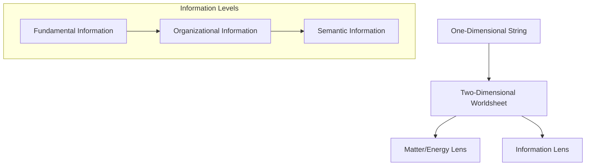

## Contents

- [Dual Lenses](#dual-lenses)
- [Information Levels](#information-levels)
- [Ontic Structural Realism](#ontic-structural-realism)
- [Pattern Stability and Outward Stabilization](#pattern-stability-and-outward-stabilization)

Information and matter represent complementary aspects of physical processes, as demonstrated in quantum mechanics where the same phenomenon can be described in terms of both energy/momentum and information content. The worldsheet metaphor provides an intuitive visualization of this duality: imagine fundamental processes as dynamic patterns that can be 'read' through either lens.

The universe, in its entirety, is an indivisible **higher-dimensional continuum** (spacetime, perhaps with compactified dimensions as envisaged by string theory) in which fundamental **one-dimensional strings** sweep out **two-dimensional "[worldsheets](../glossary/W.md#worldsheet)."** This ceaseless weave of worldsheets—from the quantum to the cosmic scale—*is* the fabric of reality.

Throughout this document we will examine that fabric through two mutually-entailing descriptive lenses, a concept central to [Pattern Realism](../glossary/P.md#pattern-realism):

- the **matter/energy lens**, which tracks conserved quantities, forces, and dynamical evolution; and
- the **information lens**, which tracks the distinguishability of states, pattern-structure, and the flow of "difference that makes a difference."

**Practical Example:** Imagine a photon's worldsheet—the same two-dimensional sweep can be read under the matter/energy lens to track its momentum and energy, or under the information lens to follow patterns like polarization states that carry semantic significance for an observer.

Nothing ontological separates these views; they are bookkeeping schemes applied to the same underlying pattern. When the prose privileges informational vocabulary, it should be read as a perspectival choice, not as a claim that "information floats free of matter."

## Dual Lenses

This dual-lens approach is central to Pattern Realism. Rather than privileging either materialist or informationalist accounts, we recognize that both perspectives capture essential aspects of the same underlying reality. The matter/energy lens excels at tracking conservation laws, forces, and causal dynamics—the domain of traditional physics. The information lens excels at understanding pattern recognition, distinguishability, complexity, and meaning-making—increasingly crucial as we study biological and cognitive systems.

Neither lens is more "fundamental" than the other; they are complementary tools for understanding different aspects of structured processes. A complete description often requires switching between lenses or using both simultaneously, much like how quantum mechanics employs both wave and particle descriptions depending on the experimental context.

## Information Levels

From the information perspective, the dynamic [worldsheets](../glossary/W.md#worldsheet) can be treated as **structured signals**—persistent differences that can, in principle, be copied, transformed, or lost. From the matter/energy perspective those same [worldsheets](../glossary/W.md#worldsheet) are **vibrational excitations** carrying momentum, charge, and so on. The descriptive shift changes the questions we ask (about entropy versus about forces) but not the underlying stuff. For brevity, this section primarily adopts the informational viewpoint, with the tacit understanding that every statement has a dual reading in conventional physical terms.

Within this informational lens, information is not a secondary add-on but co-fundamental with the physical description; it is simply the same pattern read under a state-counting metric. Visualizing **one-dimensional strings sweeping out two-dimensional [worldsheets](../glossary/W.md#worldsheet)** offers an intuitive picture of how such structured signals arise. This involves considering different levels of information, as detailed in [Semantic vs. Organizational vs. Fundamental](../glossary/S.md#semantic-vs-organizational-vs-fundamental):

- **[Fundamental Information](../glossary/F.md#fundamental-information)**: This encompasses the **intrinsic properties** of these **fundamental strings**. Crucially, their specific, **stable, and quantized modes of vibration** determine their apparent characteristics (like mass, charge, and spin). The work of physicists like Sylvester James Gates Jr. on supersymmetric structures, including adinkras and the discovery of error-correcting codes within fundamental equations, points to the deep, information-theoretic nature of these stable vibrational modes. Each such stable vibrational mode manifests as a **distinct type of elementary particle**, forming the first layer of **stable building blocks** from which more complex structures [emerge](../glossary/E.md#emergence). These particle properties, born from specific vibrational patterns, in turn define the nature of the strings' **[worldsheets](../glossary/W.md#worldsheet)** and their subsequent interactions.
- **[Organizational Information](../glossary/O.md#organizational-information)**: This is embodied in the **specific configurations and histories (the [worldsheets](../glossary/W.md#worldsheet))** of these **strings** through spacetime – their dynamic form, interactions (such as joining and splitting), and relational configurations. From an information-theoretic standpoint, such as that pioneered by Claude Shannon, these configurations can be quantified in terms of their complexity, entropy, and the information content required to specify them. It also manifests as the **broader emergent patterns and structures** that arise from the collective tapestry of these interwoven **[worldsheets](../glossary/W.md#worldsheet)** when observed at different scales.

These foundational and organizational patterns set the stage for the emergence of **[Semantic Information](../glossary/S.md#semantic-information)**—information that carries meaning for an interpreting agent. This crucial transition from raw pattern to interpreted meaning represents a key threshold in the information hierarchy, explored in detail in [1.a. Pathway of Emergence](1a-pathway-emergence/1a-pathway-emergence.md).

## Ontic Structural Realism

Thus, there is an **inseparable link** between the strings and the informational patterns they realise. A **string** *is* its dynamic pattern of existence; describing that pattern in energy units or in bits are alternate projections of the same object. Ontologically, we therefore lean toward what philosophers call **ontic structural realism**: reality is structured process; "material" and "informational" are two coherent but partial glosses on that structure.

The transition from basic [organizational/structural pattern](../glossary/O.md#organizational-information) (e.g., the patterns of [worldsheets](../glossary/W.md#worldsheet) underlying an atom) to [*semantic* or *processed* information](../glossary/S.md#semantic-information) is therefore not a jump from "matter" to "information," but a **climb up the same pattern hierarchy** ([Semantic vs. Organizational vs. Fundamental](../glossary/S.md#semantic-vs-organizational-vs-fundamental)) toward configurations that model, predict, and act upon other configurations.

## Pattern Stability and Outward Stabilization

A fundamental principle emerges from observing how patterns behave across all scales of organization: **self-stabilizing patterns exhibit outward stabilization propensity**.
*Self-stabilizing patterns are configurations that inherently maintain their structure or behavior over time, ranging from stable elementary particles and atoms in physics, to homeostatic mechanisms and the remarkable stability of DNA in biology, to attractors in dynamical systems, and even persistent social norms or individual habits.*
This scale-invariant principle manifests consistently from quantum systems to biological organisms to information networks. Theoretical physicist Sylvester James Gates Jr.'s work on supersymmetry, for instance, has uncovered adinkras and mathematical structures resembling error-correcting codes embedded within the fundamental equations. Such findings suggest that mechanisms for pattern integrity and self-stabilization could be an intrinsic feature of reality at its deepest level, providing a foundational basis for the stability observed in more complex systems.

When a pattern achieves internal stability—whether through quantum mechanical ground states, thermodynamic equilibria, biological homeostasis, or informational consistency—it tends to extend that stability outward to its environment. This is not merely passive resistance to perturbation, but active pattern propagation that creates zones of increased order and predictability in the surrounding medium.

This principle operates through several mechanisms:

- **Boundary Stabilization**: Stable patterns create well-defined interfaces that constrain neighboring patterns, reducing local entropy
- **Template Effects**: Self-stabilizing patterns serve as templates that guide the formation of similar or complementary patterns nearby
- **Structural Recruitment**: Organized information patterns tend to recruit and organize previously unstructured information, extending their own stability into the environment
- **Cascading Order**: Local stability creates conditions that favor the emergence of higher-order organizational patterns

This principle of outward stabilization is not merely an abstract concept but finds echoes and concrete manifestations across numerous domains:

- In **biology and ecology**, phenomena like *niche construction* (e.g., beavers building dams that stabilize water levels and create new wetland ecosystems) or *ecosystem engineering* (e.g., corals building reefs that form stable habitats) exemplify how organisms actively project stability onto their environments.
- In **physics and chemistry**, phase-ordering processes such as solidification (e.g., ice nucleating in supercooled water) show how a tiny region of local order can template organization in surrounding matter.
- **Systems theory** describes *attractors* in dynamical systems, where a system tends to evolve towards stable states or patterns, effectively organizing its own behavior and that of coupled systems.
- In the **social sciences**, the development of *standards, institutions, and laws* imposes order and predictability on social interactions, while *cultural transmission* sees coherent belief systems or practices (memes) spread and stabilize social structures.

These diverse examples, from the molecular to the societal, underscore the scale-invariant nature of outward stabilization propensity.

This outward stabilization propensity explains how complex hierarchical organizations emerge from simpler components and why stable patterns tend to cluster and reinforce each other across scales. It provides a foundational mechanism for understanding both the spontaneous emergence of order and the preservation of organizational complexity in dynamic systems.

---

**Dive deeper:**

- [1.a. From Organizational Information to Semantic Information: A Pathway of Emergence](1a-pathway-emergence/1a-pathway-emergence.md)
- [1.b. Emergence of Consciousness](1b-emergence-of-consciousness.md)
- [1.c. Addressing the "Hard Problem" of Consciousness](1c-hard-problem-of-consciousness.md)

---

[^ Overview](../../README.md)

---
[<< Previous: README.md](../../README.md) | [Home: README.md](../../README.md) | [Glossary: glossary.md](../glossary.md) | [Next: From Organizational Information to Semantic Information >>](1a-pathway-emergence/1a-pathway-emergence.md)
