# ⚙️ 1.a. From Organizational Information to Semantic Information: A Pathway of Emergence {#1a1-the-emergence-of-semantic-information}
<!-- markdownlint-disable MD036 -->
*Low Altitude Analysis*
<!-- markdownlint-enable MD036 -->

📍 **Altitude**: Low (0-1,000 feet) - Detailed Analysis

<!--

- Need to break this up into one overview and several deep dives

-->

## Contents

- [I. Foundation: Stable Structures and Inherent Patterns](#i-foundation-stable-structures-and-inherent-patterns)
- [II. Environmental Information: Patterns as Potential Cues](#ii-environmental-information-patterns-as-potential-cues)
  - [Divergent Interpretations: Color Patch on Leaf](#divergent-interpretations-color-patch-on-leaf)
  - [Divergent Interpretations: Scent Plume](#divergent-interpretations-scent-plume)
- [II.5. The Bridge: From Environmental Patterns to True Agency](#ii5-the-bridge-from-environmental-patterns-to-true-agency)
- [III. Proto-Semantics: Simple Agents, Detection, and Functional Significance](#iii-proto-semantics-simple-agents-detection-and-functional-significance)
- [IV. Developing Semantics: Complex Agents, Internal Representation, and Prediction](#iv-developing-semantics-complex-agents-internal-representation-and-prediction)
- [V. Full-Blown Semantics: Symbolic Systems, Language, and Shared Meaning](#v-full-blown-semantics-symbolic-systems-language-and-shared-meaning)
- [VI. Core Principles in the Emergence of Semantic Information](#vi-core-principles-in-the-emergence-of-semantic-information)
- [Falsification Criteria for Pathway Emergence](#falsification-criteria-for-pathway-emergence)
- [Comparative Framework Analysis](#comparative-framework-analysis)
  - [Unique Contributions of the Framework](#unique-contributions-of-the-framework)

The transition from the fundamental, [organizational information](../glossary/O.md#organizational-information) embodied in **patterns of [worldsheets](../glossary/W.md#worldsheet)** to [semantic information](../glossary/S.md#semantic-information)—information that holds meaning and reference for an [agent](../glossary/A.md#agent)—is a complex multi-stage process of [emergence](../glossary/E.md#emergence). This section outlines a plausible pathway for this development, consistent with the principles of this ontology. It emphasizes that meaning is not an intrinsic property of [fundamental information](../glossary/F.md#fundamental-information) (i.e., the [worldsheets](../glossary/W.md#worldsheet) themselves) but arises from the functional role and interpretation of **patterns within these [worldsheets](../glossary/W.md#worldsheet)** by increasingly complex systems, particularly through the [agent\'s](../glossary/A.md#agent) "inside-out lens".

**The key bridge** from environmental patterns to true agency occurs through the emergence of **autopoietic organization** (Stage II.5) that establishes the **inside-out lens architecture** ([Section 3.a](../03-agents-as-information-processors/3a-inside-out-lens-self-preservation.md))—the self-referential processing foundation that, when it becomes recursive, generates consciousness ([Section 1.b](1b-emergence-of-consciousness.md)) and completes the transformation from passive patterns to active agents.

## I. Foundation: Stable Structures and Inherent Patterns

As established ([Section 1](1-pattern-realism.md)), the dynamics of fundamental strings and their [worldsheets](../glossary/W.md#worldsheet) give rise to stable, quantized vibrational modes. Each distinct mode manifests as a unique elementary particle, forming the first layer of **stable building blocks**.

This set of stable particle types can be understood as the **fundamental alphabet of reality**. It is the complete set of characters from which all physical structures are composed. The stability of this alphabet is paramount; without it, patterns could not reliably form. The work of physicists like Sylvester James Gates Jr., discovering error-correcting codes in supersymmetry, provides a compelling mechanism for this stability. It suggests that the fabric of reality contains intrinsic proofreading protocols that ensure a vibrational pattern corresponding to an "electron" remains an electron, resisting the constant "noise" of quantum fluctuations.

This level of information is what we define as **[Fundamental Information](../glossary/F.md#fundamental-information)**, and thanks to its discrete, character-like nature, we can quantify its complexity.

### Quantifying Foundational Complexity: A Shannon Entropy Approach

We can apply Claude Shannon's information theory to measure the richness and structure of this fundamental alphabet. The Shannon entropy ($H$) of a system measures its average information content, accounting for the likelihood of each possible state. The full formula is:

$$H(X) = -\sum_{i=1}^{n} p(x_i) \log_2 p(x_i)$$

Here, the probabilities $p(x_i)$ are not uniform. They are determined by the fundamental laws of physics. A particle mode that is very stable and requires little energy to be excited (like an electron) will have a much higher intrinsic probability, $p(electron)$, than a mode that is extremely massive and unstable (like a top quark), which will have a very low probability, $p(top\_quark)$. These probabilities represent the inherent bias of our universe's physical laws.

Let's perform a more realistic thought experiment. Consider a toy universe with just four particle types in its alphabet, with the following physically-motivated, non-uniform probabilities:

- $p(\text{electron}) = 0.6$ (common, stable)
- $p(\text{photon}) = 0.3$ (common, massless)
- $p(\text{neutrino}) = 0.09$ (less common)
- $p(\text{Higgs boson}) = 0.01$ (rare, high-energy)

Plugging these values into the Shannon formula would yield a specific entropy value. We don't need to do the exact math here; the crucial insight lies in comparing it to the maximum possible entropy. The maximum entropy for a 4-character alphabet would occur if all were equally likely ($p=0.25$), giving $H_{max} = \log_2(4) = 2$ bits.

Because our realistic probabilities are highly skewed, the calculated entropy would be **significantly less than 2 bits**.

This lower entropy value is not just a mathematical curiosity. It would represent a new fundamental constant of nature with a much deeper meaning:

- It quantifies the **predictive structure** of our universe's laws. A low entropy value signifies a universe with strong biases, where some outcomes are heavily favored, making it more structured and less random.
- It measures the **informational efficiency** of reality. The physical laws don't "waste" information on a flat distribution of possibilities; they are optimized to produce a specific, constrained set of outcomes.
- The final value of $H$ becomes a measure not just of the *size* of the particle alphabet, but of the **inherent structural bias** of the physical laws that generate it.

These particles, defined by the stable, informationally structured patterns of **[Fundamental Information](../glossary/F.md#fundamental-information)**, then combine to form stable atoms, molecules, and larger physical structures. This layered [emergence](../glossary/E.md#emergence) provides the necessary, reliable physical substrate upon which more complex **[Organizational Information](../glossary/O.md#organizational-information)** can be built.

*Stage I takeaway: The universe's foundation is a discrete alphabet of stable particles whose inherent probabilistic bias, and thus its informational complexity, can be quantified by a fundamental Shannon entropy value.*

## II. [Environmental Information](../glossary/E.md#environmental-information): Patterns as Potential Cues

The environment, composed of stable physical structures and their dynamic interactions (all ultimately arising from the configurations and interactions of **[worldsheets](../glossary/W.md#worldsheet)**), presents a rich tapestry of physical patterns—light reflecting from surfaces, chemical gradients, pressure waves, etc. These **patterns of [worldsheets](../glossary/W.md#worldsheet)** are not inherently semantic but constitute *potential information* or environmental cues. They are physical regularities that can be detected and correlated with other events or conditions by an [agent](../glossary/A.md#agent) capable of doing so. The information content of these environmental patterns, and the capacity of an agent to detect and process them, can be conceptualized through the lens of Claude Shannon's information theory, which provides a mathematical framework for quantifying information and understanding the limits of communication channels.

### Divergent Interpretations: Color Patch on Leaf

### Divergent Interpretations: Scent Plume

*Stage II takeaway: Environmental patterns only become meaningful when detected and correlated by an agent.*

## II.5. The Bridge: From Environmental Patterns to True Agency

The transition from passive environmental patterns to active [agents](../glossary/A.md#agent) capable of [proto-semantic](../glossary/P.md#proto-semantics) interpretation follows a thermodynamically driven progression that bridges the gap between mere physical complexity and true agency.

This progression combines England's principle of [dissipative adaptation](../glossary/D.md#dissipative-adaptation), Kauffman's [autocatalytic](../glossary/A.md#autocatalytic) sets, and Maturana and Varela's [autopoietic](../glossary/A.md#autopoietic) theory to explain how pattern-reactive matter evolves into meaning-making agents. The following diagram illustrates this progression as a series of overlapping functional layers operating across multiple timescales. Each layer builds upon the previous while providing feedback that reshapes earlier processes. The thermodynamic layer creates the energetic foundation, the [autocatalytic](../glossary/A.md#autocatalytic) layer enables self-reproduction, the [autopoietic](../glossary/A.md#autopoietic) layer establishes autonomous boundaries, and the [proto-semantic](../glossary/P.md#proto-semantics) layer introduces functional meaning evaluation. Understanding these layers and their interactions reveals how [worldsheet](../glossary/W.md#worldsheet) patterns undergo a fundamental transformation from passive environmental structures to active agents capable of assigning functional significance to their surroundings.

**Legend:**

- 🌊 **Thermodynamic Layer**: Driven by energy gradients and dissipative efficiency
- ⚛️ **[Autocatalytic](../glossary/A.md#autocatalytic) Layer**: Self-sustaining chemical reaction networks  
- 🔄 **[Autopoietic](../glossary/A.md#autopoietic) Layer**: Self-producing organizational systems
- 🎯 **[Proto-Semantic](../glossary/P.md#proto-semantics) Layer**: Functional meaning assignment

**Process Timescales:**

- 🔴 **Fast (microseconds-milliseconds)**: Molecular fluctuations, selection pressure
- 🟡 **Medium (seconds-minutes)**: Structure formation, network connectivity  
- 🟢 **Slow (minutes-hours)**: Production closure, boundary formation
- 🔵 **Semantic (variable)**: Meaning evaluation and assignment

**Arrow Types:**

- **Solid arrows (→)**: Direct causal influence
- **Dotted arrows (-.->)**: Feedback/modulation effects
- **Subgraph boundaries**: Overlapping functional layers, not rigid separations

```mermaid
flowchart TB
  %% Input from Stage II
  EP["Environmental Patterns<br/>(Stage II)"] --> EG["Sustained Energy Gradients<br/>(far-from-equilibrium driving)"]
  
  %% Thermodynamic Layer
  subgraph TD ["🌊 Thermodynamic Driving"]
    EG -->|continuous driving| MF["Molecular Fluctuations<br/>(stochastic exploration)"]
    MF -->|statistical selection| SP["Selection for Dissipative Efficiency<br/>(England's principle)"]
    SP --> DS["Dissipative Structures<br/>(Prigogine order)"]
    DS -.->|modify energy landscape| EG
    DS -->|stabilize efficient paths| SP
  end
  
  %% Autocatalytic Layer - overlaps with thermodynamic
  subgraph AC_Layer ["⚛️ Autocatalytic Emergence"]
    DS -->|complexity accumulation| CT["Connectivity Threshold<br/>(Kauffman criticality)"]
    CT -->|phase transition| ACN["Autocatalytic Networks<br/>(collective autocatalysis)"]
    ACN -->|positive feedback| CT
    ACN -.->|enhance dissipation| DS
    ACN -->|emergent catalytic closure| CC["Catalytic Closure<br/>(self-sustaining chemistry)"]
    CC -->|maintain connectivity| ACN
  end
  
  %% Autopoietic Layer - emerges from autocatalytic
  subgraph AP_Layer ["🔄 Autopoietic Organization"]
    CC -->|operational closure| PC["Production Closure<br/>(Maturana/Varela)"]
    PC --> BD["Boundary Formation<br/>(inside/outside)"]
    BD --> APS["Autopoietic System<br/>(autonomous agent)"]
    APS -->|maintain production| PC
    APS -->|reinforce boundaries| BD
    APS -.->|stabilize autocatalysis| CC
  end
  
  %% Proto-Semantic Layer - qualitative leap
  subgraph PS_Layer ["🎯 Proto-Semantic Processing"]
    APS -->|enables| VE["Viability Evaluation<br/>(functional assessment)"]
    VE --> IOL["Inside-Out Lens<br/>(meaning assignment)"]
    IOL -->|behavior modulation| APS
    IOL -->|pattern discrimination| VE
    IOL -.->|selective pressure| SP
  end
  
  %% Outputs to Stage III
  IOL --> PS["Proto-Semantics<br/>(Stage III)"]
  
  %% Functional meaning space
  subgraph FM ["Functional Meaning Space"]
    PS --> UV["Autopoiesis<br/>Enhancing"]
    PS --> DV["Autopoiesis<br/>Threatening"] 
    PS --> IV["Autopoiesis<br/>Neutral"]
  end
  
  %% Cross-scale feedback (multi-directional)
  APS -.->|create new gradients| EG
  IOL -.->|bias molecular selection| MF
  ACN -.->|template new structures| DS
  
  %% Temporal dynamics indicator
  classDef fast stroke:#ffcccc
  classDef medium stroke:#ffffcc 
  classDef slow stroke:#ccffcc
  classDef semantic stroke:#ccccff

  class MF,SP fast
  class DS,CT,ACN medium
  class PC,BD,APS slow
  class VE,IOL,PS semantic
```

- **Thermodynamic Imperative and [Dissipative Structures](../glossary/D.md#dissipative-structures):** Following Jeremy England's work on [dissipative adaptation](../glossary/D.md#dissipative-adaptation) and building on Ilya Prigogine's theory of [dissipative structures](../glossary/D.md#dissipative-structures), matter in sustained far-from-equilibrium conditions experiences constant thermodynamic driving toward configurations that more efficiently dissipate energy. This is not a gradual process but involves stochastic exploration of molecular configurations followed by statistical selection for dissipative efficiency. The resulting [dissipative structures](../glossary/D.md#dissipative-structures) modify their local energy landscape, creating feedback loops that stabilize efficient energy-dissipating pathways—the foundational **patterns of [worldsheets](../glossary/W.md#worldsheet)** that exhibit emergent order. Crucially, these structures represent the first **[self-stabilizing patterns](../glossary/S.md#self-stabilizing-patterns) of [worldsheets](../glossary/W.md#worldsheet)** that maintain their organization through continuous energy flow, establishing stable configurations that persist far longer than their individual molecular components. This concept of inherent self-stabilization at fundamental levels resonates with findings such as those by Sylvester James Gates Jr., whose work on adinkras and error-correcting codes in supersymmetry points to deep, information-theoretic mechanisms for pattern integrity at the very foundation of physical law, providing a robust platform for the emergence of more complex, actively self-maintaining systems.

- **[Autocatalytic](../glossary/A.md#autocatalytic) Threshold and Network Emergence:** Stuart Kauffman's work reveals that [autocatalytic](../glossary/A.md#autocatalytic) emergence occurs through a critical phase transition: when molecular networks reach a connectivity threshold, collective autocatalysis suddenly becomes possible. This represents a qualitative leap where individual chemical reactions (each involving specific **[worldsheet](../glossary/W.md#worldsheet) configurations**) become coupled into self-sustaining, self-reproducing networks. The emergence of catalytic closure—where the network as a whole catalyzes its own production—transforms passive [dissipative structures](../glossary/D.md#dissipative-structures) into active, self-maintaining systems. These [autocatalytic](../glossary/A.md#autocatalytic) networks enhance energy dissipation efficiency while creating the foundation for operational autonomy, establishing coherent **patterns of [worldsheets](../glossary/W.md#worldsheet)** that exhibit collective self-reproduction. These networks represent a new class of **[self-stabilizing patterns](../glossary/S.md#self-stabilizing-patterns) of [worldsheets](../glossary/W.md#worldsheet)** where chemical reaction cycles mutually reinforce each other, creating robust, self-perpetuating molecular organizations that can recover from perturbations and maintain their functional identity.

- **[Autopoietic](../glossary/A.md#autopoietic) Organization and Production Closure:** Building on Maturana and Varela's [autopoietic](../glossary/A.md#autopoietic) theory, the transition from [autocatalytic](../glossary/A.md#autocatalytic) networks to true [autopoietic](../glossary/A.md#autopoietic) systems involves the emergence of production closure—where the network's components are produced by the network itself through its own organization. This creates a fundamental boundary between "self" and "environment" that is not merely physical but organizational and functional. The [autopoietic](../glossary/A.md#autopoietic) system maintains its identity through continuous self-production, establishing the first genuine autonomous [agent](../glossary/A.md#agent) with clear operational boundaries. Critically, this organizational closure represents a specific hierarchical arrangement of **[worldsheet](../glossary/W.md#worldsheet) patterns** where the system's components (molecular structures) and processes (biochemical reactions) are unified into a coherent, self-maintaining whole that transcends its individual parts. [Autopoietic](../glossary/A.md#autopoietic) systems constitute the most sophisticated **[self-stabilizing patterns](../glossary/S.md#self-stabilizing-patterns) of [worldsheets](../glossary/W.md#worldsheet)** yet achieved, where the entire organizational structure actively works to maintain its own existence, creating a self-referential system that can distinguish itself from its environment and preserve its operational integrity across time.

- **Birth of Proto-Semantic Processing:** The emergence of autopoietic organization enables a qualitative shift in information processing—the development of viability evaluation. The system can now assess environmental patterns in terms of their functional significance for autopoietic maintenance. This creates the primitive **"inside-out lens"** architecture ([Section 3.a](../03-agents-as-information-processors/3a-inside-out-lens-self-preservation.md))—a systematic evaluation system that assigns functional meaning to environmental **patterns of [worldsheets](../glossary/W.md#worldsheet)** from the agent's self-referential perspective. Patterns are categorized as autopoiesis-enhancing (resources), autopoiesis-threatening (dangers), or autopoiesis-neutral (irrelevant), constituting the most primitive form of semantic processing. **Crucially, this inside-out lens architecture establishes the foundation for true agency**: when this self-referential processing becomes sufficiently sophisticated to recursively examine its own operations, consciousness emerges ([Section 1.b](1b-emergence-of-consciousness.md)), completing the transition from passive environmental patterns to genuine agents capable of subjective experience and autonomous meaning-making. This meaning-assignment process creates **[self-stabilizing patterns](../glossary/S.md#self-stabilizing-patterns) of [worldsheets](../glossary/W.md#worldsheet)** at the behavioral level, where consistent responses to environmental cues become encoded in the agent's structure, establishing stable repertoires of meaning-action couplings that enhance survival.

- **Multi-Scale Feedback and Temporal Dynamics:** The progression involves feedback across multiple scales and timescales: rapid molecular fluctuations, intermediate dissipative structure formation, slower autocatalytic network development, and the emergence of stable autopoietic organization. Critically, later stages reshape earlier ones—autopoietic systems create new energy gradients, proto-semantic processing biases molecular selection, and autocatalytic networks template new dissipative structures. This multi-directional causality ensures that agency, once emerged, actively participates in shaping its own foundational processes. Throughout this progression, we observe the fundamental **[worldsheet](../glossary/W.md#worldsheet) patterns** becoming increasingly organized, from simple energy-dissipating configurations to complex hierarchical structures capable of self-modification and meaning-assignment—all while remaining grounded in the same underlying ontological substrate. Each emergent level creates new forms of **[self-stabilizing patterns](../glossary/S.md#self-stabilizing-patterns) of [worldsheets](../glossary/W.md#worldsheet)** that interact across scales, with higher-level stabilities (like autopoietic organization) providing constraints that guide and stabilize lower-level processes (like molecular dynamics), creating a nested hierarchy of mutual stabilization.

*Stage II.5 takeaway: Thermodynamic necessity drives the emergence of autopoietic agents with primitive functional meaning and the foundational inside-out lens architecture that will enable full agency and consciousness.*

## III. Proto-Semantics: Simple Agents, Detection, and Functional Significance

With the emergence of autopoietic organization and its primitive inside-out lens (Stage II.5), we now have genuine agents capable of functional meaning assignment. The following stage explores how this basic architecture develops into more sophisticated forms of semantic processing while maintaining its grounding in self-preserving organization.

The [emergence](../glossary/E.md#emergence) of simple life forms marks a crucial step. These [agents](../glossary/A.md#agent), as self-preserving "pockets of the universe" ([Section 3](../03-agents-as-information-processors/3-agents-as-information-processors.md)), begin to interact with environmental cues in a way that fosters their persistence. This interaction is the dawn of proto-semantics:

- **Detection and Response:** Simple [agents](../glossary/A.md#agent) possess physical structures (receptors—themselves complex arrangements of [worldsheets](../glossary/W.md#worldsheet)) capable of detecting specific environmental patterns. This detection triggers internal state changes within the [agent](../glossary/A.md#agent), leading to specific behaviors (e.g., movement towards a nutrient, avoidance of a toxin).
- **Functional Meaning via the "Inside-Out Lens":** The detected environmental pattern (a specific **pattern of [worldsheets](../glossary/W.md#worldsheet)**) acquires a rudimentary *functional meaning* or *valence* for the [agent](../glossary/A.md#agent). This meaning is not consciously apprehended but is defined by the pattern\'s relevance to the [agent\'s](../glossary/A.md#agent) self-preservation, as structured by its primitive "inside-out lens". For example, a sugar molecule (representing a specific, stable **pattern of [worldsheets](../glossary/W.md#worldsheet)**) effectively *means* "resource-for-persistence" to a bacterium because of the bacterium\'s evolved capacity to metabolize it.
- **DNA/RNA as Embodied Proto-Semantic Information:** A prime illustration is found in the role of DNA/RNA. These molecular structures are highly stable informational patterns (complex configurations of **patterns of [worldsheets](../glossary/W.md#worldsheet)**) that store [organizational information](../glossary/O.md#organizational-information). When "read" or expressed by the cellular machinery, this genetic information directs the assembly of the organism\'s components and imposes specific, often "built-in," behavioral patterns (e.g., constructing a flagellum, synthesizing an enzyme for digestion). Thus, a gene sequence (itself a **pattern of [worldsheets](../glossary/W.md#worldsheet)**) acquires functional meaning by reliably leading to structures and behaviors that contribute to the organism\'s persistence within its environment.

*Stage III takeaway: Simple detection mechanisms grant basic functional meaning to environmental cues.*

**Practical Example:** A motile bacterium detecting a nutrient gradient (e.g., sugar molecules) uses receptor proteins (physical patterns of worldsheets) to guide movement toward higher concentrations—a clear case of proto-semantics in action.

## IV. Developing Semantics: Complex Agents, Internal Representation, and Prediction

The transition from proto-semantics to more developed semantic capabilities occurs with the [emergence](../glossary/E.md#emergence) of increasingly complex [agents](../glossary/A.md#agent), particularly those possessing nervous systems. These systems, themselves highly organized and dynamic configurations of [worldsheets](../glossary/W.md#worldsheet), allow for novel ways of processing environmental and internal information, leading to the formation of internal representations and predictive models, thereby enriching the nature of meaning for the [agent](../glossary/A.md#agent).

- **[Emergence](../glossary/E.md#emergence) of Nervous Systems:** Nervous systems constitute a specialized architecture for rapid and complex information transmission and processing. Individual neurons and their connections (synapses) act as dynamic units whose states (e.g., firing rates, synaptic strengths)—all ultimately specific **patterns of [worldsheet](../glossary/W.md#worldsheet) activity**—can be modified by experience. This allows for a far more flexible and high-dimensional processing of information than in simpler organisms.
- **Internal Representations and Neural Codes:** Within these nervous systems, patterns of neural activity begin to reliably correlate with, and thus internally "represent," aspects of the external world (objects, events, spatial relationships) or the agent\'s own internal states (e.g., hunger, fear). These are not mere detections but are structured internal states—neural codes—that can be activated even in the absence of the immediate stimulus (forming the basis of memory and imagination). The information here, while still physically instantiated as **patterns of worldsheets** (specifically, neural activity patterns), now functions as an internal token or model corresponding to some facet of reality relevant to the agent. The efficiency of these neural codes, the amount of information they convey, and the processes of reducing uncertainty through sensory input and internal modeling can be analyzed using principles from Claude Shannon's information theory, highlighting how nervous systems optimize the encoding and transmission of meaningful data.
- **Learning, Memory, and Contextualization:** The "inside-out lens" ([Section 3.a](../03-agents-as-information-processors/3a-inside-out-lens-self-preservation.md)) of such an agent becomes significantly more sophisticated. Through mechanisms like synaptic plasticity (changes in the strength of connections between neurons based on activity), agents learn from experience.
  - **Memory:** Experiences, encoded as modifications to neural structures and activity patterns, allow past information to influence present processing and future behavior. This means the "meaning" of a current stimulus can be profoundly altered by past encounters. For example, a previously neutral pattern might acquire the meaning "danger" after being associated with a negative experience.
  - **Context-Sensitivity:** The meaning of an informational pattern becomes highly dependent on the broader context, including other co-occurring stimuli, the agent's current internal state, and its memories.
- **Prediction, Planning, and Goal-Directed Behavior:** A crucial development is the capacity for these internal representations to be used not just to model the present but to *predict* future states and *plan* actions.
  - The "inside-out lens" actively constructs and tests hypotheses about the world. An internal representation of a situation can be manipulated offline to simulate potential outcomes of different actions.
  - Information now acquires meaning based on its utility for successful prediction and the achievement of the agent's goals (which are fundamentally tied to persistence and propagation of its complex form). For instance, observing certain cloud patterns might *mean* "impending rain, seek shelter" not just as a learned association, but as part of a predictive model of weather that informs goal-directed behavior.
- **Richer, More Abstract Meanings:** While still grounded in the agent's struggle for persistence, meanings can become more abstract. An agent might develop internal representations for social relationships, hierarchical structures within a group, or complex causal chains in its environment. The "value" assigned to certain informational patterns becomes more nuanced than simple "approach/avoid".

The development of these semantic capabilities represents a significant increase in an [agent\'s](../glossary/A.md#agent) capacity to navigate its environment effectively, anticipate challenges, and exploit opportunities. The information processed is still ultimately grounded in the fundamental **patterns of [worldsheets](../glossary/W.md#worldsheet)** that constitute reality, but it is now filtered, structured, represented, and imbued with complex, context-dependent, and goal-oriented meaning by the [agent\'s](../glossary/A.md#agent) increasingly sophisticated "inside-out lens". This sets the stage for the even more abstract symbolic representation seen in full-blown language.

*Stage IV takeaway: Complex agents form internal models for prediction, enriching the meaning of patterns.*

## V. [Full-Blown Semantics](../glossary/F.md#full-blown-semantics): Symbolic Systems, Language, and Shared Meaning

```mermaid
sequenceDiagram
  participant Env as Environment
  participant A as Agent A
  participant CG as "Common Ground"
  participant B as Agent B

  Env-->>A: event "tree falls"
  A-->>A: perceive & tokenize → "tree", "fell"
  A-->>CG: propose phrase "The tree fell"
  CG-->>B: shared conventions / grammar
  A-->>B: transmit "The tree fell"
  B-->>B: parse & decode to concept
  B-->>Env: act on "tree fell"
```

The [emergence](../glossary/E.md#emergence) of full-blown semantic capabilities, most notably exemplified by human language and abstract thought, represents a pinnacle in the development of information processing by [agents](../glossary/A.md#agent). This stage is characterized by the use of symbolic systems, where arbitrary tokens (sounds, gestures, written marks) become systematically associated with concepts, objects, actions, and even other symbols. This allows for a combinatorial explosion of meaning, enabling communication, complex reasoning, and the construction of shared conceptual worlds.

- **Emergence of Arbitrary Symbols and Syntax:**
  - **Symbolization:** Building upon the internal representations developed in Stage IV, agents (primarily humans) develop the capacity to associate these internal concepts with external, often arbitrary, symbols. A specific sound ("tree") or a written mark becomes a conventional token for the concept of a tree. This detachment of the symbol from any necessary physical resemblance to its referent allows for immense flexibility.
  - **Syntax/Grammar:** Crucially, agents develop rule-based systems (syntax or grammar) for combining these symbols. These rules govern how symbols can be ordered and modified to create novel, complex propositions and meanings from a finite set of symbols. This combinatorial power allows for the expression of an almost infinite range of thoughts and ideas, far exceeding what is possible with simple associative representations. The physical basis for these symbolic operations still lies in neural activity (complex **patterns of worldsheets** in brains), but these patterns now implement highly abstract rule systems.
- **The Symbol Grounding Problem:** A key challenge is understanding how these arbitrary symbols connect to their referents and acquire meaning for the agent and the community—the "symbol grounding problem". Within this framework:
  - **Grounding in Embodied Experience and Representation:** Symbols are ultimately grounded, albeit often through many layers of abstraction, in the agent's embodied interactions with the world and the internal representations (Stage IV) derived from these interactions. The symbol "tree" is grounded through sensory experiences of trees, actions related to trees, and the internal conceptual model of what a tree is.
  - **Social Interaction and Ostension:** The meaning of symbols is often learned and reinforced through social interaction, ostensive definition (pointing and naming), and shared activities. The "inside-out lens" of one agent aligns with another's through these communicative acts.
- **Intersubjectivity and Cultural Transmission – The Rise of Shared Worlds:**
  - **Shared Meanings:** Through sustained communicative interaction within a community, symbols and their associated meanings become conventionalized and shared. This intersubjective agreement on meaning is essential for effective communication and cooperation. The "meaning" of a symbol is no longer solely agent-relative but becomes co-constructed and maintained by a community of "inside-out lenses".
  - **Language as a Higher-Order [Information System](../glossary/I.md#information-system):** Language itself [emerges](../glossary/E.md#emergence) as a powerful "[information system](../glossary/I.md#information-system)" (as described in [Section 4](../04-information-systems/4-information-systems.md)). It has its own structure, evolves over time, and is transmitted culturally across generations. It becomes a primary medium through which individuals inherit and contribute to a collective body of [semantic information](../glossary/S.md#semantic-information).
  - **Construction of Abstract Conceptual Worlds:** [Full-blown semantics](../glossary/F.md#full-blown-semantics) enables the creation of highly abstract concepts (e.g., justice, freedom, mathematical entities, scientific theories, fictional narratives). These concepts may not have direct physical referents but are defined by their relationships to other symbols within a complex semantic web, all ultimately instantiated in neural and externalized informational patterns ([worldsheets](../glossary/W.md#worldsheet)).
- **Link to [Information Systems](../glossary/I.md#information-system) ([Section 4](../04-information-systems/4-information-systems.md) & [5](../05-competitive-dynamics/5-competitive-dynamics.md)):**
  - The development of language and other symbolic systems is a prerequisite for the [emergence](../glossary/E.md#emergence) of the complex "meta-narratives," ideologies, and scientific theories discussed in [Section 4](../04-information-systems/4-information-systems.md). These are vast, interconnected structures of [semantic information](../glossary/S.md#semantic-information).
  - The "competitive dynamics" ([Section 5](../05-competitive-dynamics/5-competitive-dynamics.md)) of these [information systems](../glossary/I.md#information-system) are largely played out in the semantic realm, as different conceptual frameworks and narratives vie for acceptance and influence within the cognitive landscapes of host [agents](../glossary/A.md#agent).

[Full-blown semantics](../glossary/F.md#full-blown-semantics), therefore, represents a level where the "inside-out lens" not only models the immediate environment for persistence but actively constructs, shares, and navigates complex, abstract, and culturally transmitted worlds of meaning. This capacity is deeply intertwined with the evolution of human sociality and cognition, and its material basis remains the intricate patterns of neural activity ([worldsheets](../glossary/W.md#worldsheet)) shaped by both biological evolution and cultural learning.

*Stage V takeaway: Symbolic systems enable combinatorial and socially shared meaning beyond individual agents.*

## VI. Core Principles in the Emergence of Semantic Information

- **Physical Grounding:** All forms of information, including [semantic information](../glossary/S.md#semantic-information), remain instantiated in physical patterns (ultimately configurations of **[worldsheets](../glossary/W.md#worldsheet)** organized at different scales and complexities).
- **Emergence and Evolution of Meaning:** Meaning evolves through the successive [emergence](../glossary/E.md#emergence) of complex systems and their interactions with the world, grounded in their structural and functional properties.
- **Inside-Out Lens:** The "inside-out lens" of agents, shaped by their evolutionary history and individual experiences, plays a crucial role in interpreting and giving meaning to information.
- **Interconnectedness of Semantic Information:** Semantic information is interconnected and layered, with simpler, more fundamental forms of meaning providing the basis for more complex and abstract meanings.

*Stage VI takeaway: All semantic information remains grounded in physical patterns, structured by agents' lenses.*

---

**Summary:** This pathway illustrates how raw organizational patterns transform into rich semantic structures through successive stages of detection, representation, and symbolic abstraction, culminating in the complex, shared information systems that define human cognition.

## Falsification Criteria for Pathway Emergence

To ensure scientific rigor, the framework's model of semantic information emergence must include testable predictions that could potentially refute or require substantial revision of the theoretical claims:

<!-- markdownlint-disable MD033 -->
| Criterion | Framework Prediction | Falsification Conditions |
|-----------|---------------------|--------------------------|
| **Stage Progression Predictions** | The emergence of semantic information follows a specific developmental sequence: organizational patterns → environmental cues → thermodynamic coupling → proto-semantics → neural representation → symbolic systems, with each stage building necessarily on the previous ones | • Discovery of biological systems that develop symbolic communication without prior neural representation capabilities • Identification of agents with sophisticated proto-semantic abilities that lack any thermodynamic coupling with their environment • Evidence of semantic information emerging directly from organizational patterns without intermediate developmental stages |
| **Thermodynamic Bridge Necessity** | The transition from environmental patterns to proto-semantics requires thermodynamic coupling between agent and environment, creating the energetic basis for the "inside-out lens" to develop functional significance attribution | • Discovery of agents that develop meaningful environmental responses without any thermodynamic exchange with their environment • Demonstration that semantic information can emerge in completely isolated systems with no energy flow • Evidence of "inside-out lens" development in systems that maintain thermodynamic equilibrium with their environment |
| **Autocatalytic Semantic Development** | Once proto-semantics emerges, the development toward full semantic information exhibits autocatalytic properties, where semantic capabilities accelerate their own enhancement through positive feedback loops | • Biological systems that develop proto-semantic abilities but show no evidence of accelerated semantic development over evolutionary timescales • Semantic capabilities that consistently inhibit rather than enhance further semantic development • Linear rather than exponential progression in semantic complexity despite adequate environmental complexity and selection pressures |
| **Autopoietic Integration Requirements** | Advanced semantic information requires autopoietic organization where agents maintain their semantic coherence through active boundary maintenance and self-referential processes | • Discovery of agents with sophisticated semantic abilities that show no autopoietic organization or boundary maintenance • Semantic systems that function effectively while being completely passive with respect to their own organization • Evidence that semantic coherence can be maintained without any self-referential processes |
| **Symbolic Threshold Predictions** | The transition to symbolic systems represents a qualitative threshold where combinatorial semantic possibilities expand exponentially, enabling cultural transmission and abstract concept formation | • Gradual, linear progression from neural representation to symbolic systems without any identifiable threshold effects • Symbolic systems that show no combinatorial expansion of semantic possibilities compared to pre-symbolic representations • Evidence of cultural transmission and abstract concepts in agents lacking symbolic systems |
<!-- markdownlint-enable MD033 -->

## Comparative Framework Analysis

The Brain from Brane pathway emergence model distinguishes itself from several established theoretical frameworks:

| Theory | Traditional Position | Framework Distinction | Empirical Differentiator |
|--------|---------------------|----------------------|--------------------------|
| **Information Integration Theory (IIT)** | Consciousness emerges from integrated information (Φ) in any system that exhibits non-zero phi, with semantic content arising from the specific structure of integrated information | While acknowledging information integration, emphasizes the evolutionary and thermodynamic contexts that shape how integration develops. Semantic information requires not just integration but specific developmental pathways that create functional significance for agents | Framework predicts semantic information requires evolutionary development and environmental coupling, whereas IIT suggests any integrated information system could potentially be conscious regardless of its developmental history |
| **Predictive Processing Theory** | Cognition emerges from hierarchical predictive models that minimize prediction error through active inference, with semantic content arising from successful predictive modeling | Incorporates predictive modeling within the broader context of thermodynamic coupling and autopoietic organization. Prediction is one component of semantic development but not sufficient without the evolutionary context that shapes what needs to be predicted and why | Framework predicts that semantic information requires more than predictive accuracy—it requires the development of functional significance through thermodynamic coupling and autocatalytic development processes |
| **Enactive Cognition Theory** | Cognition emerges from embodied interaction between agent and environment, with meaning arising from the history of structural coupling and co-evolution | Shares emphasis on agent-environment coupling but provides more specific mechanistic details about thermodynamic requirements and stage-based development. Adds the autocatalytic and autopoietic dimensions that enactive theory often treats more generally | Framework provides specific predictions about thermodynamic thresholds and autocatalytic transitions that distinguish it from more general enactive approaches |
| **Computational Theory of Mind** | Mental states and semantic content are computational states; meaning arises from symbolic manipulation according to syntactic rules that preserve semantic relationships | Rejects the idea that syntax can be divorced from developmental and thermodynamic context. Semantic information emerges not from abstract computation but from the specific evolutionary processes that create functional significance within thermodynamically coupled systems | Framework predicts that purely syntactic systems cannot develop genuine semantic information without thermodynamic coupling and evolutionary development, whereas computational theory suggests meaning can emerge from any appropriately structured symbolic manipulation |
| **Panpsychist Information Theories** | Consciousness and semantic information are fundamental features of reality, present at all scales from elementary particles to complex systems | While grounding all information in worldsheet patterns, emphasizes that semantic information specifically emerges through developmental processes. Not all information is semantic; the transition requires specific autocatalytic and autopoietic organizational achievements | Framework predicts specific thresholds and transitions in semantic development, whereas panpsychist theories suggest semantic information should be present at all organizational scales |

### Unique Contributions of the Framework

| Contribution | Description |
|--------------|-------------|
| **Thermodynamic Grounding** | Explicitly connects semantic emergence to thermodynamic coupling, providing energetic foundations for meaning that other theories often leave implicit |
| **Stage-Specific Predictions** | Offers detailed, testable predictions about specific developmental stages and transition criteria between them |
| **Autocatalytic Dynamics** | Incorporates self-reinforcing development processes that explain the acceleration of semantic complexity once proto-semantics emerges |
| **Autopoietic Integration** | Connects semantic development to self-maintenance and boundary-making processes that ground meaning in agent persistence |
| **Worldsheet Ontology** | Grounds all stages of development in fundamental physical patterns while explaining how higher-order semantic patterns emerge from but are not reducible to lower-level organizational information |
| **Falsifiable Architecture** | Provides specific criteria for empirical testing that distinguish it from less empirically constrained approaches to consciousness and meaning |

---
[<< Previous: 🔍 1. Pattern Realism: Matter/Energy and Information as Complementary Lenses](1-pattern-realism.md) | [Up: 🔍 1. Pattern Realism: Matter/Energy and Information as Complementary Lenses](1-pattern-realism.md) | [Next: ⚙️ 1.b. Emergence of Consciousness >>](1b-emergence-of-consciousness.md)
