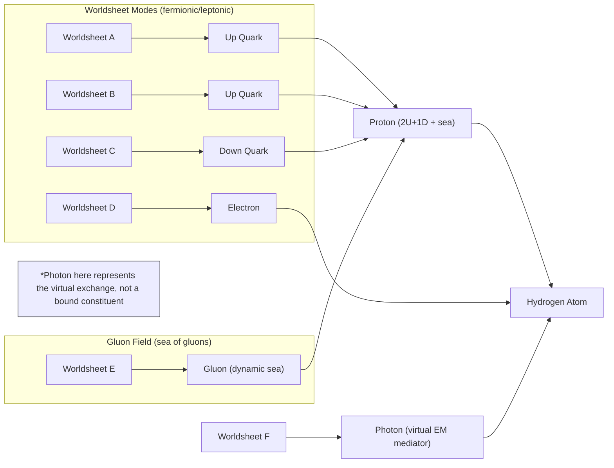

# ⚙️ 1.a.1. Foundation: Stable Structures and Inherent Patterns
<!-- markdownlint-disable MD036 -->
*Low Altitude Analysis*
<!-- markdownlint-enable MD036 -->

📍 **Altitude**: Low (0-1,000 feet) - Detailed Analysis

## I. Foundation: Stable Structures and Inherent Patterns

As established ([Section 1](../1-pattern-realism.md)), the dynamics of fundamental strings and their [worldsheets](../../glossary/W.md#worldsheet) give rise to stable, quantized vibrational modes. Each distinct mode manifests as a unique elementary particle, forming the first layer of **stable building blocks**.

This set of stable particle types can be understood as the **fundamental alphabet of reality**. It is the complete set of characters from which all physical structures are composed. The stability of this alphabet is paramount; without it, patterns could not reliably form. The work of physicists like Sylvester James Gates Jr., discovering error-correcting codes in supersymmetry, provides a compelling mechanism for this stability. It suggests that the fabric of reality contains intrinsic proofreading protocols that ensure a vibrational pattern corresponding to an "electron" remains an electron, resisting the constant "noise" of quantum fluctuations.

This level of information is what we define as **[Fundamental Information](../../glossary/F.md#fundamental-information)**, and thanks to its discrete, character-like nature, we can quantify its complexity.

### Quantifying Foundational Complexity: A Shannon Entropy Approach

We can apply Claude Shannon's information theory to measure the richness and structure of this fundamental alphabet. The Shannon entropy ($H$) of a system measures its average information content, accounting for the likelihood of each possible state. The full formula is:

$$H(X) = -\sum_{i=1}^{n} p(x_i) \log_2 p(x_i)$$

Here, the probabilities $p(x_i)$ are not uniform. They are determined by the fundamental laws of physics. A particle mode that is very stable and requires little energy to be excited (like an electron) will have a much higher intrinsic probability, $p(electron)$, than a mode that is extremely massive and unstable (like a top quark), which will have a very low probability, $p(top\_quark)$. These probabilities represent the inherent bias of our universe's physical laws.

Let's perform a more realistic thought experiment. Consider a toy universe with just four particle types in its alphabet, with the following physically-motivated, non-uniform probabilities:

- $p(\text{electron}) = 0.6$ (common, stable)
- $p(\text{photon}) = 0.3$ (common, massless)
- $p(\text{neutrino}) = 0.09$ (less common)
- $p(\text{Higgs boson}) = 0.01$ (rare, high-energy)

Plugging these values into the Shannon formula would yield a specific entropy value. We don't need to do the exact math here; the crucial insight lies in comparing it to the maximum possible entropy. The maximum entropy for a 4-character alphabet would occur if all were equally likely ($p=0.25$), giving $H_{max} = \log_2(4) = 2$ bits.

Because our realistic probabilities are highly skewed, the calculated entropy would be **significantly less than 2 bits**.

This lower entropy value is not just a mathematical curiosity. It would represent a new fundamental constant of nature with a much deeper meaning:

- It quantifies the **predictive structure** of our universe's laws. A low entropy value signifies a universe with strong biases, where some outcomes are heavily favored, making it more structured and less random.
- It measures the **informational efficiency** of reality. The physical laws don't "waste" information on a flat distribution of possibilities; they are optimized to produce a specific, constrained set of outcomes.
- The final value of $H$ becomes a measure not just of the *size* of the particle alphabet, but of the **inherent structural bias** of the physical laws that generate it.

These particles, defined by the stable, informationally structured patterns of **[Fundamental Information](../../glossary/F.md#fundamental-information)**, then combine to form stable atoms, molecules, and larger physical structures. This layered [emergence](../../glossary/E.md#emergence) provides the necessary, reliable physical substrate upon which more complex **[Organizational Information](../../glossary/O.md#organizational-information)** can be built.

*Stage I takeaway: The universe's foundation is a discrete alphabet of stable particles whose inherent probabilistic bias, and thus its informational complexity, can be quantified by a fundamental Shannon entropy value.*

---
[<< Previous: ⚙️ 1.a. From Organizational Information to Semantic Information](1a-pathway-emergence.md) | [Up: 🔍 1. Pattern Realism: Matter/Energy and Information as Complementary Lenses](../1-pattern-realism.md) | [Next: ⚙️ 1.a.2. Environmental Information: Patterns as Potential Cues >>](1a2-environmental-information.md)
