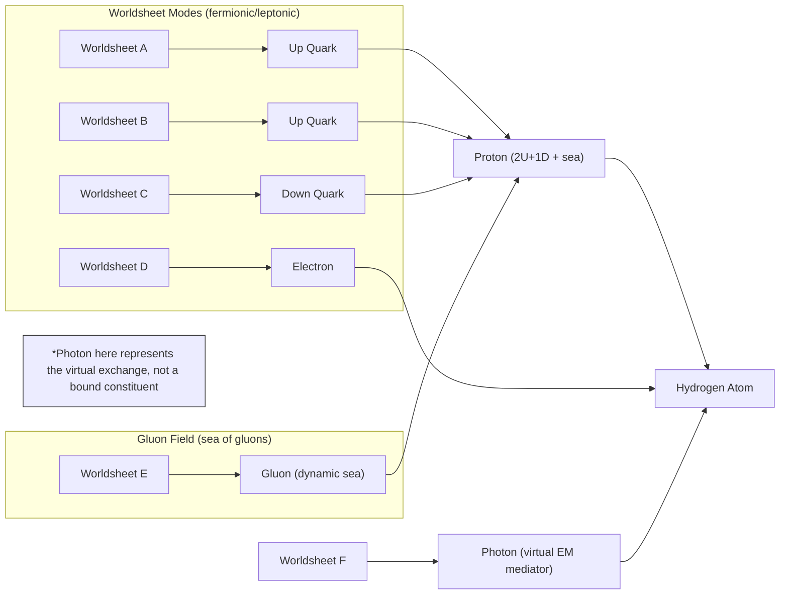

## I. Foundation: Stable Structures and Inherent Patterns

```mermaid
flowchart LR
  %% group fundamental worldsheets and modes
  subgraph "Worldsheet Modes (fermionic/leptonic)"
    WS_A["Worldsheet A"] --> U1["Up Quark"]
    WS_B["Worldsheet B"] --> U2["Up Quark"]
    WS_C["Worldsheet C"] --> D["Down Quark"]
    WS_D["Worldsheet D"] --> Electron["Electron"]
  end

  %% show dynamic gluon field as a sea
  subgraph "Gluon Field (sea of gluons)"
    WS_E["Worldsheet E"] --> G["Gluon (dynamic sea)"]
  end

  %% proton composition with sea annotation
  U1 & U2 & D & G --> Proton["Proton (2U+1D + sea)"]

  %% virtual photon mediator called out
  WS_F["Worldsheet F"] --> Photon["Photon (virtual EM mediator)"]

  %% final assembly note
  Proton & Electron & Photon --> H["Hydrogen Atom"]

  %% legend or note: all nodes are organizational patterns of strings
  classDef note stroke:#333,stroke-width:1px;
  note1["*Photon here represents the virtual exchange, not a bound constituent"]:::note
```

As established ([Section 1](../1-pattern-realism.md)), the dynamics of fundamental strings and their [worldsheets](../../glossary/W.md#worldsheet) give rise to stable, quantized vibrational modes. Each distinct mode manifests as a unique elementary particle, forming the first layer of **stable building blocks**.

This set of stable particle types can be understood as the **fundamental alphabet of reality**. It is the complete set of characters from which all physical structures are composed. The stability of this alphabet is paramount; without it, patterns could not reliably form. The work of physicists like Sylvester James Gates Jr. on error-correcting codes in supersymmetry is suggestive here: it points toward the possibility that deep physical structure may include information-theoretic constraints that help preserve lawful pattern integrity. Within this ontology, that work functions as a clue and analogy, not as a settled mechanism on which the framework depends.

This level of information is what we define as **[Fundamental Information](../../glossary/F.md#fundamental-information)**, and thanks to its discrete, character-like nature, we can quantify its complexity.

### Quantifying Foundational Complexity: A Shannon Entropy Approach

We can use Claude Shannon's information theory to model the richness and structure of this fundamental alphabet. The Shannon entropy ($H$) of a system measures its average information content, accounting for the likelihood of each possible state. The full formula is:

$$H(X) = -\sum_{i=1}^{n} p(x_i) \log_2 p(x_i)$$

Here, the probabilities $p(x_i)$ are not assumed to be uniform. In a fully developed version of this approach, they would need to be defined relative to a specified physical ensemble: an energy regime, cosmological epoch, interaction context, or other principled sampling frame. A particle mode that is stable and easily excited in one context may be far more common than a mode that is massive, unstable, or accessible only at high energies. These probabilities would then model the structural bias expressed by our universe's physical laws.

As a thought experiment, consider a toy universe with just four particle types in its alphabet, with the following physically motivated, non-uniform probabilities:

- $p(\text{electron}) = 0.6$ (common, stable)
- $p(\text{photon}) = 0.3$ (common, massless)
- $p(\text{neutrino}) = 0.09$ (less common)
- $p(\text{Higgs boson}) = 0.01$ (rare, high-energy)

Plugging these values into the Shannon formula would yield a specific entropy value. We don't need to do the exact math here; the crucial insight lies in comparing it to the maximum possible entropy. The maximum entropy for a 4-character alphabet would occur if all were equally likely ($p=0.25$), giving $H_{max} = \log_2(4) = 2$ bits.

Because these toy probabilities are highly skewed, the calculated entropy would be **significantly less than 2 bits**.

This lower entropy value is not just a mathematical curiosity. If the relevant ensemble could be rigorously specified, it would offer a compact measure of structural bias:

- It quantifies the **predictive structure** of our universe's laws. A low entropy value signifies a universe with strong biases, where some outcomes are heavily favored, making it more structured and less random.
- It measures the **informational efficiency** of reality. The physical laws don't "waste" information on a flat distribution of possibilities; they are optimized to produce a specific, constrained set of outcomes.
- The final value of $H$ would measure not just the *size* of the particle alphabet, but the **inherent structural bias** of the physical laws that generate it within the chosen ensemble.

These particles, defined by the stable, informationally structured patterns of **[Fundamental Information](../../glossary/F.md#fundamental-information)**, then combine to form stable atoms, molecules, and larger physical structures. This layered [emergence](../../glossary/E.md#emergence) provides the necessary, reliable physical substrate upon which more complex **[Organizational Information](../../glossary/O.md#organizational-information)** can be built.

*Stage I takeaway: The universe's foundation can be modeled as a discrete alphabet of stable particles whose probabilistic bias, and thus informational complexity, may be quantified once the relevant physical ensemble is carefully specified.*
