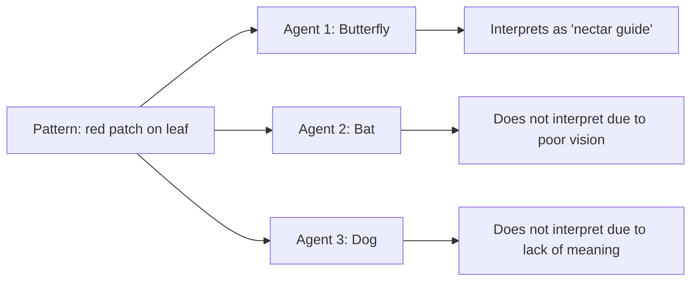
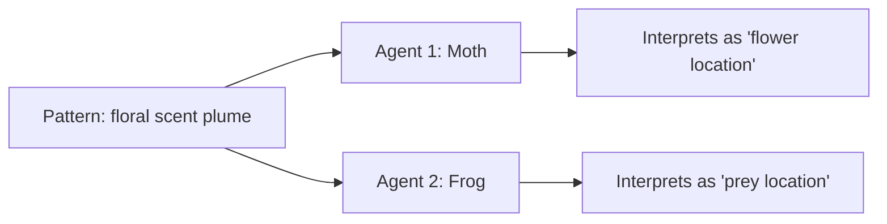

## II. Environmental Information: Patterns as Potential Cues

The environment, composed of stable physical structures and their dynamic interactions (all ultimately arising from the configurations and interactions of **[worldsheets](../../glossary/W.md#worldsheet)**), presents a rich tapestry of physical patterns—light reflecting from surfaces, chemical gradients, pressure waves, etc. These **patterns of [worldsheets](../../glossary/W.md#worldsheet)** are not inherently semantic but constitute *potential information* or environmental cues. They are physical regularities that can be detected and correlated with other events or conditions by an [agent](../../glossary/A.md#agent) capable of doing so. The information content of these environmental patterns, and the capacity of an agent to detect and process them, can be conceptualized through the lens of Claude Shannon's information theory, which provides a mathematical framework for quantifying information and understanding the limits of communication channels.

### Divergent Interpretations: Color Patch on Leaf

### Divergent Interpretations: Scent Plume

*Stage II takeaway: Environmental patterns only become meaningful when detected and correlated by an agent.*

---
[<< Previous: Foundation: Stable Structures and Inherent Patterns](1a1-foundation.md) | [Up: Pattern Realism: Matter/Energy and Information as Complementary Lenses](../1-pattern-realism.md) | [Next: Thermodynamic & Autopoietic Bridge >>](1a25-thermodynamic-bridge.md)
