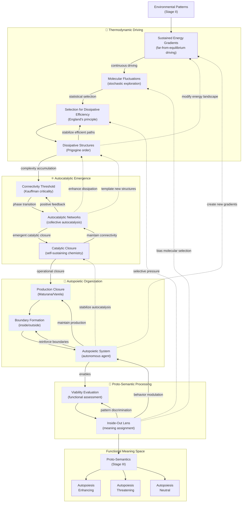

## II.5. The Bridge: From Environmental Patterns to True Agency

The transition from passive environmental patterns to active [agents](../../glossary/A.md#agent) capable of [proto-semantic](../../glossary/P.md#proto-semantics) interpretation follows a thermodynamically driven progression that bridges the gap between mere physical complexity and true agency.

This progression combines England's principle of [dissipative adaptation](../../glossary/D.md#dissipative-adaptation), Kauffman's [autocatalytic](../../glossary/A.md#autocatalytic) sets, and Maturana and Varela's [autopoietic](../../glossary/A.md#autopoietic) theory to explain how pattern-reactive matter evolves into meaning-making agents. The following diagram illustrates this progression as a series of overlapping functional layers operating across multiple timescales. Each layer builds upon the previous while providing feedback that reshapes earlier processes. The thermodynamic layer creates the energetic foundation, the [autocatalytic](../../glossary/A.md#autocatalytic) layer enables self-reproduction, the [autopoietic](../../glossary/A.md#autopoietic) layer establishes autonomous boundaries, and the [proto-semantic](../../glossary/P.md#proto-semantics) layer introduces functional meaning evaluation. Understanding these layers and their interactions reveals how [worldsheet](../../glossary/W.md#worldsheet) patterns undergo a fundamental transformation from passive environmental structures to active agents capable of assigning functional significance to their surroundings.

**Legend:**

- 🌊 **Thermodynamic Layer**: Driven by energy gradients and dissipative efficiency
- ⚛️ **[Autocatalytic](../../glossary/A.md#autocatalytic) Layer**: Self-sustaining chemical reaction networks  
- 🔄 **[Autopoietic](../../glossary/A.md#autopoietic) Layer**: Self-producing organizational systems
- 🎯 **[Proto-Semantic](../../glossary/P.md#proto-semantics) Layer**: Functional meaning assignment

**Process Timescales:**

- 🔴 **Fast (microseconds-milliseconds)**: Molecular fluctuations, selection pressure
- 🟡 **Medium (seconds-minutes)**: Structure formation, network connectivity  
- 🟢 **Slow (minutes-hours)**: Production closure, boundary formation
- 🔵 **Semantic (variable)**: Meaning evaluation and assignment

**Arrow Types:**

- **Solid arrows (→)**: Direct causal influence
- **Dotted arrows (-.->)**: Feedback/modulation effects
- **Subgraph boundaries**: Overlapping functional layers, not rigid separations

- **Thermodynamic Imperative and [Dissipative Structures](../../glossary/D.md#dissipative-structures):** Following Jeremy England's work on [dissipative adaptation](../../glossary/D.md#dissipative-adaptation) and building on Ilya Prigogine's theory of [dissipative structures](../../glossary/D.md#dissipative-structures), matter in sustained far-from-equilibrium conditions experiences constant thermodynamic driving toward configurations that more efficiently dissipate energy. This is not a gradual process but involves stochastic exploration of molecular configurations followed by statistical selection for dissipative efficiency. The resulting [dissipative structures](../../glossary/D.md#dissipative-structures) modify their local energy landscape, creating feedback loops that stabilize efficient energy-dissipating pathways—the foundational **patterns of [worldsheets](../../glossary/W.md#worldsheet)** that exhibit emergent order. Crucially, these structures represent the first **[self-stabilizing patterns](../../glossary/S.md#self-stabilizing-patterns) of [worldsheets](../../glossary/W.md#worldsheet)** that maintain their organization through continuous energy flow, establishing stable configurations that persist far longer than their individual molecular components. This concept of inherent self-stabilization at fundamental levels resonates with findings such as those by Sylvester James Gates Jr., whose work on adinkras and error-correcting codes in supersymmetry points to deep, information-theoretic mechanisms for pattern integrity at the very foundation of physical law, providing a robust platform for the emergence of more complex, actively self-maintaining systems.

- **[Autocatalytic](../../glossary/A.md#autocatalytic) Threshold and Network Emergence:** Stuart Kauffman's work reveals that [autocatalytic](../../glossary/A.md#autocatalytic) emergence occurs through a critical phase transition: when molecular networks reach a connectivity threshold, collective autocatalysis suddenly becomes possible. This represents a qualitative leap where individual chemical reactions (each involving specific **[worldsheet](../../glossary/W.md#worldsheet) configurations**) become coupled into self-sustaining, self-reproducing networks. The emergence of catalytic closure—where the network as a whole catalyzes its own production—transforms passive [dissipative structures](../../glossary/D.md#dissipative-structures) into active, self-maintaining systems. These [autocatalytic](../../glossary/A.md#autocatalytic) networks enhance energy dissipation efficiency while creating the foundation for operational autonomy, establishing coherent **patterns of [worldsheets](../../glossary/W.md#worldsheet)** that exhibit collective self-reproduction. These networks represent a new class of **[self-stabilizing patterns](../../glossary/S.md#self-stabilizing-patterns) of [worldsheets](../../glossary/W.md#worldsheet)** where chemical reaction cycles mutually reinforce each other, creating robust, self-perpetuating molecular organizations that can recover from perturbations and maintain their functional identity.

- **[Autopoietic](../../glossary/A.md#autopoietic) Organization and Production Closure:** Building on Maturana and Varela's [autopoietic](../../glossary/A.md#autopoietic) theory, the transition from [autocatalytic](../../glossary/A.md#autocatalytic) networks to true [autopoietic](../../glossary/A.md#autopoietic) systems involves the emergence of production closure—where the network's components are produced by the network itself through its own organization. This creates a fundamental boundary between "self" and "environment" that is not merely physical but organizational and functional. The [autopoietic](../../glossary/A.md#autopoietic) system maintains its identity through continuous self-production, establishing the first genuine autonomous [agent](../../glossary/A.md#agent) with clear operational boundaries. Critically, this organizational closure represents a specific hierarchical arrangement of **[worldsheet](../../glossary/W.md#worldsheet) patterns** where the system's components (molecular structures) and processes (biochemical reactions) are unified into a coherent, self-maintaining whole that transcends its individual parts. [Autopoietic](../../glossary/A.md#autopoietic) systems constitute the most sophisticated **[self-stabilizing patterns](../../glossary/S.md#self-stabilizing-patterns) of [worldsheets](../../glossary/W.md#worldsheet)** yet achieved, where the entire organizational structure actively works to maintain its own existence, creating a self-referential system that can distinguish itself from its environment and preserve its operational integrity across time.

- **Birth of Proto-Semantic Processing:** The emergence of autopoietic organization enables a qualitative shift in information processing—the development of viability evaluation. The system can now assess environmental patterns in terms of their functional significance for autopoietic maintenance. This creates the primitive **"inside-out lens"** architecture ([Section 3.a](../../03-agents-as-information-processors/3a-inside-out-lens-self-preservation.md))—a systematic evaluation system that assigns functional meaning to environmental **patterns of [worldsheets](../../glossary/W.md#worldsheet)** from the agent's self-referential perspective. Patterns are categorized as autopoiesis-enhancing (resources), autopoiesis-threatening (dangers), or autopoiesis-neutral (irrelevant), constituting the most primitive form of semantic processing. **Crucially, this inside-out lens architecture establishes the foundation for true agency**: when this self-referential processing becomes sufficiently sophisticated to recursively examine its own operations, consciousness emerges ([Section 1.b](../1b-emergence-of-consciousness.md)), completing the transition from passive environmental patterns to genuine agents capable of subjective experience and autonomous meaning-making. This meaning-assignment process creates **[self-stabilizing patterns](../../glossary/S.md#self-stabilizing-patterns) of [worldsheets](../../glossary/W.md#worldsheet)** at the behavioral level, where consistent responses to environmental cues become encoded in the agent's structure, establishing stable repertoires of meaning-action couplings that enhance survival.

- **Multi-Scale Feedback and Temporal Dynamics:** The progression involves feedback across multiple scales and timescales: rapid molecular fluctuations, intermediate dissipative structure formation, slower autocatalytic network development, and the emergence of stable autopoietic organization. Critically, later stages reshape earlier ones—autopoietic systems create new energy gradients, proto-semantic processing biases molecular selection, and autocatalytic networks template new dissipative structures. This multi-directional causality ensures that agency, once emerged, actively participates in shaping its own foundational processes. Throughout this progression, we observe the fundamental **[worldsheet](../../glossary/W.md#worldsheet) patterns** becoming increasingly organized, from simple energy-dissipating configurations to complex hierarchical structures capable of self-modification and meaning-assignment—all while remaining grounded in the same underlying ontological substrate. Each emergent level creates new forms of **[self-stabilizing patterns](../../glossary/S.md#self-stabilizing-patterns) of [worldsheets](../../glossary/W.md#worldsheet)** that interact across scales, with higher-level stabilities (like autopoietic organization) providing constraints that guide and stabilize lower-level processes (like molecular dynamics), creating a nested hierarchy of mutual stabilization.

*Stage II.5 takeaway: Thermodynamic necessity drives the emergence of autopoietic agents with primitive functional meaning and the foundational inside-out lens architecture that will enable full agency and consciousness.*

---
[<< Previous: ⚙️ 1.a.2. Environmental Information: Patterns as Potential Cues](1a2-environmental-information.md) | [Up: 🔍 1. Pattern Realism: Matter/Energy and Information as Complementary Lenses](../1-pattern-realism.md) | [Next: ⚙️ 1.a.3. Proto-Semantics: Simple Agents, Detection & Functional Significance >>](1a3-proto-semantics.md)
