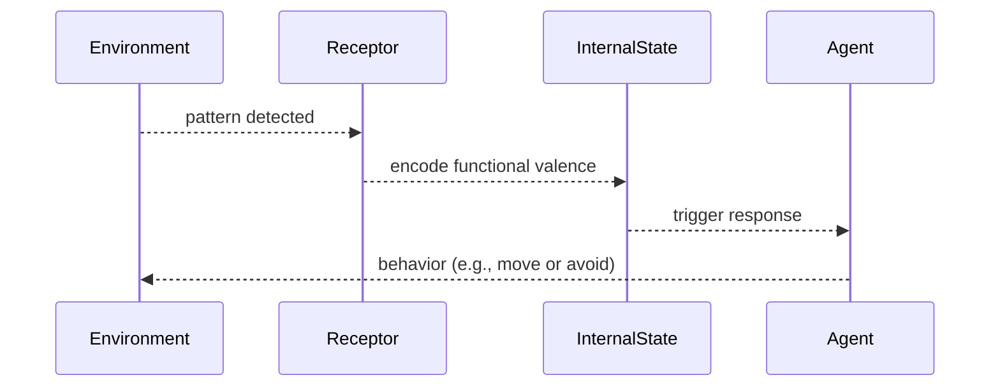

# ⚙️ 1.a.3. Proto-Semantics: Simple Agents, Detection & Functional Significance
<!-- markdownlint-disable MD036 -->
*Low Altitude Analysis*
<!-- markdownlint-enable MD036 -->

📍 **Altitude**: Low (0-1,000 feet) - Detailed Analysis

## III. Proto-Semantics: Simple Agents, Detection, and Functional Significance

With the emergence of autopoietic organization and its primitive inside-out lens (Stage II.5), we now have genuine agents capable of functional meaning assignment. The following stage explores how this basic architecture develops into more sophisticated forms of semantic processing while maintaining its grounding in self-preserving organization.

The [emergence](../../glossary/E.md#emergence) of simple life forms marks a crucial step. These [agents](../../glossary/A.md#agent) as self-preserving "pockets of the universe" ([Section 3](../../03-agents-as-information-processors/3-agents-as-information-processors.md)), begin to interact with environmental cues in a way that fosters their persistence. This interaction is the dawn of proto-semantics:

- **Detection and Response:** Simple [agents](../../glossary/A.md#agent) possess physical structures (receptors—themselves complex arrangements of [worldsheets](../../glossary/W.md#worldsheet)) capable of detecting specific environmental patterns. This detection triggers internal state changes within the [agent](../../glossary/A.md#agent), leading to specific behaviors (e.g., movement towards a nutrient, avoidance of a toxin).
- **Functional Meaning via the "Inside-Out Lens":** The detected environmental pattern (a specific **pattern of [worldsheets](../../glossary/W.md#worldsheet)**) acquires a rudimentary *functional meaning* or *valence* for the [agent](../../glossary/A.md#agent). This meaning is not consciously apprehended but is defined by the pattern\'s relevance to the [agent\'s](../../glossary/A.md#agent) self-preservation, as structured by its primitive "inside-out lens". For example, a sugar molecule (representing a specific, stable **pattern of [worldsheets](../../glossary/W.md#worldsheet)**) effectively *means* "resource-for-persistence" to a bacterium because of the bacterium\'s evolved capacity to metabolize it.
- **DNA/RNA as Embodied Proto-Semantic Information:** A prime illustration is found in the role of DNA/RNA. These molecular structures are highly stable informational patterns (complex configurations of **patterns of [worldsheets](../../glossary/W.md#worldsheet)**) that store [organizational information](../../glossary/O.md#organizational-information). When "read" or expressed by the cellular machinery, this genetic information directs the assembly of the organism\'s components and imposes specific, often "built-in," behavioral patterns (e.g., constructing a flagellum, synthesizing an enzyme for digestion). Thus, a gene sequence (itself a **pattern of [worldsheets](../../glossary/W.md#worldsheet)**) acquires functional meaning by reliably leading to structures and behaviors that contribute to the organism\'s persistence within its environment.

**Practical Example:** A motile bacterium detecting a nutrient gradient (e.g., sugar molecules) uses receptor proteins (physical patterns of worldsheets) to guide movement toward higher concentrations—a clear case of proto-semantics in action.

*Stage III takeaway: Simple detection mechanisms grant basic functional meaning to environmental cues.*

---
[<< Previous: ⚙️ 1.a.2.5. Thermodynamic & Autopoietic Bridge](1a25-thermodynamic-bridge.md) | [Up: 🔍 1. Pattern Realism: Matter/Energy and Information as Complementary Lenses](../1-pattern-realism.md) | [Next: ⚙️ 1.a.4. Developing Semantics: Internal Representation & Prediction >>](1a4-developing-semantics.md)
