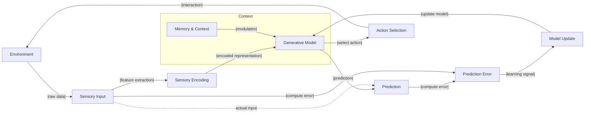

# ⚙️ 1.a.4. Developing Semantics: Internal Representation & Prediction
<!-- markdownlint-disable MD036 -->
*Low Altitude Analysis*
<!-- markdownlint-enable MD036 -->

📍 **Altitude**: Low (0-1,000 feet) - Detailed Analysis

## IV. Developing Semantics: Complex Agents, Internal Representation, and Prediction

The transition from proto-semantics to more developed semantic capabilities occurs with the [emergence](../../glossary/E.md#emergence) of increasingly complex [agents](../../glossary/A.md#agent), particularly those possessing nervous systems. These systems, themselves highly organized and dynamic configurations of [worldsheets](../../glossary/W.md#worldsheet), allow for novel ways of processing environmental and internal information, leading to the formation of internal representations and predictive models, thereby enriching the nature of meaning for the [agent](../../glossary/A.md#agent).

- **[Emergence](../../glossary/E.md#emergence) of Nervous Systems:** Nervous systems constitute a specialized architecture for rapid and complex information transmission and processing. Individual neurons and their connections (synapses) act as dynamic units whose states (e.g., firing rates, synaptic strengths)—all ultimately specific **patterns of [worldsheet](../../glossary/W.md#worldsheet) activity**—can be modified by experience. This allows for a far more flexible and high-dimensional processing of information than in simpler organisms.
- **Internal Representations and Neural Codes:** Within these nervous systems, patterns of neural activity begin to reliably correlate with, and thus internally "represent," aspects of the external world (objects, events, spatial relationships) or the agent\'s own internal states (e.g., hunger, fear). These are not mere detections but are structured internal states—neural codes—that can be activated even in the absence of the immediate stimulus (forming the basis of memory and imagination). The information here, while still physically instantiated as **patterns of worldsheets** (specifically, neural activity patterns), now functions as an internal token or model corresponding to some facet of reality relevant to the agent. The efficiency of these neural codes, the amount of information they convey, and the processes of reducing uncertainty through sensory input and internal modeling can be analyzed using principles from Claude Shannon's information theory, highlighting how nervous systems optimize the encoding and transmission of meaningful data.
- **Learning, Memory, and Contextualization:** The "inside-out lens" ([Section 3.a](../../03-agents-as-information-processors/3a-inside-out-lens-self-preservation.md)) of such an agent becomes significantly more sophisticated. Through mechanisms like synaptic plasticity (changes in the strength of connections between neurons based on activity), agents learn from experience.
  - **Memory:** Experiences, encoded as modifications to neural structures and activity patterns, allow past information to influence present processing and future behavior. This means the "meaning" of a current stimulus can be profoundly altered by past encounters. For example, a previously neutral pattern might acquire the meaning "danger" after being associated with a negative experience.
  - **Context-Sensitivity:** The meaning of an informational pattern becomes highly dependent on the broader context, including other co-occurring stimuli, the agent's current internal state, and its memories.
- **Prediction, Planning, and Goal-Directed Behavior:** A crucial development is the capacity for these internal representations to be used not just to model the present but to *predict* future states and *plan* actions.
  - The "inside-out lens" actively constructs and tests hypotheses about the world. An internal representation of a situation can be manipulated offline to simulate potential outcomes of different actions.
  - Information now acquires meaning based on its utility for successful prediction and the achievement of the agent's goals (which are fundamentally tied to persistence and propagation of its complex form). For instance, observing certain cloud patterns might *mean* "impending rain, seek shelter" not just as a learned association, but as part of a predictive model of weather that informs goal-directed behavior.
- **Richer, More Abstract Meanings:** While still grounded in the agent's struggle for persistence, meanings can become more abstract. An agent might develop internal representations for social relationships, hierarchical structures within a group, or complex causal chains in its environment. The "value" assigned to certain informational patterns becomes more nuanced than simple "approach/avoid".

The development of these semantic capabilities represents a significant increase in an [agent\'s](../../glossary/A.md#agent) capacity to navigate its environment effectively, anticipate challenges, and exploit opportunities. The information processed is still ultimately grounded in the fundamental **patterns of [worldsheets](../../glossary/W.md#worldsheet)** that constitute reality, but it is now filtered, structured, represented, and imbued with complex, context-dependent, and goal-oriented meaning by the [agent\'s](../../glossary/A.md#agent) increasingly sophisticated "inside-out lens". This sets the stage for the even more abstract symbolic representation seen in full-blown language.

*Stage IV takeaway: Complex agents form internal models for prediction, enriching the meaning of patterns.*

---
[<< Previous: ⚙️ 1.a.3. Proto-Semantics: Simple Agents, Detection & Functional Significance](1a3-proto-semantics.md) | [Up: 🔍 1. Pattern Realism: Matter/Energy and Information as Complementary Lenses](../1-pattern-realism.md) | [Next: ⚙️ 1.a.5. Full-Blown Semantics: Symbolic Systems & Shared Meaning >>](1a5-full-semantics.md)
