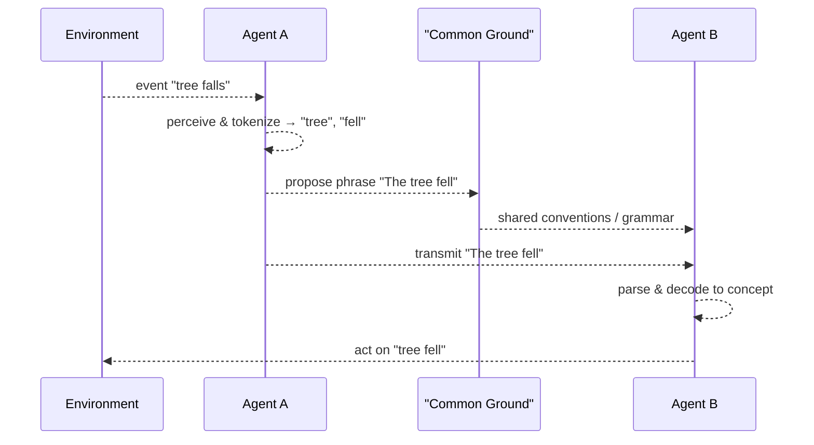

## V. Full-Blown Semantics: Symbolic Systems, Language, and Shared Meaning

The [emergence](../../glossary/E.md#emergence) of full-blown semantic capabilities, most notably exemplified by human language and abstract thought, represents a pinnacle in the development of information processing by [agents](../../glossary/A.md#agent). This stage is characterized by the use of symbolic systems, where arbitrary tokens (sounds, gestures, written marks) become systematically associated with concepts, objects, actions, and even other symbols. This allows for a combinatorial explosion of meaning, enabling communication, complex reasoning, and the construction of shared conceptual worlds.

- **Emergence of Arbitrary Symbols and Syntax:**
  - **Symbolization:** Building upon the internal representations developed in Stage IV, agents (primarily humans) develop the capacity to associate these internal concepts with external, often arbitrary, symbols. A specific sound ("tree") or a written mark becomes a conventional token for the concept of a tree. This detachment of the symbol from any necessary physical resemblance to its referent allows for immense flexibility.
  - **Syntax/Grammar:** Crucially, agents develop rule-based systems (syntax or grammar) for combining these symbols. These rules govern how symbols can be ordered and modified to create novel, complex propositions and meanings from a finite set of symbols. This combinatorial power allows for the expression of an almost infinite range of thoughts and ideas, far exceeding what is possible with simple associative representations. The physical basis for these symbolic operations still lies in neural activity (complex **patterns of worldsheets** in brains), but these patterns now implement highly abstract rule systems.
- **The Symbol Grounding Problem:** A key challenge is understanding how these arbitrary symbols connect to their referents and acquire meaning for the agent and the community—the "symbol grounding problem". Within this framework:
  - **Grounding in Embodied Experience and Representation:** Symbols are ultimately grounded, albeit often through many layers of abstraction, in the agent's embodied interactions with the world and the internal representations (Stage IV) derived from these interactions. The symbol "tree" is grounded through sensory experiences of trees, actions related to trees, and the internal conceptual model of what a tree is.
  - **Social Interaction and Ostension:** The meaning of symbols is often learned and reinforced through social interaction, ostensive definition (pointing and naming), and shared activities. The "inside-out lens" of one agent aligns with another's through these communicative acts.
- **Intersubjectivity and Cultural Transmission – The Rise of Shared Worlds:**
  - **Shared Meanings:** Through sustained communicative interaction within a community, symbols and their associated meanings become conventionalized and shared. This intersubjective agreement on meaning is essential for effective communication and cooperation. The "meaning" of a symbol is no longer solely agent-relative but becomes co-constructed and maintained by a community of "inside-out lenses".
  - **Language as a Higher-Order [Information System](../../glossary/I.md#information-system):** Language itself [emerges](../../glossary/E.md#emergence) as a powerful "[information system](../../glossary/I.md#information-system)" (as described in [Section 4](../../04-information-systems/4-information-systems.md)). It has its own structure, evolves over time, and is transmitted culturally across generations. It becomes a primary medium through which individuals inherit and contribute to a collective body of [semantic information](../../glossary/S.md#semantic-information).
  - **Construction of Abstract Conceptual Worlds:** [Full-blown semantics](../../glossary/F.md#full-blown-semantics) enables the creation of highly abstract concepts (e.g., justice, freedom, mathematical entities, scientific theories, fictional narratives). These concepts may not have direct physical referents but are defined by their relationships to other symbols within a complex semantic web, all ultimately instantiated in neural and externalized informational patterns ([worldsheets](../../glossary/W.md#worldsheet)).
- **Link to [Information Systems](../../glossary/I.md#information-system) ([Section 4](../../04-information-systems/4-information-systems.md) & [5](../../05-competitive-dynamics/5-competitive-dynamics.md)):**
  - The development of language and other symbolic systems is a prerequisite for the [emergence](../../glossary/E.md#emergence) of the complex "meta-narratives," ideologies, and scientific theories discussed in [Section 4](../../04-information-systems/4-information-systems.md). These are vast, interconnected structures of [semantic information](../../glossary/S.md#semantic-information).
  - The "competitive dynamics" ([Section 5](../../05-competitive-dynamics/5-competitive-dynamics.md)) of these [information systems](../../glossary/I.md#information-system) are largely played out in the semantic realm, as different conceptual frameworks and narratives vie for acceptance and influence within the cognitive landscapes of host [agents](../../glossary/A.md#agent).

[Full-blown semantics](../../glossary/F.md#full-blown-semantics), therefore, represents a level where the "inside-out lens" not only models the immediate environment for persistence but actively constructs, shares, and navigates complex, abstract, and culturally transmitted worlds of meaning. This capacity is deeply intertwined with the evolution of human sociality and cognition, and its material basis remains the intricate patterns of neural activity ([worldsheets](../../glossary/W.md#worldsheet)) shaped by both biological evolution and cultural learning.

*Stage V takeaway: Symbolic systems enable combinatorial and socially shared meaning beyond individual agents.*

---
[<< Previous: ⚙️ 1.a.4. Developing Semantics: Internal Representation & Prediction](1a4-developing-semantics.md) | [Up: 🔍 1. Pattern Realism: Matter/Energy and Information as Complementary Lenses](../1-pattern-realism.md) | [Next: ⚙️ 1.a.6. Core Principles in the Emergence of Semantic Information >>](1a6-core-principles.md)
