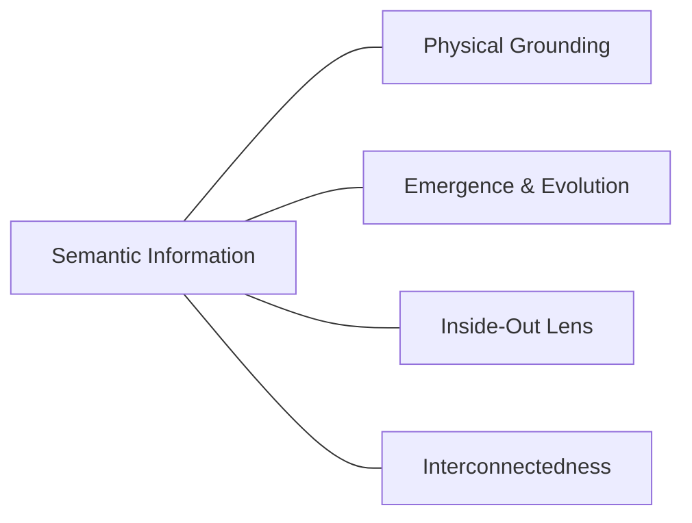

## VI. Core Principles in the Emergence of Semantic Information

- **Physical Grounding:** All forms of information, including [semantic information](../../glossary/S.md#semantic-information), remain instantiated in physical patterns (ultimately configurations of **[worldsheets](../../glossary/W.md#worldsheet)** organized at different scales and complexities).
- **Emergence and Evolution of Meaning:** Meaning evolves through the successive [emergence](../../glossary/E.md#emergence) of complex systems and their interactions with the world, grounded in their structural and functional properties.
- **Inside-Out Lens:** The "inside-out lens" of agents, shaped by their evolutionary history and individual experiences, plays a crucial role in interpreting and giving meaning to information.
- **Interconnectedness of Semantic Information:** Semantic information is interconnected and layered, with simpler, more fundamental forms of meaning providing the basis for more complex and abstract meanings.

**Summary:** This pathway illustrates how raw organizational patterns transform into rich semantic structures through successive stages of detection, representation, and symbolic abstraction, culminating in the complex, shared information systems that define human cognition.

*Stage VI takeaway: All semantic information remains grounded in physical patterns, structured by agents' lenses.*

---
[<< Previous: Full-Blown Semantics: Symbolic Systems & Shared Meaning](1a5-full-semantics.md) | [Up: Pattern Realism: Matter/Energy and Information as Complementary Lenses](../1-pattern-realism.md) | [Next: Tests, Falsification, and Framework Comparison >>](1a7-tests-comparisons.md)
