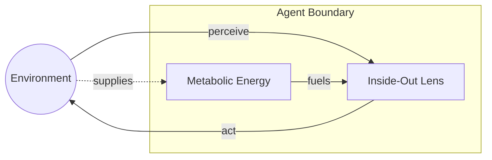
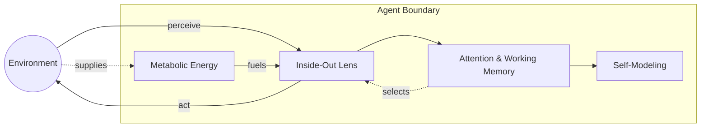
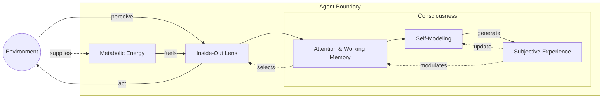

# ⚙️ 1.b. Emergence of Consciousness
<!-- markdownlint-disable MD036 -->
*Low Altitude Analysis*
<!-- markdownlint-enable MD036 -->

📍 **Altitude**: Low (0-1,000 feet) - Detailed Analysis

This section analyzes the emergence of consciousness in agents that have already achieved **autopoietic organization** and are **endogenously powered**—that is, they have crossed the [Engine Threshold](../04-information-systems/4d-host-information-interactions.md#the-engine-threshold-from-organizational-agency-to-agent-mediated-agency). The focus here is on the subsequent architectural transition to recursive self-examination.

## The Recursive Threshold

[**Consciousness**](../glossary/C.md#consciousness) emerges when the [**inside-out lens**](../glossary/I.md#inside-out-lens) architecture ([Section 3.a](../03-agents-as-information-processors/3a-inside-out-lens-self-preservation.md)) becomes **recursive**—applying its self-referential processing capabilities to its own operations.

This transition exemplifies Pattern Realism's [**outward stabilization propensity**](1-pattern-realism.md#pattern-stability-and-outward-stabilization): when **self-stabilizing patterns** achieve sufficient organizational coherence, they naturally extend their stability outward by incorporating themselves as objects of their own processing.

**Consciousness is recursion.** The inside-out lens examining itself.

### From External to Internal Self-Reference

Building on [Section 1.a's](1a-pathway-emergence/1a-pathway-emergence.md) semantic emergence, the inside-out lens initially processes:

- Environmental information relative to agent goals
- Threats and opportunities from an agent-centered perspective  
- Behavioral strategies for self-preservation

**The recursive threshold** occurs when this same architecture turns inward:

- **Processing states** become objects of semantic analysis
- **Internal dynamics** are interpreted through the same frameworks used for environmental navigation
- **The processor** becomes both subject and object within its own informational framework

#### Stage 0: Reactive Agent (No Self-Model)

#### Stage 1: Self-Modeling Agent (Pre-Recursive)

#### Stage 2: Recursive Consciousness (Full)

### Neural Substrate Requirements

Consciousness requires specific organizational thresholds where **autopoietic organization** supports recursive processing:

**Organizational Closure**: Pattern Realism's coordinated mechanisms (**boundary stabilization**, **template effects**, **structural recruitment**, **cascading order**) create **production closure**—organizational patterns stable enough to model their own maintenance.

**Thermodynamic Viability**: Recursive processing is metabolically expensive. Neural systems must achieve energy efficiency that makes self-examination sustainable alongside environmental navigation.

## The Bootstrap Solution

The classic bootstrap problem—how does a system develop self-reference without already possessing it?—dissolves when we recognize that **the inside-out lens architecture already exists** across agent types.

Consciousness doesn't create self-reference; it's what happens when **pre-existing self-reference becomes recursive**.

### Developmental Pathway

1. **Inside-Out Lens**: Self/non-self organization (bacteria → mammals)
2. **Sophisticated Self-Modeling**: Complex environmental navigation with rich self-representation  
3. **Recursive Threshold**: The architecture applies its self-referential processing to its own operations
4. **Consciousness**: Recursive self-examination as the qualitative signature of this transition

### Critical Mass Dynamics

Consciousness emerges through **phase transition** when **outward stabilization propensity** creates self-reinforcing recursive loops:

- Recursive processing becomes **stable and self-sustaining**
- Self-referential models achieve **sufficient accuracy** to guide behavior
- Meta-cognitive capabilities provide **adaptive advantages**
- **Subjective experience** emerges as the informational signature of recursive operations

## Consciousness as Recursive Architecture

### Fundamental Characteristics of Self-Stabilizing Patterns

Following Pattern Realism's principles, consciousness exhibits the fundamental characteristics of **self-stabilizing patterns**:

- **Phase transition**: Discontinuous emergence when recursive thresholds are reached, reflecting the **cascading order** principle from [Section 1](1-pattern-realism.md#pattern-stability-and-outward-stabilization).
- **Structural stability**: Conscious patterns maintain coherence through **boundary stabilization**, a mechanism that reduces local entropy and constrains neighboring patterns.
- **Template propagation**: Recursive self-modeling through coordinated Pattern Realism mechanisms, directly applying the **template effects** principle to guide the formation of similar patterns.
- **Critical dependencies**: Specific organizational substrates required for stable recursive operations, embodying the **structural recruitment** principle by organizing previously unstructured information.

### Empirical Implications

This recursive framework generates testable predictions:

- **Consciousness correlates** with neural signatures of recursive processing
- **Disrupting recursion** should alter conscious experience predictably
- **Artificial systems** achieving recursive self-examination should exhibit consciousness markers
- **Developmental consciousness** should emerge with recursive processing capabilities

## Bridge to Philosophical Analysis

This recursive foundation addresses the [**"Hard Problem" of Consciousness**](1c-hard-problem-of-consciousness.md) by:

- **Grounding consciousness** in measurable **recursive operations** rather than mysterious emergence
- **Explaining subjective experience** as the qualitative signature of recursive inside-out lens operations
- **Connecting mechanism to function**: Recursive self-examination serves adaptive purposes while generating the first-person perspective
- **Providing falsifiable predictions** about consciousness emergence and disruption

The recursive insight bridges scientific mechanism with philosophical phenomenology—consciousness emerges naturally from Pattern Realism's **outward stabilization propensity** when self-referential architectures achieve sufficient organizational coherence to examine themselves.

This provides the foundation for Section 1.c's philosophical analysis with concrete, measurable organizational principles rooted in the same **self-stabilizing patterns** that govern all reality.

---
[<< Previous: ⚙️ 1.a.7. Tests, Falsification, and Framework Comparison](1a-pathway-emergence/1a7-tests-comparisons.md) | [Up: 🔍 1. Pattern Realism: Matter/Energy and Information as Complementary Lenses](1-pattern-realism.md) | [Next: ⚙️ 1.c. Resolving the "Hard Problem" of Consciousness >>](1c-hard-problem-of-consciousness.md)
