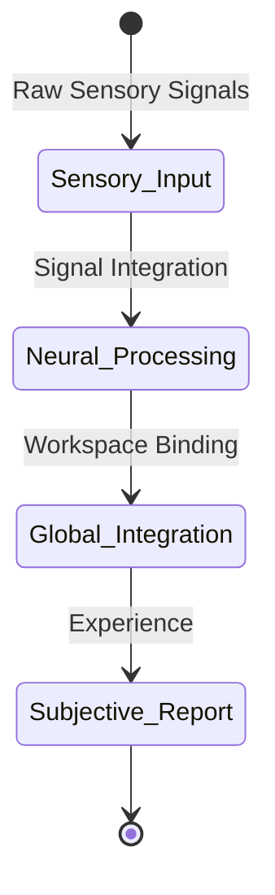

# ⚙️ 1.b. Emergence of Consciousness
*Low Altitude Analysis*

📍 **Altitude**: Low (0-1,000 feet) - Detailed Analysis

[Consciousness](../glossary.md#consciousness), particularly [self-awareness](../glossary.md#self-awareness) with its subjective qualities, is understood as a complex [**emergent property**](../glossary.md#emergent-property). It emerges from highly specific, complex patterns within this dynamic spacetime tapestry (i.e., advanced biological brains—a structure whose emergence from the fundamental 'brane'-like fabric of reality might playfully be termed “brain from brane”—as intricate sub-patterns of these fundamental traces). The "[inside-out lens](../glossary.md#inside-out-lens)" is how such a complex pattern of traces achieves self-awareness and structures *further* information for its own persistence.

---

[^ 1. Pattern Realism: Matter/Energy and Information as Complementary Lenses](1-pattern-realism.md)  

---
[<< Previous: **1.a. From Organizational Information to Semantic Information: A Pathway of Emergence**](1a-pathway-emergence.md) | [Up: 1. Pattern Realism: Matter/Energy and Information as Complementary Lenses](1-pattern-realism.md) | [Next: **1.c. Addressing the "Hard Problem" of Consciousness** >>](1c-hard-problem-of-consciousness.md)
