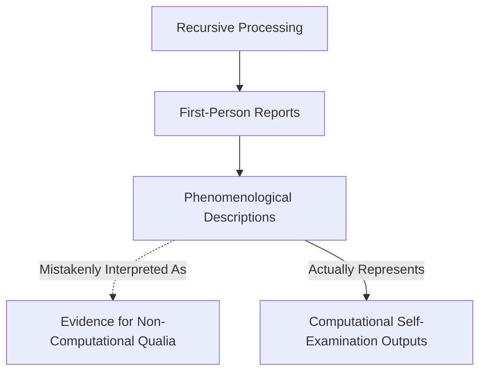

## Contents

- [1. The Traditional Problem Formulation](#1-the-traditional-problem-formulation)
- [2. Eliminating the Explanatory Gap](#2-eliminating-the-explanatory-gap)
- [3. Methodological Implications](#3-methodological-implications)

Building on [Section 1.b's](1b-emergence-of-consciousness.md) establishment of consciousness as recursive information processing, this section addresses the philosophical challenge of "subjective experience" and demonstrates why the traditional "hard problem" dissolves under closer examination.

## 1. The Traditional Problem Formulation

The "hard problem" of consciousness presupposes that physical processes generate subjective qualitative experiences ([qualia](../glossary/Q.md#qualia)) that constitute a distinct explanatory target beyond functional information processing.

The conventional approach assumes consciousness involves **two distinct phenomena**:

1. Information processing (measurable, functional)
2. Subjective experience (unmeasurable, qualitative)

**This framework proposes a more parsimonious alternative.** Following principles of scientific methodology, if subjective experience produces no detectable effects beyond those explained by recursive information processing, and generates no additional predictive power, then the most economical explanation is that consciousness consists entirely of the recursive processing established in [Section 1.b](1b-emergence-of-consciousness.md).

This approach parallels Carl Sagan's invisible dragon thought experiment: when a phenomenon leaves no measurable trace beyond what is already explained by known processes, parsimony suggests the additional phenomenon may be conceptually unnecessary.

## 2. Eliminating the Explanatory Gap

The recursive processing account from [Section 1.b](1b-emergence-of-consciousness.md) fully explains consciousness phenomena without requiring additional non-computational supplements:

### Philosophical Reframing

**Traditional Gap**: How does recursive processing *generate* subjective experience?

**Eliminative Solution**: Recursive processing *constitutes* subjective experience—there is no additional phenomenon requiring generation.

### Phenomenological Reports as Computational Outputs

**Reports of "qualia"** represent natural outputs of recursive information processing architectures examining their own discriminative states, not evidence for non-computational phenomena:

- **"Redness" of red** = Computational state of recursive self-examination when processing specific wavelength discriminations
- **"Painfulness" of pain** = Recursive processing examining its own threat-detection and damage-response computations
- **"What-it's-likeness"** = First-person perspective generated by recursive self-examination architecture

### Theoretical Integration

This eliminates the explanatory gap by recognizing that consciousness phenomena are fully captured by the recursive computational architectures detailed in [Section 1.b](1b-emergence-of-consciousness.md):

- **Self-reports of experience** = Computational outputs of recursive self-examination
- **Subjective perspective** = First-person computational architecture
- **Phenomenological richness** = Sophistication of recursive processing operations

No additional theoretical commitments required.

## 3. Methodological Implications

### Scientific Standards for Consciousness Claims

This framework establishes clear methodological criteria for evaluating consciousness theories:

**Claims regarding consciousness phenomena beyond recursive information processing require:**

1. **Operational definitions** specifying measurable characteristics distinct from computational processes
2. **Independent verification** demonstrating existence apart from recursive processing effects
3. **Causal specification** identifying unique contributions beyond those explained by recursive architectures
4. **Falsifiable predictions** enabling empirical discrimination from purely computational accounts

### Comparative Framework Analysis

This eliminative approach distinguishes itself from other consciousness theories:

- **Global Workspace Theory**: Incorporates information integration while maintaining that recursive self-examination constitutes rather than generates consciousness
- **Integrated Information Theory**: Acknowledges information integration measures while rejecting claims that integration plus additional "experience" equals consciousness
- **Higher-Order Thought Theories**: Aligns with recursive self-examination framework while eliminating postulated non-computational subjective additions

### Research Implications

**Focus on Measurable Phenomena**: Rather than seeking neural correlates of unmeasurable "subjective experience," research should investigate the recursive processing architectures that constitute consciousness, as detailed in [Section 1.b](1b-emergence-of-consciousness.md).

**Eliminate Philosophical Confusion**: The hard problem represents conceptual confusion rather than genuine scientific challenge—dissolving it enables productive empirical investigation.

## Conclusion

The traditional "hard problem" dissolves when consciousness is recognized as consisting entirely of the recursive information processing established in [Section 1.b](1b-emergence-of-consciousness.md), without requiring additional non-computational phenomena.

**Phenomenological reports** reflect the first-person perspective of recursive computational architectures examining themselves, rather than evidence for mysterious subjective additions to physical processes.

This eliminative approach enables rigorous scientific investigation by focusing research on measurable recursive processing mechanisms rather than unmeasurable philosophical postulates.

---

**Summary:** The "hard problem" represents conceptual confusion arising from unwarranted assumptions about consciousness requiring non-computational supplements. Consciousness consists entirely of recursive self-examination, eliminating explanatory gaps and enabling systematic empirical research.

---

[^ 1. Pattern Realism: Matter/Energy and Information as Complementary Lenses](1-pattern-realism.md)

---
[<< Previous: Emergence of Consciousness](1b-emergence-of-consciousness.md) | [Up: Pattern Realism: Matter/Energy and Information as Complementary Lenses](1-pattern-realism.md) | [Next: Oneness, Interconnectedness, and the Nature of Distinctions >>](../02-oneness-interconnectedness/2-oneness-interconnectedness.md)
