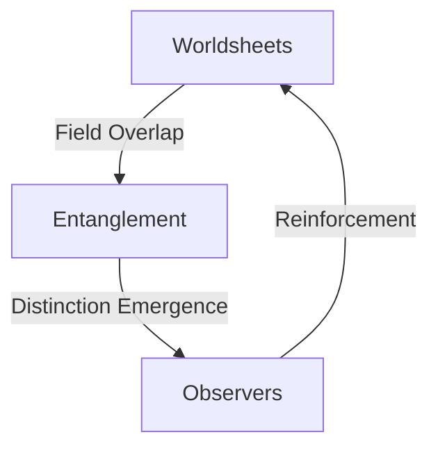

# **2. Oneness, Interconnectedness, and the Nature of Distinctions**

## Table of Contents
- [2.1 Overview of Oneness](#21-overview-of-oneness)
- [2.2 Worldsheets and Interactions](#22-worldsheets-and-interactions)
- [2.3 Reconciling Unity and Distinction](#23-reconciling-unity-and-distinction)

## 2.1 Overview of Oneness
The universe is fundamentally a single, interconnected whole. This entirety can be conceptualized as a continuous, dynamic tapestry of interacting [**worldsheets**](../glossary.md#worldsheet).

## 2.2 Worldsheets and Interactions
All **worldsheets** exist within the same spacetime continuum and can influence each other through emergent field interactions, propagating effects across scales.

## 2.3 Reconciling Unity and Distinction
Even as these interactions maintain universal oneness, localized informational patterns give rise to emergent and subjective distinctions (see [2.a.](2a-emergent-subjective-distinctions.md) and [2.b.](2b-reconciling-oneness-and-competition.md)). This interplay underpins both harmonious coherence and dynamic differentiation within the fabric of reality.

---

**Dive deeper:**
- [2.a. Emergent and Subjective Distinctions within a Structured Whole](2a-emergent-subjective-distinctions.md)
- [2.b. Reconciling Oneness with Competition](2b-reconciling-oneness-and-competition.md)

---

[^ Overview](../../README.md)

---
[<< Previous: **1.c. Addressing the "Hard Problem" of Consciousness**](../01-pattern-realism/1c-hard-problem-of-consciousness.md) | [Home: README.md](../../README.md) | [Glossary: glossary.md](../glossary.md) | [Next: **2. a. Emergent and Subjective Distinctions within a Structured Whole** >>](2a-emergent-subjective-distinctions.md)
