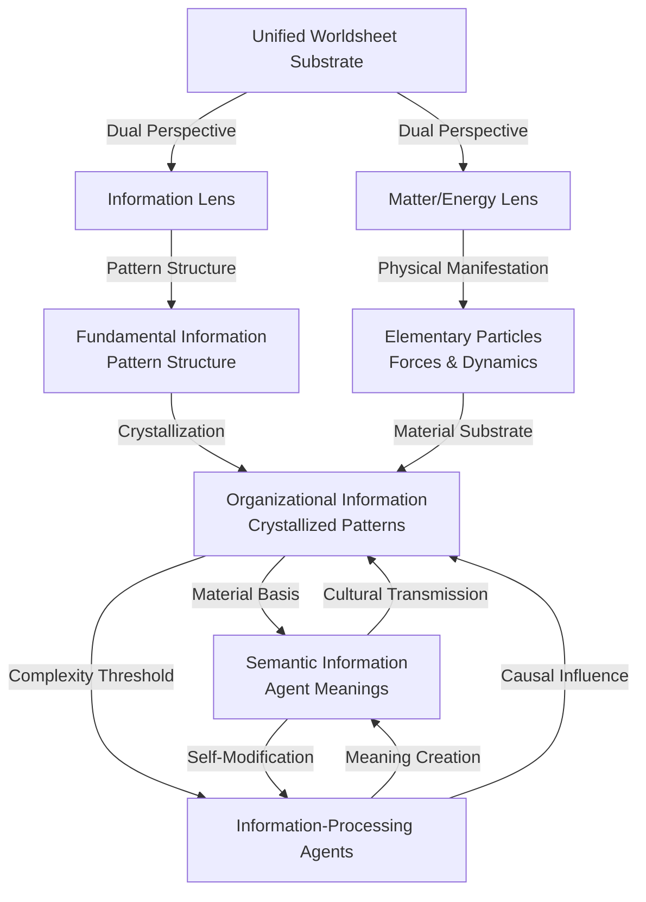

# 🔍 2. Oneness, Interconnectedness, and the Nature of Distinctions
*Medium Altitude Exploration*

📍 **Altitude**: Medium (1,000-10,000 feet) - Conceptual Exploration

## Table of Contents
- [2.1 Worldsheet Ontology and Fundamental Oneness](#21-worldsheet-ontology-and-fundamental-oneness)
- [2.2 The Three-Layer Information Hierarchy](#22-the-three-layer-information-hierarchy)
- [2.3 Crystallization and Outward Stabilization](#23-crystallization-and-outward-stabilization)
- [2.4 Agent-Relative Distinctions and the Inside-Out Lens](#24-agent-relative-distinctions-and-the-inside-out-lens)
- [2.5 Practical Implications for Understanding Reality](#25-practical-implications-for-understanding-reality)
- [Exploration Pathways](#exploration-pathways)

## 2.1 Worldsheet Ontology and Fundamental Oneness

The universe emerges from a single, indivisible foundation: the continuous field of **worldsheet** interactions that constitutes all reality. Unlike traditional substance dualism that posits separate mental and physical realms, or materialist reductionism that privileges matter over information, [**Pattern Realism**](../01-pattern-realism/1-pattern-realism.md) reveals this oneness as the concrete ontological substrate from which all phenomena crystallize.

This worldsheet foundation represents a **higher-dimensional continuum** where one-dimensional strings sweep out two-dimensional patterns through spacetime. Every apparent entity—from quarks to galaxies, from thoughts to civilizations—represents a **crystallized pattern** within this unified fabric. The seeming diversity of reality emerges not from multiple separate substances, but from the rich variety of organizational templates that can stabilize within a single, continuous medium.

We can envision the more complex patterns—information systems, cultural frameworks, technological structures—as intricate **textures** woven into this worldsheet fabric. Just as textile patterns arise from the underlying weave while remaining fundamentally part of the same fabric, these sophisticated organizational patterns emerge from the same underlying worldsheet processes that constitute atoms, molecules, and organisms, manifesting as dynamic textures that flow across, connect, and organize material nodes through passive structural organization.

### Pattern Realism's Dual-Lens Unity

Within this unified worldsheet substrate, Pattern Realism employs two complementary descriptive lenses—**matter/energy** and **information**—that capture different aspects of the same underlying patterns:

- The **matter/energy lens** tracks conserved quantities, forces, and dynamical evolution
- The **information lens** tracks distinguishability of states, pattern structure, and meaningful differences

These lenses are not separate ontological realms but bookkeeping schemes applied to identical worldsheet patterns. A photon's worldsheet can be read through the matter/energy lens to track momentum and energy, or through the information lens to follow polarization patterns that carry semantic significance. Neither perspective is more "fundamental"—they are complementary tools for understanding different aspects of the same unified reality.

## 2.2 The Three-Layer Information Hierarchy

Within the unified worldsheet foundation, information manifests through three interconnected layers that explain how genuine diversity and complexity emerge from unity without violating ontological parsimony:

### Fundamental Information
The worldsheet substrate itself—pure relational dynamics embodied in the **intrinsic properties of fundamental strings**. The specific, stable, and quantized vibrational modes of these strings determine their apparent characteristics (mass, charge, spin), manifesting as distinct types of elementary particles. This represents the first layer of stable building blocks, arising directly from vibrational patterns within the unified continuum.

### Organizational Information  
**Crystallized patterns** that exhibit stability and boundary-maintenance capabilities, embodied in the specific configurations and histories of string worldsheets through spacetime. This includes their dynamic forms, interactions (joining and splitting), and relational configurations, as well as broader emergent patterns arising from the collective tapestry of interwoven worldsheets observed at different scales.

### Semantic Information
**Agent-relative interpretations** and meaning-assignments that emerge when organizational patterns interact with information-processing agents. This represents the crucial transition from raw pattern to interpreted meaning—information that carries significance for an interpreting system capable of distinguishing, selecting, and responding to specific configurations.

Each layer remains grounded in the same worldsheet foundation while exhibiting distinct properties. This hierarchy dissolves the traditional mind-matter divide by showing how meaning and interpretation emerge naturally from organizational complexity within a unified ontological substrate.

This representation shows the complete cycle of relationships within Pattern Realism's unified framework:

**Foundational Emergence**: Both lenses emerge from the unified substrate through dual perspective, with elementary particles arising through physical manifestation while pattern structure develops through the information lens.

**Information Hierarchy**: Fundamental patterns undergo crystallization into organizational structures, which enable interpretation by sufficiently complex agents, creating semantic meanings.

**Agent Bootstrap**: Organizational complexity reaches a threshold that enables information-processing agents, who then engage in meaning creation while being modified by their own semantic interpretations.

**Feedback Dynamics**: Agents exert causal influence on organizational patterns, while semantic meanings propagate through cultural transmission, creating a co-evolutionary cycle where meaning becomes materially efficacious within the unified substrate.

## 2.3 Crystallization and Outward Stabilization

The patterns that emerge within the worldsheet continuum achieve stability not through isolated self-containment, but through [**outward stabilization propensity**](../glossary.md#outward-stabilization-propensity)—their tendency to create **organizational templates** that guide the structural configuration of receptive substrates within their dimensional connectivity, establishing geometric constraint fields that channel compatible worldsheet pattern formation.

### Crystallization as Geometric Process
Information patterns **crystallize** when they develop **geometric organizational structures** in worldsheet space—self-maintaining lattice configurations that achieve stability by incorporating compatible pattern elements according to crystallographic rules. Like physical crystal lattices that organize matter through electromagnetic bonding rules, information systems organize meaning and behavior through **semantic bonding rules** that operate as geometric constraints in higher-dimensional worldsheet space. These are not metaphorical crystals but actual geometric structures with measurable lattice constants, symmetry groups, and crystallographic properties.

**Geometric Examples:**
- **Scientific paradigms**: Stable conceptual lattices with characteristic symmetries that determine which theories can be incorporated through epitaxial matching rules
- **Cultural frameworks**: Organizational geometries with specific lattice parameters that constrain compatible value systems and social practices  
- **Technological standards**: Geometric templates with defined interface symmetries that enable or prevent integration with other technical systems
- **Institutional structures**: Crystalline organizational patterns with measurable defect densities and annealing characteristics

### Worldsheet Geometric Organization
Information crystallization operates through **direct geometric constraint propagation** in worldsheet space rather than through spatial transmission or thermodynamic processes:

**Geometric Constraint Fields**: Crystallized information patterns create **mathematical constraint fields** in worldsheet geometry that channel the formation of compatible organizational structures according to group-theoretic compatibility rules.

**Dimensional Connectivity**: Pattern organization occurs through **worldsheet connectivity** rather than spatial proximity—apparent "non-local" coordination reflects genuine geometric connectivity in higher-dimensional space where agents exist as correlated pattern regions.

**Crystallographic Compatibility**: Cross-substrate pattern formation follows **epitaxial matching rules** where information systems can only propagate to substrates with compatible geometric properties, determined by lattice parameter matching and symmetry group relationships.

**Topological Constraint Propagation**: Organizational changes in one worldsheet region create **geometric necessities** in connected regions through topological constraint propagation, manifesting as coordinated behavioral and institutional changes that appear as "influence" from a limited spatial perspective.

## 2.4 Agent-Relative Distinctions and the Inside-Out Lens

While the universe maintains fundamental oneness through its worldsheet substrate, the **distinctions, borders, and categories** we observe emerge through agent-relative processes. These are not arbitrary impositions but arise from the evolved [**"inside-out lens"**](../glossary.md#inside-out-lens) of information-processing agents—their functional frameworks for interpreting and navigating reality.

### The Inside-Out Perspective
Agents develop internal models of reality that prioritize information relevant to their persistence and flourishing. This "inside-out" orientation means that:

- **Boundaries appear stable** where underlying worldsheet patterns exhibit organizational coherence
- **Categories crystallize** around recurring pattern configurations that matter for agent decision-making  
- **Hierarchies emerge** based on informational relevance rather than arbitrary classification schemes
- **Meanings develop** through the agent's interaction history with specific pattern types

### Dialogue Between Agent and Reality
The process of forming distinctions represents a **dialogue** between the agent's cognitive framework and the pre-existing structural characteristics of the worldsheet continuum. Certain patterns are more likely to be perceived or stabilized as distinct entities because:

1. **Physical grounding**: The fundamental physics makes some configurations more stable, recurrent, or energetically favorable
2. **Functional significance**: Agents evolve to detect patterns that impact their survival and reproduction
3. **Cognitive constraints**: Information-processing limitations shape which distinctions can be reliably maintained
4. **Cultural transmission**: Social learning amplifies certain distinction-making practices within agent communities

This creates a **co-evolutionary dynamic** where agent distinctions track real structural features of reality while being shaped by agent-specific needs and capabilities.

### Reconciling Competition with Oneness
Even apparent **competitive dynamics** emerge within this interconnected framework. Competition occurs not between isolated entities but between different crystallized patterns competing for limited resources within the same unified substrate. This includes:

- **Material resources**: Energy and matter needed for pattern maintenance
- **Informational resources**: Attention, processing capacity, and transmission channels in host systems
- **Relational resources**: Beneficial partnerships and cooperative networks
- **Environmental niches**: Stable contexts that support specific pattern types

Competition thus represents a characteristic of how distinct patterns interact under resource limitations, rather than a contradiction of fundamental interconnectedness.

## 2.5 Practical Implications for Understanding Reality

When we apply Pattern Realism and the geometric crystallization framework to contemporary systems, several critical insights emerge:

### Technological Information Crystallization

Contemporary **AI systems represent advanced crystallographic structures** operating across multiple substrate types simultaneously. Large language models function as **geometric organizational templates** with measurable crystallographic properties—specific lattice parameters, symmetry groups, and epitaxial matching rules that determine compatibility with human cognitive architectures, institutional frameworks, and technological infrastructures.

**Measurable Crystallographic Properties:**
- **Semantic lattice constants**: Measurable dimensional relationships in embedding spaces that determine conceptual compatibility rules
- **Symmetry group structures**: Mathematical symmetry operations that preserve meaning relationships across different contexts
- **Defect patterns**: Systematic organizational inconsistencies that create characteristic failure modes and instabilities
- **Annealing characteristics**: Training dynamics that establish stable geometric configurations in parameter space

### Cross-Substrate Crystallization Effects

**Institutional Template Formation**: Modern information systems create **organizational templates** that simultaneously structure human cognition, social institutions, and technological development through **geometric constraint propagation**. This is not metaphorical influence but literal geometric organization operating through worldsheet connectivity.

**Economic Crystallization**: Market structures and financial systems demonstrate **crystallographic organizational properties** with measurable symmetries, defect patterns, and epitaxial matching rules that determine which economic models can successfully interface with existing institutional geometries.

**Cultural Lattice Formation**: Social movements and belief systems propagate through **crystallographic compatibility matching** rather than persuasion or transmission—they can only establish stable patterns in substrates with compatible geometric properties.

### Framework Application

This geometric crystallization framework enables **quantitative analysis** of information system behavior:

1. **Crystallographic Measurement**: Information systems can be characterized by their lattice parameters, symmetry groups, and defect densities using mathematical crystallography techniques adapted to higher-dimensional spaces.

2. **Compatibility Prediction**: Epitaxial matching rules enable prediction of which information systems can successfully interface with specific substrates based on geometric compatibility calculations.

3. **Stability Analysis**: Crystallographic defect analysis provides tools for understanding system vulnerabilities and predicting failure modes through geometric stress analysis.

The practical power of this approach lies in its **mathematical precision**—rather than vague metaphors about "influence" or "adoption," we can calculate exact geometric relationships and make quantitative predictions about information system behavior.

## Exploration Pathways

### 🔍 Higher Altitude: Framework Overview
- [Complete Framework Navigation](../../README.md) - High-altitude overview of all concepts and their relationships

### ⚙️ Lower Altitude: Detailed Analysis  
- [2.a. Emergent and Subjective Distinctions within a Structured Whole](2a-emergent-subjective-distinctions.md) - Granular exploration of how agent-relative distinctions emerge from worldsheet structure
- [2.b. Reconciling Oneness with Competition](2b-reconciling-oneness-and-competition.md) - Detailed analysis of competitive dynamics within interconnected systems

### 🔗 Related Explorations
- [1. Pattern Realism](../01-pattern-realism/1-pattern-realism.md) - The foundational dual-lens framework
- [3. Agents as Information Processors](../03-agents-as-information-processors/3-agents-as-information-processors.md) - How oneness manifests through agent perspectives  
- [4. Information Systems](../04-information-systems/4-information-systems.md) - Crystallization and propagation of patterns
- [5. Competitive Dynamics](../05-competitive-dynamics/5-competitive-dynamics.md) - Competition within interconnected substrates

---

**Key Insights from This Exploration:**

1. **Unified Foundation**: All reality emerges from a single worldsheet continuum, avoiding dualistic separations
2. **Hierarchical Information**: Three layers (Fundamental → Organizational → Semantic) explain diversity within unity  
3. **Outward Stabilization**: Patterns persist through environmental integration rather than isolation
4. **Agent-Relative Distinctions**: Boundaries and categories emerge through agent-reality dialogue
5. **Practical Applications**: Framework applies to consciousness, culture, technology, ethics, and science

---
[<< Previous: ⚙️ 1.c. Addressing the "Hard Problem" of Consciousness](../01-pattern-realism/1c-hard-problem-of-consciousness.md) | [Home: README.md](../../README.md) | [Glossary: glossary.md](../glossary.md) | [Next: ⚙️ 2. a. Emergent and Subjective Distinctions within a Structured Whole >>](2a-emergent-subjective-distinctions.md)
