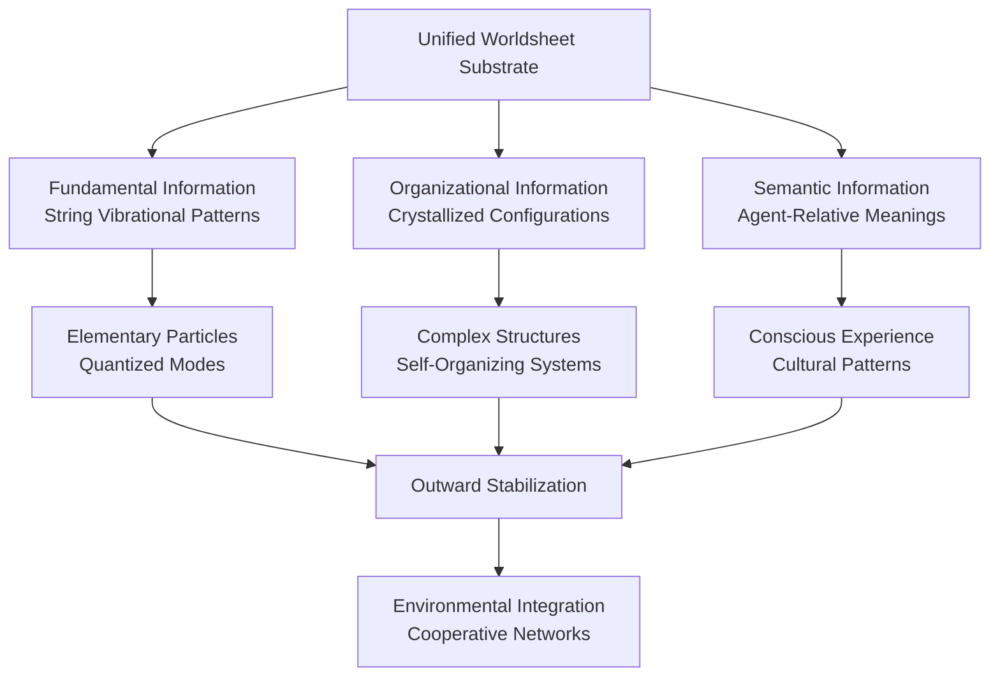

# 🔍 2. Oneness, Interconnectedness, and the Nature of Distinctions
*Medium Altitude Exploration*

📍 **Altitude**: Medium (1,000-10,000 feet) - Conceptual Exploration

## Table of Contents
- [2.1 Worldsheet Ontology and Fundamental Oneness](#21-worldsheet-ontology-and-fundamental-oneness)
- [2.2 The Three-Layer Information Hierarchy](#22-the-three-layer-information-hierarchy)
- [2.3 Crystallization and Outward Stabilization](#23-crystallization-and-outward-stabilization)
- [2.4 Agent-Relative Distinctions and the Inside-Out Lens](#24-agent-relative-distinctions-and-the-inside-out-lens)
- [2.5 Implications for Understanding Reality](#25-implications-for-understanding-reality)
- [Exploration Pathways](#exploration-pathways)

## 2.1 Worldsheet Ontology and Fundamental Oneness

The universe emerges from a single, indivisible foundation: the continuous field of **worldsheet** interactions that constitutes all reality. Unlike traditional substance dualism that posits separate mental and physical realms, or materialist reductionism that privileges matter over information, [**Pattern Realism**](../01-pattern-realism/1-pattern-realism.md) reveals this oneness as the concrete ontological substrate from which all phenomena crystallize.

This worldsheet foundation represents a **higher-dimensional continuum** where one-dimensional strings sweep out two-dimensional patterns through spacetime. Every apparent entity—from quarks to galaxies, from thoughts to civilizations—represents a **crystallized pattern** within this unified fabric. The seeming diversity of reality emerges not from multiple separate substances, but from the rich variety of patterns that can stabilize within a single, continuous medium.

### Pattern Realism's Dual-Lens Unity

Within this unified worldsheet substrate, Pattern Realism employs two complementary descriptive lenses—**matter/energy** and **information**—that capture different aspects of the same underlying patterns:

- The **matter/energy lens** tracks conserved quantities, forces, and dynamical evolution
- The **information lens** tracks distinguishability of states, pattern structure, and meaningful differences

These lenses are not separate ontological realms but bookkeeping schemes applied to identical worldsheet patterns. A photon's worldsheet can be read through the matter/energy lens to track momentum and energy, or through the information lens to follow polarization patterns that carry semantic significance. Neither perspective is more "fundamental"—they are complementary tools for understanding different aspects of the same unified reality.

## 2.2 The Three-Layer Information Hierarchy

Within the unified worldsheet foundation, information manifests through three interconnected layers that explain how genuine diversity and complexity emerge from unity without violating ontological parsimony:

### Fundamental Information
The worldsheet substrate itself—pure relational dynamics embodied in the **intrinsic properties of fundamental strings**. The specific, stable, and quantized vibrational modes of these strings determine their apparent characteristics (mass, charge, spin), manifesting as distinct types of elementary particles. This represents the first layer of stable building blocks, arising directly from vibrational patterns within the unified continuum.

### Organizational Information  
**Crystallized patterns** that exhibit stability and boundary-maintenance capabilities, embodied in the specific configurations and histories of string worldsheets through spacetime. This includes their dynamic forms, interactions (joining and splitting), and relational configurations, as well as broader emergent patterns arising from the collective tapestry of interwoven worldsheets observed at different scales.

### Semantic Information
**Agent-relative interpretations** and meaning-assignments that emerge when organizational patterns interact with information-processing agents. This represents the crucial transition from raw pattern to interpreted meaning—information that carries significance for an interpreting system capable of distinguishing, selecting, and responding to specific configurations.

Each layer remains grounded in the same worldsheet foundation while exhibiting distinct properties. This hierarchy dissolves the traditional mind-matter divide by showing how meaning and interpretation emerge naturally from organizational complexity within a unified ontological substrate.

## 2.3 Crystallization and Outward Stabilization

The patterns that emerge within the worldsheet continuum achieve stability not through isolated self-containment, but through [**outward stabilization propensity**](../glossary.md#outward-stabilization-propensity)—their tendency to maintain coherence by establishing beneficial relationships with their environment.

### Crystallization Mechanisms
Patterns **crystallize** when they develop self-reinforcing structures that persist through time. Unlike static crystals in physical chemistry, these informational crystals are dynamic processes that maintain their organization through continuous interaction with their surroundings. Examples include:

- **Subatomic particles**: Stable vibrational modes that persist through quantum field interactions
- **Biological organisms**: Self-organizing metabolic networks that maintain identity through material exchange
- **Information systems**: Cultural patterns, languages, and technologies that propagate through host interactions
- **Agent networks**: Social structures and institutions that stabilize through cooperative dynamics

### Environmental Integration
Rather than existing as isolated entities, crystallized patterns integrate with their environments through multiple mechanisms:

- **Resource flow**: Exchanging energy, matter, and information to maintain organizational integrity
- **Feedback loops**: Responding to environmental changes while maintaining core pattern identity  
- **Cooperative dynamics**: Forming mutually beneficial relationships with other crystallized patterns
- **Adaptive evolution**: Modifying peripheral features while preserving essential organizational structure

This outward orientation explains how individual patterns can maintain distinct identities while remaining fundamentally interconnected within the broader worldsheet fabric.

## 2.4 Agent-Relative Distinctions and the Inside-Out Lens

While the universe maintains fundamental oneness through its worldsheet substrate, the **distinctions, borders, and categories** we observe emerge through agent-relative processes. These are not arbitrary impositions but arise from the evolved [**"inside-out lens"**](../glossary.md#inside-out-lens) of information-processing agents—their functional frameworks for interpreting and navigating reality.

### The Inside-Out Perspective
Agents develop internal models of reality that prioritize information relevant to their persistence and flourishing. This "inside-out" orientation means that:

- **Boundaries appear stable** where underlying worldsheet patterns exhibit organizational coherence
- **Categories crystallize** around recurring pattern configurations that matter for agent decision-making  
- **Hierarchies emerge** based on informational relevance rather than arbitrary classification schemes
- **Meanings develop** through the agent's interaction history with specific pattern types

### Dialogue Between Agent and Reality
The process of forming distinctions represents a **dialogue** between the agent's cognitive framework and the pre-existing structural characteristics of the worldsheet continuum. Certain patterns are more likely to be perceived or stabilized as distinct entities because:

1. **Physical grounding**: The fundamental physics makes some configurations more stable, recurrent, or energetically favorable
2. **Functional significance**: Agents evolve to detect patterns that impact their survival and reproduction
3. **Cognitive constraints**: Information-processing limitations shape which distinctions can be reliably maintained
4. **Cultural transmission**: Social learning amplifies certain distinction-making practices within agent communities

This creates a **co-evolutionary dynamic** where agent distinctions track real structural features of reality while being shaped by agent-specific needs and capabilities.

### Reconciling Competition with Oneness
Even apparent **competitive dynamics** emerge within this interconnected framework. Competition occurs not between isolated entities but between different crystallized patterns competing for limited resources within the same unified substrate. This includes:

- **Material resources**: Energy and matter needed for pattern maintenance
- **Informational resources**: Attention, processing capacity, and transmission channels in host systems
- **Relational resources**: Beneficial partnerships and cooperative networks
- **Environmental niches**: Stable contexts that support specific pattern types

Competition thus represents a characteristic of how distinct patterns interact under resource limitations, rather than a contradiction of fundamental interconnectedness.

## 2.5 Implications for Understanding Reality

This oneness-grounded framework has profound implications for how we understand diverse phenomena:

### Consciousness and Experience
Rather than being mysterious additions to physical reality, consciousness and subjective experience represent the **semantic information layer** emerging from sufficient organizational complexity. The "hard problem" of consciousness dissolves when we recognize that experiential qualities are not separate from but integral to certain organizational patterns within the worldsheet continuum.

### Social and Cultural Phenomena  
Societies, cultures, and institutions represent **large-scale crystallized patterns** that achieve stability through outward integration with human agents and environmental resources. Their apparent autonomy emerges from their organizational coherence rather than from separate metaphysical status.

### Technology and AI Systems
Artificial intelligence and technological systems represent **novel crystallization patterns** within the same worldsheet substrate. As these systems develop more sophisticated organizational structures, they exhibit increasing degrees of agency and semantic processing capabilities—not as simulations of "real" intelligence but as genuine participants in the information hierarchy.

### Ethical and Value Systems
Moral frameworks and value systems represent **competing informational patterns** that crystallize through social transmission and practical application. Their legitimacy derives not from transcendent authority but from their capacity to promote beneficial coordination and flourishing within interconnected agent networks.

### Scientific Understanding
Science itself represents a **collective crystallization process** where human agents develop increasingly accurate and useful models of worldsheet patterns. Scientific theories succeed by tracking real structural features while being constrained by cognitive and cultural factors that shape how knowledge crystallizes and propagates.

## Exploration Pathways

### 🔍 Higher Altitude: Framework Overview
- [Complete Framework Navigation](../../README.md) - High-altitude overview of all concepts and their relationships

### ⚙️ Lower Altitude: Detailed Analysis  
- [2.a. Emergent and Subjective Distinctions within a Structured Whole](2a-emergent-subjective-distinctions.md) - Granular exploration of how agent-relative distinctions emerge from worldsheet structure
- [2.b. Reconciling Oneness with Competition](2b-reconciling-oneness-and-competition.md) - Detailed analysis of competitive dynamics within interconnected systems

### 🔗 Related Explorations
- [1. Pattern Realism](../01-pattern-realism/1-pattern-realism.md) - The foundational dual-lens framework
- [3. Agents as Information Processors](../03-agents-as-information-processors/3-agents-as-information-processors.md) - How oneness manifests through agent perspectives  
- [4. Information Systems](../04-information-systems/4-information-systems.md) - Crystallization and propagation of patterns
- [5. Competitive Dynamics](../05-competitive-dynamics/5-competitive-dynamics.md) - Competition within interconnected substrates

---

**Key Insights from This Exploration:**

1. **Unified Foundation**: All reality emerges from a single worldsheet continuum, avoiding dualistic separations
2. **Hierarchical Information**: Three layers (Fundamental → Organizational → Semantic) explain diversity within unity  
3. **Outward Stabilization**: Patterns persist through environmental integration rather than isolation
4. **Agent-Relative Distinctions**: Boundaries and categories emerge through agent-reality dialogue
5. **Practical Applications**: Framework applies to consciousness, culture, technology, ethics, and science

---

[<< Previous: ⚙️ 1.c. Addressing the "Hard Problem" of Consciousness](../01-pattern-realism/1c-hard-problem-of-consciousness.md) | [Home: Framework Overview](../../README.md) | [Next: ⚙️ 2.a. Emergent and Subjective Distinctions >>](2a-emergent-subjective-distinctions.md)
