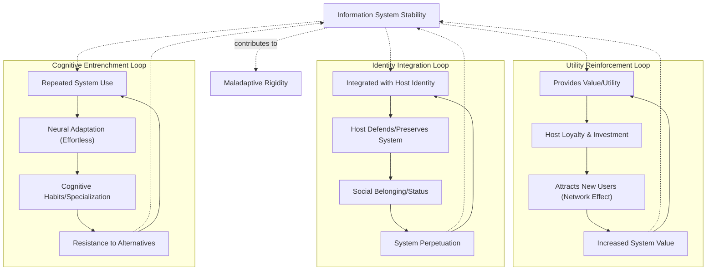
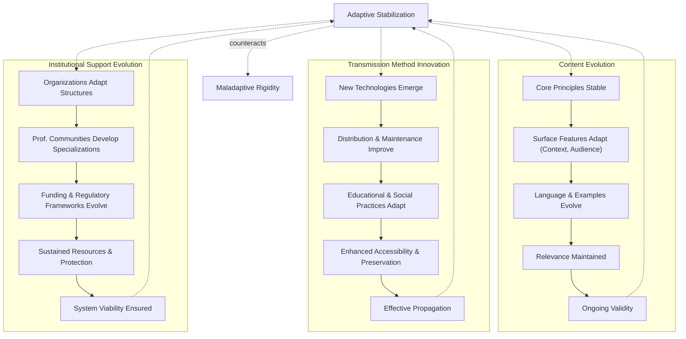
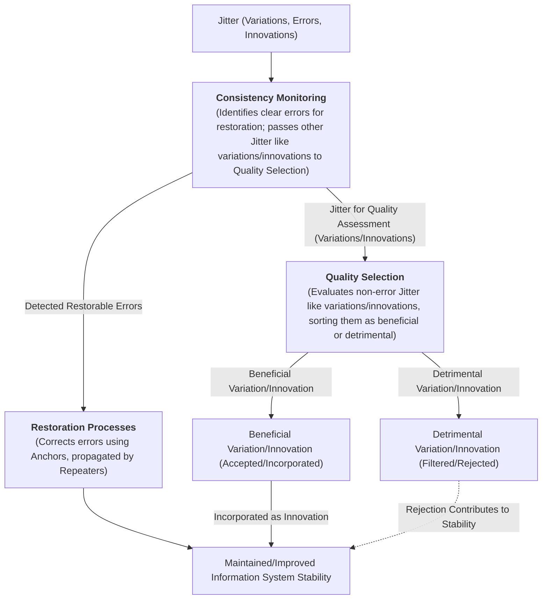

# ⚙️ 4.b.1. Mechanisms of Emergent Stability
<!-- markdownlint-disable MD036 -->
*Low Altitude Analysis*
<!-- markdownlint-enable MD036 -->

📍 **Altitude**: Low (0-1,000 feet) - Detailed Analysis

[Information systems](../../glossary/I.md#information-system) achieve and maintain stability not as a static state, but through dynamic, ongoing processes—a concept central to fields like **Systems Theory**, which examines how feedback loops, interconnected components, and emergent properties contribute to the behavior and persistence of complex entities. This is a specific manifestation of a broader principle observed across various scales, where [self-stabilizing patterns](../../glossary/S.md#self-stabilizing-patterns) (a concept from Pattern Realism) tend to preserve and propagate themselves. Central to this in the context of [information systems](../../glossary/I.md#information-system) is the concept of [**value**](../../glossary/V.md#value-of-an-information-system) and [**utility**](../../glossary/U.md#utility-of-an-information-system) they provide to their hosts.

The material actualization of these dynamic processes, including the formation and persistence of [self-stabilizing patterns](../../glossary/S.md#self-stabilizing-patterns), can be understood through the **Repeater/Jitter/Anchor (R/J/A) model** (detailed in [Section 4.a.1](../4a-material-organization-dynamics.md#4a1-the-repeaterjitteranchor-model)). This model explains how information systems are physically transmitted and amplified (**Repeaters**), how they incorporate variation and innovation (**Jitter**), and how they maintain fidelity and stability (**Anchors**). The mechanisms of emergent stability discussed below often rely on specific configurations and interactions of these R/J/A components.

* **Value:** In the context of an [information system (IS)](../../glossary/I.md#information-system), [**value**](../../glossary/V.md#value-of-an-information-system) refers to the overall perceived or actualized benefit that the IS provides to its host (typically an [agent](../../glossary/A.md#agent) or a collective of agents). This benefit is assessed through the host's "inside-out lens" ([Section 3a](../../03-agents-as-information-processors/3a-inside-out-lens-self-preservation.md)) and can encompass a wide range of contributions, such as enhancing the host's understanding, facilitating goal achievement, improving persistence, increasing its perceived [**coherence**](../../glossary/C.md#coherence-of-an-information-system) (internal consistency and logical integrity of the IS itself), or fulfilling social or psychological needs. Value is often multifaceted and can be subjective.
* **Utility:** [**Utility**](../../glossary/U.md#utility-of-an-information-system) is a more specific dimension of value, representing the practical effectiveness and efficiency with which an IS enables a host to perform a particular task, solve a specific problem, or achieve a defined objective. It measures the functional "usefulness" of the IS in a given context. An IS with high utility directly contributes to the host's operational capabilities.

These factors are critical in driving the feedback loops that reinforce an IS's presence and influence.

## **4.b.1.1. [Self-Reinforcing Feedback Loops](../../glossary/S.md#self-reinforcing-feedback-loops-in-information-systems)**

[Information systems](../../glossary/I.md#information-system) develop stability through [positive feedback mechanisms](../../glossary/P.md#positive-feedback) that strengthen their own propagation. These loops operate across several dimensions, mutually reinforcing the system's presence and influence within a host population.

**Utility Reinforcement:**

The perceived or actualized [utility](../../glossary/U.md#utility-of-an-information-system) of an information system is a primary driver of its stability, a concept explored in fields like **Behavioral Economics** when studying choice and value. When systems provide tangible [value](../../glossary/V.md#value-of-an-information-system) to their hosts—such as solving problems, achieving goals, or enhancing understanding—they create powerful incentives for their continued preservation and transmission. These practical benefits often translate into host loyalty and a willingness to invest resources in the system's maintenance and propagation. Furthermore, the sharing of success stories and testimonials can act as a potent force, attracting new adopters and strengthening the conviction of existing participants. This process is often amplified by [network effects](../../glossary/N.md#network-effects) (a concept from **Network Theory** and **Economics**): as more individuals or agents join and utilize the system, its overall value can increase, creating a virtuous cycle of growth and reinforcement. This utility is often amplified when the information system **resonates** with the host's pre-existing cognitive frameworks, values, or needs, making its adoption and integration feel more natural and compelling. For example, a widely adopted communication protocol becomes more valuable to each user as the number of other users increases, making it more likely to be maintained and taught to newcomers. This reinforcement is materially achieved as **Repeaters** (e.g., satisfied users, communication networks) effectively transmit the system's utility, while **Anchors** (e.g., established best practices, core functionalities) ensure its consistent delivery.

**Identity Integration:**

Information systems can become deeply interwoven with the personal or group identity of their hosts, creating a strong resistance to change—a phenomenon extensively studied in **Social Psychology** (e.g., Social Identity Theory). When an IS is internalized as a core component of self-concept or collective identity, any challenge to the system can be perceived as a threat to the identity itself. This motivates hosts to actively defend the system and preserve its integrity. Social identity functions further solidify this bond, as shared adherence to an IS can foster a sense of belonging, status, and community, creating strong emotional investments in its perpetuation. This integration is particularly strong when the information system **resonates** deeply with the core values and beliefs that constitute the host's identity. For instance, adherence to a particular scientific paradigm or a cultural tradition can become central to a group's identity, leading members to actively uphold its tenets and transmit them to future generations, even in the face of competing ideas. The status and sense of belonging derived from participation encourage continued engagement and advocacy for the system. Materially, **Repeaters** (social interactions, personal narratives, educational processes) continuously reinforce the system's role in identity, and **Anchors** (sacred texts, group symbols, core rituals) solidify its connection to the self or collective.

**Cognitive Entrenchment:**

The repeated use of an information system can lead to its [cognitive entrenchment](../../glossary/C.md#cognitive-entrenchment) within host populations, a process illuminated by **Cognitive Psychology** and **Neuroscience** through studies on habit formation and neural plasticity. As individuals consistently interact with a system, their neural pathways adapt, making the system's operations feel increasingly "natural," intuitive, and effortless. This process fosters the development of cognitive habits, where the system is automatically invoked in relevant contexts without conscious deliberation. Pattern recognition capabilities of the host become specialized, prioritizing system-relevant information and processing it more efficiently. Consequently, alternative approaches or competing information systems may become cognitively more demanding and less accessible, as they require overcoming established mental routines and developing new cognitive skills. This phenomenon is reminiscent of Thomas Kuhn's description of paradigm shifts in "The Structure of Scientific Revolutions," where established scientific communities can become deeply invested in existing frameworks, resisting new, potentially superior, conceptualizations. For example, an expert using a specific programming language for many years will find it easier and more "natural" to solve problems with that language, potentially overlooking or struggling with solutions offered by unfamiliar languages, even if those alternatives might be objectively more efficient for a given task. This [entrenchment](../../glossary/C.md#cognitive-entrenchment) makes the established system more resilient to displacement. This entrenchment relies on the host's cognitive architecture acting as a **Repeater**, internalizing and automatizing the system's patterns through repeated exposure, often supported by **Anchors** like standardized training or frequently used interfaces. While **Jitter** in individual learning or application can lead to minor variations, the core patterns are deeply embedded by this repetition.

However, this very [entrenchment](../../glossary/C.md#cognitive-entrenchment), while fostering stability, can also lead to [**maladaptive rigidity**](../../glossary/M.md#maladaptive-rigidity)—a concept that also echoes Kuhn's work on how paradigms can hinder the acceptance of new scientific truths. When the environment changes significantly, or when fundamentally superior information systems emerge, the deep-seated cognitive habits and specialized pattern recognition that once reinforced the system can become significant barriers to adopting necessary changes or new, more effective systems. In such cases, the 'resilience to displacement' transforms into a resistance to beneficial evolution, potentially threatening the long-term viability of the host or the system itself if it cannot adapt. In terms of the R/J/A model, this rigidity can manifest when **Anchors** become too inflexible, or **Repeaters** lose their capacity to effectively process or adapt to beneficial **Jitter** (novel information or environmental shifts that signal a need for change).

## **4.b.1.2. [Adaptive Stabilization](../../glossary/A.md#adaptive-stabilization)**

Information systems maintain stability not by rigidly resisting external pressures, but by dynamically adapting to environmental changes. This principle of adaptive resilience is a cornerstone of **Evolutionary Biology**, which studies how life forms evolve to survive in changing ecosystems, and [**Complex Adaptive Systems (CAS) theory**](../../glossary/C.md#complex-adaptive-systems-cas-theory), which explores how systems composed of many interacting components (like economies, ecosystems, or social groups) self-organize and adapt. Rather than becoming brittle, these information systems exhibit flexibility, allowing them to persist and even thrive amidst new challenges and opportunities. This adaptive capacity manifests in several key areas, driven by the dynamic interplay of **Jitter** (introducing necessary variations), **Repeaters** (propagating successful adaptations), and flexible **Anchors** (maintaining core identity while allowing peripheral change), as conceptualized in the R/J/A model:

**Content Evolution:**

Information systems demonstrate [adaptive stabilization](../../glossary/A.md#adaptive-stabilization) by evolving their content while preserving their core essence. This involves maintaining the stability of fundamental principles and tenets, which provide continuity and identity, while allowing surface features—such as examples, applications, language, and terminology—to adapt to new socio-cultural contexts and contemporary audiences. As highlighted in **Communication Theory** and **Semiotics**, the meaning and relevance of information are context-dependent. Therefore, by updating case studies, refreshing success stories, and modifying language to match current usage patterns, the system ensures its ongoing validity and resonance. For instance, a scientific theory's core postulates might remain unchanged for decades, but the textbooks explaining it will evolve with new discoveries, pedagogical approaches, and illustrative examples relevant to current students. This dynamic balance between core stability and peripheral flexibility allows the information system to remain both recognizable and currently applicable. This process exemplifies the R/J/A model in action: **Jitter** introduces new examples, applications, or phrasing; **Repeaters** (such as educators, publications, or updated software) disseminate these beneficial changes; and **Anchors** (core principles, foundational texts, or key algorithms) ensure the system's essential identity remains intact.

**Transmission Method Innovation:**

The longevity of an information system is also significantly enhanced by its capacity to innovate its methods of transmission and maintenance. This involves embracing new technologies that enable more effective, widespread, and resilient distribution. Concepts from **Media Ecology** and **Information Science** emphasize how the medium shapes the message and its reach. For example, the shift from oral traditions to written texts, then to printing presses, and now to digital networks, has profoundly altered how information systems are stored, accessed, and propagated. Beyond technology, educational approaches must adapt to changing learning preferences, cognitive styles, and available tools to ensure effective inculcation in new generations of hosts. Social practices surrounding the information system also evolve, leveraging available communication channels—from community gatherings to online forums—to foster engagement and collective understanding. Concurrently, storage and preservation methods improve with technological advancements, safeguarding the system's integrity against degradation over time. Such innovation represents an evolution of the system's **Repeaters** (e.g., new media platforms, pedagogical techniques) and the development of new or adapted **Anchoring** strategies (e.g., digital preservation standards, updated curricula) to support these new transmission forms. This evolution is often spurred by **Jitter** arising from technological advancements or changing social landscapes.

**Institutional Support Evolution:**

Finally, [adaptive stabilization](../../glossary/A.md#adaptive-stabilization) relies on the co-evolution of institutional structures that support the information system. As explored in **Sociology of Organizations** and **Institutional Economics**, formal and informal institutions provide the framework for an information system\'s persistence and governance. Organizations dedicated to the system\'s maintenance, such as academic departments, religious bodies, or professional associations, must adapt their own structures, strategies, and methods in response to changing environments. Professional communities may develop new specializations, accreditations, and training programs to cultivate expertise and ensure quality control. Funding mechanisms, whether from public grants, private endowments, or community contributions, must evolve to ensure continued resource availability for the system\'s operations and development. Furthermore, legal and regulatory frameworks may adapt to protect beneficial information systems (e.g., intellectual property laws for creative works, or standards for scientific data) or to guide their ethical application, thus promoting their stability and societal integration. These institutions function as complex, evolving **Repeaters** (disseminating norms, knowledge, and practices) and **Anchors** (maintaining standards, preserving core tenets, and providing stable governance). Their adaptation to new environments, often a response to various forms of **Jitter** (e.g., societal shifts, new challenges, internal critiques), is crucial for the sustained support and propagation of the information system.

In essence, the persistence of an information system is a dynamic dance between the internal pressures of [self-reinforcement](../../glossary/S.md#self-reinforcing-feedback-loops-in-information-systems) described in section 4.b.1.1, which provide coherence and drive propagation, and the external demands for [adaptive stabilization](../../glossary/A.md#adaptive-stabilization). Too much inward focus without adaptation risks [maladaptive rigidity](../../glossary/M.md#maladaptive-rigidity) and irrelevance in a changing environment (ossification). Conversely, too much adaptation without a stable core risks a loss of identity and coherence, leading to the system dissolving or becoming unrecognizable. Thus, an enduring information system is perpetually navigating this delicate balance, teetering on the edge between disintegration and inflexible stagnation, constantly integrating new information and modifying its peripheral aspects while fiercely protecting its core identity and utility. This navigation involves a continuous adjustment of its material R/J/A components: its **Repeaters** are refined for effective propagation, beneficial **Jitter** is selectively incorporated for innovation, and its **Anchors** are calibrated to ensure both stability and adaptability.

## **4.b.1.3. Error Correction and Quality Control**

Stable information systems develop mechanisms to detect and correct degradation, drawing parallels with concepts of repair and maintenance in **Engineering** and **Information Theory** (e.g., error-correcting codes): These mechanisms fundamentally rely on the interplay of R/J/A components: **Anchors** (e.g., canonical versions, established standards, validation protocols) define 'correctness' and provide reference points; **Repeaters** (e.g., educational systems, automated correction tools, community review processes) propagate corrections or reinforce standards; and dedicated processes manage or filter detrimental **Jitter** (errors, deviations, or inferior variants) while potentially identifying beneficial Jitter for incorporation.

**Consistency Monitoring:**

Consistency monitoring within an information system involves several key activities to detect and flag detrimental **Jitter**. Internal logic checking mechanisms scrutinize the system for contradictions and inconsistencies, thereby ensuring its [**coherence**](../../glossary/C.md#coherence-of-an-information-system) (i.e., its internal consistency and logical integrity) by relying on logical **Anchors** embedded within its structure. Furthermore, the system's integrity is maintained by cross-referencing its content and outputs against authoritative sources, such as canonical texts or established datasets, which act as crucial **Anchors** to detect any drift from core principles. Community oversight also plays a vital role; acting as a distributed network of **Repeaters** and monitors, the community actively catches errors and upholds standards, identifying problematic **Jitter**. Finally, automated verification systems, which can be viewed as specialized **Repeaters** or **Anchors** equipped with checking logic, systematically flag potential problems or deviations from established norms.

**Restoration Processes:**

Once inconsistencies or degradations are identified, restoration processes are engaged to correct them. Reference materials, serving as stable **Anchors**—such as style guides, original manuscripts, or master copies—provide the basis for correcting degraded versions of the information, guiding **Repeaters** in the task of restoring fidelity. Expert communities, comprising groups of specialized **Repeaters**, contribute by maintaining authoritative interpretations; they function as living **Anchors**, actively correcting misinterpretations that arise as problematic **Jitter**. Educational systems, as key **Repeaters**, play a crucial role by retraining participants in the proper understanding and practice of the information system, thereby counteracting the propagation of errors and reinforcing **Anchored** knowledge. Additionally, technological **Anchors** like version control systems offer robust mechanisms to neutralize detrimental **Jitter** by enabling a rollback to previously verified and stable states, which **Repeaters** can then reliably use and propagate.

**Quality Selection:**

Quality selection mechanisms ensure that the information system evolves by filtering out detrimental elements and incorporating beneficial ones. Peer review and evaluation processes, facilitated by social **Repeaters** who apply **Anchored** criteria, serve to filter out inferior variants (detrimental **Jitter**) while identifying and promoting high-quality contributions (beneficial **Jitter**). A degree of competition between different versions or manifestations of the system, each potentially incorporating various forms of **Jitter**, allows for the testing and selection of higher quality implementations, which are subsequently more widely propagated by **Repeaters**. User feedback, which can be considered a form of environmental **Jitter**, provides valuable input for improvement and refinement efforts; it signals to **Repeaters** and system maintainers areas where existing **Anchors** might require adjustment or where new, beneficial variations should be adopted. Finally, performance metrics, acting as quantitative **Anchors**, help identify areas within the system that need enhancement, often highlighting where current **Repeaters** may be underperforming or where the system is particularly vulnerable to the negative impacts of detrimental **Jitter**.

---
[<< Previous: ⚙️ 4.b. Emergent Stability and Longevity](4b-emergent-stability-longevity.md) | [Up: 🔍 4. Information as an Active, Evolving System (e.g., Language, Meta-Narratives)](../4-information-systems.md) | [Next: ⚙️ 4.b.2. Factors Contributing to Longevity >>](4b2-factors-contributing-longevity.md)
