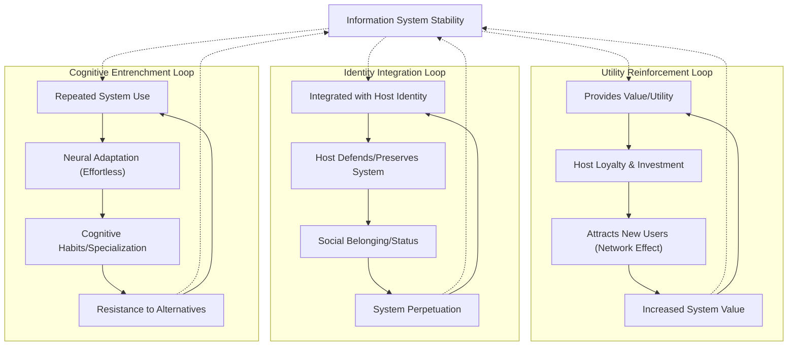

# ⚙️ 4.b.1. Mechanisms of Emergent Stability

*Low Altitude Analysis*

📍 **Altitude**: Low (0-1,000 feet) - Detailed Analysis

<!--

- What are coherence and resonance?
- cognitive entrenchment vs maladaptive rigidity. What's the interplay?
- flesh out the bullet points

-->

Information systems achieve and maintain stability not as a static state, but through dynamic, ongoing processes. This is a specific manifestation of a broader principle observed across various scales, where [self-stabilizing patterns (a concept from Pattern Realism)](../../01-pattern-realism/1-pattern-realism.md#pattern-stability-and-outward-stabilization) tend to preserve and propagate themselves. Central to this in the context of information systems is the concept of **value** and **utility** they provide to their hosts.

* **Value:** In the context of an information system (IS), **value** refers to the overall perceived or actualized benefit that the IS provides to its host (typically an [agent](../../glossary.md#agent) or a collective of agents). This benefit is assessed through the host's "inside-out lens" ([Section 3a](../../03-agents-as-information-processors/3a-inside-out-lens-self-preservation.md)) and can encompass a wide range of contributions, such as enhancing the host's understanding, facilitating goal achievement, improving persistence, increasing coherence, or fulfilling social or psychological needs. Value is often multifaceted and can be subjective.
* **Utility:** **Utility** is a more specific dimension of value, representing the practical effectiveness and efficiency with which an IS enables a host to perform a particular task, solve a specific problem, or achieve a defined objective. It measures the functional "usefulness" of the IS in a given context. An IS with high utility directly contributes to the host's operational capabilities.

These factors are critical in driving the feedback loops that reinforce an IS's presence and influence.

## **4.b.1.1. Self-Reinforcing Feedback Loops**

Information systems develop stability through positive feedback mechanisms that strengthen their own propagation. These loops operate across several dimensions, mutually reinforcing the system's presence and influence within a host population.

**Utility Reinforcement:**

The perceived or actualized utility of an information system is a primary driver of its stability. When systems provide tangible value to their hosts—such as solving problems, achieving goals, or enhancing understanding—they create powerful incentives for their continued preservation and transmission. These practical benefits often translate into host loyalty and a willingness to invest resources in the system's maintenance and propagation. Furthermore, the sharing of success stories and testimonials can act as a potent force, attracting new adopters and strengthening the conviction of existing participants. This process is often amplified by network effects: as more individuals or agents join and utilize the system, its overall value can increase, creating a virtuous cycle of growth and reinforcement. For example, a widely adopted communication protocol becomes more valuable to each user as the number of other users increases, making it more likely to be maintained and taught to newcomers.

**Identity Integration:**

Information systems can become deeply interwoven with the personal or group identity of their hosts, creating a strong resistance to change. When an IS is internalized as a core component of self-concept or collective identity, any challenge to the system can be perceived as a threat to the identity itself. This motivates hosts to actively defend the system and preserve its integrity. Social identity functions further solidify this bond, as shared adherence to an IS can foster a sense of belonging, status, and community, creating strong emotional investments in its perpetuation. For instance, adherence to a particular scientific paradigm or a cultural tradition can become central to a group's identity, leading members to actively uphold its tenets and transmit them to future generations, even in the face of competing ideas. The status and sense of belonging derived from participation encourage continued engagement and advocacy for the system.

**Cognitive Entrenchment:**

The repeated use of an information system can lead to its cognitive entrenchment within host populations. As individuals consistently interact with a system, their neural pathways adapt, making the system's operations feel increasingly "natural," intuitive, and effortless. This process fosters the development of cognitive habits, where the system is automatically invoked in relevant contexts without conscious deliberation. Pattern recognition capabilities of the host become specialized, prioritizing system-relevant information and processing it more efficiently. Consequently, alternative approaches or competing information systems may become cognitively more demanding and less accessible, as they require overcoming established mental routines and developing new cognitive skills. For example, an expert using a specific programming language for many years will find it easier and more "natural" to solve problems with that language, potentially overlooking or struggling with solutions offered by unfamiliar languages, even if those alternatives might be objectively more efficient for a given task. This entrenchment makes the established system more resilient to displacement.

However, this very entrenchment, while fostering stability, can also lead to **maladaptive rigidity**. When the environment changes significantly, or when fundamentally superior information systems emerge, the deep-seated cognitive habits and specialized pattern recognition that once reinforced the system can become significant barriers to adopting necessary changes or new, more effective systems. In such cases, the 'resilience to displacement' transforms into a resistance to beneficial evolution, potentially threatening the long-term viability of the host or the system itself if it cannot adapt.

## **4.b.1.2. Adaptive Stabilization**

Information systems maintain stability by adapting to environmental changes rather than resisting them:

**Content Evolution:**

* Core principles remain stable while surface features adapt to new contexts
* Examples and applications update to maintain relevance for contemporary audiences
* Language and terminology evolve to match current usage patterns
* Case studies and success stories refresh to demonstrate ongoing validity

**Transmission Method Innovation:**

* New technologies enable more effective distribution and maintenance
* Educational approaches adapt to changing learning preferences and capabilities
* Social practices evolve to leverage available communication channels
* Storage and preservation methods improve with technological advancement

**Institutional Support Evolution:**

* Organizations dedicated to system maintenance adapt their structures and methods
* Professional communities develop new specializations and training programs
* Funding mechanisms evolve to ensure continued resource availability
* Regulatory frameworks adapt to protect and promote beneficial systems

## **4.b.1.3. Error Correction and Quality Control**

Stable information systems develop mechanisms to detect and correct degradation:

**Consistency Monitoring:**

* Internal logic checking identifies contradictions and inconsistencies
* Cross-referencing against authoritative sources detects drift from core principles
* Community oversight catches errors and maintains standards
* Automated verification systems flag potential problems

**Restoration Processes:**

* Reference materials enable correction of degraded versions
* Expert communities maintain authoritative interpretations
* Educational systems retrain participants in proper understanding and practice
* Version control systems enable rollback to verified states

**Quality Selection:**

* Peer review and evaluation processes filter out inferior variants
* Competition between versions selects for higher quality implementations
* User feedback guides improvement and refinement efforts
* Performance metrics identify areas needing enhancement

---
[<< Previous: ⚙️ 4.b. Emergent Stability and Longevity](4b-emergent-stability-longevity.md) | [Up: 🔍 4. Information as an Active, Evolving System (e.g., Language, Meta-Narratives)](../4-information-systems.md) | [Next: ⚙️ 4.b.2. Factors Contributing to Longevity >>](4b2-factors-contributing-longevity.md)
