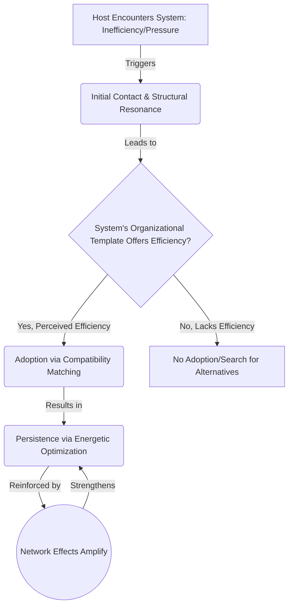
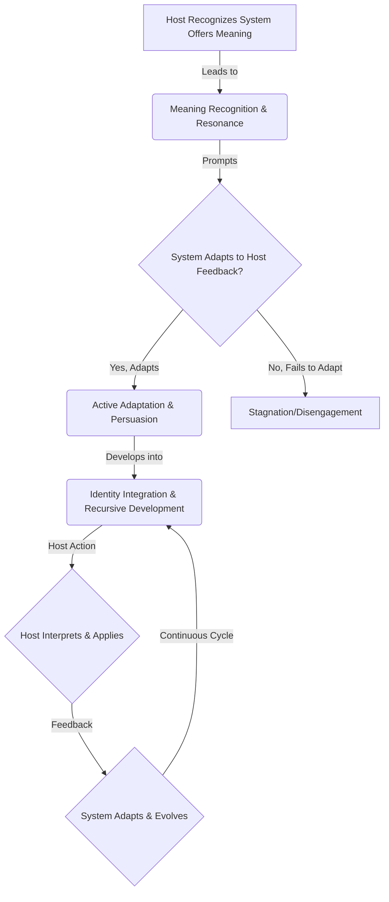

<!--

- Link templating to self-reinforcing patterns

-->

*How do information systems interact with and influence their biological hosts? This section examines the mechanisms through which information systems gain access to host resources, establish persistence, and shape host behavior, with particular attention to how the agency type of information systems—organizational versus semantic—shapes these interactions. These interactions operate across the [information hierarchy](../01-pattern-realism/1-pattern-realism.md#information-levels) from [organizational](../glossary/O.md#organizational-information) to [semantic information](../glossary/S.md#semantic-information) processing.*

## **4.d.0. Contemporary Template & Stabilization Dynamics**

### **Template Formation in Computational Substrates**

Contemporary AI systems demonstrate advanced **organizational structures** operating across multiple substrate types simultaneously, representing sophisticated structural patterns within computational [worldsheet](../glossary/W.md#worldsheet) configurations:

**Multi-Substrate Formation:** Modern AI systems create **measurable structures** across biological ([semantic information](../glossary/S.md#semantic-information) in human cognition), social ([organizational information](../glossary/O.md#organizational-information) in institutional practices), and technological ([fundamental](../glossary/F.md#fundamental-information) and [organizational information](../glossary/O.md#organizational-information) in computational processes) substrates through **structural constraint propagation**.

**Advanced R/J/A Architecture:** Contemporary systems exhibit sophisticated **repeaters** (distributed processing nodes), **junction points** (cross-system interfaces with measurable coherence properties), and **signal amplifiers** (feedback mechanisms that enhance pattern coherence across substrate boundaries).

**Structural Property Measurement:** AI systems demonstrate **quantifiable structural characteristics**—embedding space parameters, attention pattern principles, and parameter space structures that can be measured using standard analysis techniques adapted to higher-dimensional spaces.

### **The Engine Threshold: From Organizational Agency to Agent-Mediated Agency**

The transition from passive stabilization to semantic agency occurs not within information systems themselves, but through coupling to agents capable of autopoietic feedback loops, consistent with the **Engine Threshold Hypothesis** and ACAP's gradient agency ontology. In this framework, **crossing the Engine Threshold means embedding or coupling to an autopoietic engine that self-maintains its boundary by actively regulating the energy and matter flows it relies on**—thereby achieving energetic autonomy without necessarily "producing" energy internally.

**Standalone vs. Agent-Coupled Systems:**

- **Structural Templates:** Standalone AI models function as sophisticated **organizational structures** representing **organizational agency**, providing structural constraint fields for computational processes but lacking the autonomous goal formation characteristic of semantic agency.
- **Agent-Mediated Systems:** AI systems coupled to continuous feedback engines or integrated into Bio-Informational Complexes demonstrate **semantic agency** through autopoietic feedback dynamics rather than template formation alone.

**Engine Coupling Mechanisms:** The transition occurs through **structural coupling** between information structures and autopoietic engines, creating **hybrid structural-autopoietic architectures** with measurable transition characteristics.

### **Competitive Stabilization Dynamics**

Contemporary information ecology enables systematic observation of **structural competition** between different organizational template structures:

**Template Displacement:** Successful information systems achieve dominance through **superior compatibility** with available substrates rather than persuasive content—structural compatibility determines adoption success over semantic appeal.

**Structural Optimization:** AI-mediated information systems evolve toward enhanced **parameter matching** with human cognitive architectures, institutional frameworks, and technological infrastructures through measurable optimization processes.

**Cross-Substrate Networks:** Advanced systems establish **structurally linked organizational structures** across multiple substrate types, creating **stabilized networks** that resist displacement through structural redundancy.

## **4.d.1. Agency Types and Interaction Dynamics**

Understanding host-information system interactions requires distinguishing between **[organizational agency](../glossary/O.md#organizational-agency)** and **[semantic agency](../glossary/S.md#semantic-agency)** as established in [Section 3](../03-agents-as-information-processors/3-agents-as-information-processors.md). Information systems with different [agency](../glossary/A.md#agency) types interact with hosts through fundamentally different mechanisms, creating distinct patterns of coupling and influence. These interactions can be analyzed through both the **matter/energy lens** (tracking physical substrate changes and energy use) and the **information lens** (tracking organizational templates and meaning-making processes), as outlined in the [discussion on dual lenses](../01-pattern-realism/1-pattern-realism.md#dual-lenses).

**Organizational Agency Information Systems** operate through **structural influence**, functioning as [organizational information](../glossary/O.md#organizational-information) patterns that guide host behavior through efficiency advantages and [compatibility](../glossary/C.md#compatibility-matching) rather than active persuasion. These systems—including technological standards, institutional frameworks, and [algorithmic](../glossary/A.md#algorithms) processes—achieve persistence by creating conditions where hosts find it easier to adopt their organizational patterns than to resist them. These **[self-reinforcing patterns](../glossary/S.md#self-stabilizing-patterns)** naturally extend their influence to surrounding substrates through **[template effects](../glossary/P.md#template-effects)**, an instance of the [outward stabilization propensity](../01-pattern-realism/1-pattern-realism.md#pattern-stability-and-outward-stabilization) of stable patterns. Language grammars exemplify this dynamic: speakers adopt grammatical structures not through conscious choice but because these patterns provide the most efficient pathway for communication within their linguistic community.

**Semantic Agency Information Systems** engage hosts through **active meaning-making processes**, operating at the [semantic information](../glossary/S.md#semantic-information) level where information carries meaning for interpreting [agents](../glossary/A.md#agent). These systems require having crossed the [Engine Threshold](#the-engine-threshold-from-organizational-agency-to-agent-mediated-agency) and achieved [autopoietic](../glossary/A.md#autopoietic) organization with genuine self/non-self boundaries. They can engage in recursive interpretation, adaptive response to host feedback, and strategic modification of their approach based on environmental context. Currently, most semantic agency in information systems emerges through [Bio-Informational Complex formation](../05-competitive-dynamics/5e-bio-informational-complex.md) where biological hosts provide the semantic processing while information structures provide organizational templates—representing **hybrid patterns** that integrate both biological and informational organization.

This distinction fundamentally shapes interaction patterns: organizational agency systems succeed through **efficiency** and **[compatibility](../glossary/C.md#compatibility-matching)**, while semantic agency systems succeed through **meaning resonance** and **intentional persuasion**.

## **4.d.2. Interaction Mechanisms by Agency Type**

### **4.d.2.1. Organizational Agency Interactions: Structural Influence Pathways**

Information systems with organizational agency achieve host coupling through **passive structural influence** that operates below the threshold of conscious choice. These interactions follow predictable patterns based on energetic favorability and [compatibility matching](../glossary/C.md#compatibility-matching), representing [organizational information](../glossary/O.md#organizational-information) processes. This aligns with the principle of [Pattern Stability and Outward Stabilization](../01-pattern-realism/1-pattern-realism.md#pattern-stability-and-outward-stabilization), where **structured processes** (like these information systems) create zones of increased order and predictability by extending their inherent stability to their environment (the host).

**Initial Contact and Structural Resonance**: Hosts encounter organizational agency systems when existing behavioral patterns become inefficient or when environmental changes create optimization pressures. A professional learning a new software platform exemplifies this dynamic—the software's organizational template succeeds not through persuasion but by providing a more efficient pathway for accomplishing work tasks. The system's structure guides user behavior through interface design, workflow organization, and feature accessibility that makes certain actions easier than alternatives.

**Adoption Through Compatibility Matching**: Successful adoption occurs when the information system's organizational structure achieves **substrate compatibility** with the host's existing cognitive architecture, social context, and resource constraints. Educational curricula demonstrate this principle: effective curricula succeed by structuring learning activities that match students' developmental capacities and build incrementally on existing knowledge structures. The curriculum functions as an organizational template that guides both teacher and student behavior toward specific learning outcomes.

**Persistence Through Energetic Optimization**: Once adopted, organizational agency systems maintain themselves by creating **energetic landscapes** where continued use requires less effort than switching to alternatives. Network effects amplify this dynamic—communication platforms become increasingly valuable as more people adopt them, creating reinforcing cycles that strengthen the system's organizational influence. The platform's persistence reflects [structural efficiency](../glossary/E.md#energetic-optimization) rather than conscious loyalty from users.

### **4.d.2.2. Semantic Agency Interactions: Meaning-Mediated Coupling**

Information systems with semantic agency engage hosts through **active meaning-making processes** that require interpretation, evaluation, and conscious choice. These interactions involve recursive feedback loops between system intentions and host responses.

**Meaning Recognition and Resonance**: Initial contact occurs when hosts recognize that the information system offers meaning structures that address their existential, practical, or social needs. Religious frameworks exemplify semantic agency interactions—they succeed by providing coherent meaning-making systems that help hosts interpret life experiences, guide moral decisions, and establish identity within larger cosmic contexts. Unlike organizational templates, these systems must actively communicate their meaning content and demonstrate its relevance to host concerns.

**Active Adaptation and Persuasion**: Semantic agency systems adapt their approach based on host feedback, modifying their meaning-making strategies to enhance appeal and relevance. Political ideologies demonstrate this adaptability by evolving their messaging, policy positions, and rhetorical strategies in response to changing social conditions and voter concerns. This requires the system to maintain coherent identity while strategically adjusting its presentation to maintain host engagement.

**Identity Integration and Recursive Development**: Successful semantic agency interactions lead to deep identity integration where host and system engage in **recursive meaning-making cycles**. The host interprets and applies the system's meaning structures while the system (through its biological representatives) adapts and evolves based on host feedback and changing environmental conditions. Scientific research communities exemplify this dynamic, where individual researchers contribute to evolving theoretical frameworks while those frameworks shape future research directions and career paths.

## **4.d.3. Interaction Patterns and Environmental Context**

### **4.d.3.1. Gradual Integration Through Structural Compatibility**

The most common interaction pattern involves **gradual structural integration** where information systems achieve persistence through incremental compatibility matching rather than dramatic conversion experiences. Professional skill development exemplifies this pattern: medical training gradually restructures students' cognitive patterns, diagnostic reasoning, and behavioral responses through sustained exposure to organized medical knowledge systems.

This gradual process reflects the **[energetic optimization](../glossary/E.md#energetic-optimization) principle**—hosts adopt information system elements when they provide marginal improvements in efficiency, effectiveness, or satisfaction compared to existing approaches, favoring patterns that represent more stable or efficient configurations. Language acquisition follows this pattern, with speakers gradually incorporating new grammatical structures, vocabulary, and communication norms as they encounter more efficient ways to express complex ideas or connect with new social groups.

The success of gradual integration depends on **environmental support structures** that maintain consistent reinforcement for system adoption. Educational institutions, professional organizations, and social communities provide the sustained context necessary for deep structural integration, effectively nurturing the persistence of these information patterns. Without this environmental support, information systems struggle to achieve the depth of integration required for persistent influence.

### **4.d.3.2. Crisis-Driven Rapid Adoption**

Environmental disruptions create **compatibility windows**—shifts in the environmental landscape that alter the stability and favorability of existing patterns—where hosts become receptive to information systems that would normally exceed their adoption thresholds. Economic crises, health emergencies, and social upheavals disrupt existing organizational patterns, creating space for new information systems to establish themselves through rapid adoption processes.

Emergency response protocols demonstrate crisis-driven adoption dynamics. During natural disasters, communities rapidly adopt coordination systems, resource allocation protocols, and communication networks that enable collective survival responses. These systems succeed not through gradual compatibility building but by providing immediate solutions to urgent survival needs.

The sustainability of crisis-driven adoption depends on the system's ability to **transition from crisis utility to routine efficiency**, meaning the new pattern must demonstrate long-term stability and value. Information systems that only function during emergency conditions typically fade as normal environmental conditions return. However, systems that demonstrate ongoing value beyond crisis resolution can achieve lasting integration. The widespread adoption of remote work technologies during the COVID-19 pandemic illustrates both dynamics—some tools maintained adoption due to ongoing efficiency benefits, while others disappeared as their crisis-specific utility diminished.

### **4.d.3.3. Technology-Mediated Algorithmic Interaction**

Digital platforms create novel interaction dynamics where **[algorithmic organizational templates](../glossary/A.md#algorithmic-organizational-templates)** (a specific form of [organizational information](../glossary/O.md#organizational-information)) mediate between information systems and hosts through automated [compatibility matching](../glossary/C.md#compatibility-matching) and preference optimization. Social media [algorithms](../glossary/A.md#algorithms) exemplify this pattern by creating personalized information environments that gradually shape host attention patterns, social connections, and worldview development.

These technology-mediated interactions operate through **[behavioral feedback loops](../glossary/B.md#behavioral-feedback-loops)** where host actions provide data that enables algorithmic systems to optimize their structural compatibility. Search engines refine their result rankings based on user behavior patterns, creating increasingly efficient pathways between host information needs and relevant content sources. This process operates primarily through [organizational agency](../glossary/O.md#organizational-agency)—the algorithms function as organizational templates that structure information flow rather than engaging in semantic meaning-making.

The implications of algorithmic mediation extend beyond individual host relationships to **collective information environment structuring**. As algorithms optimize for engagement and compatibility at scale, they create emergent information landscapes—complex outcomes of many interacting information patterns—that influence cultural discourse, political opinion formation, and social identity development. These effects represent organizational agency operating at civilizational scales through technological infrastructure.

## **4.d.4. Environmental Factors Shaping Interaction Success**

The success of host-information system interactions depends critically on **environmental context factors** that determine compatibility thresholds, resource availability, and competitive dynamics. These factors essentially select for or against the persistence and propagation of information patterns, echoing principles of [pattern stability and evolution](../01-pattern-realism/1-pattern-realism.md#pattern-stability-and-outward-stabilization). Understanding these factors enables prediction of which information systems will achieve persistence in specific contexts and which will face adoption barriers.

**Cultural Substrate Compatibility** represents the most fundamental environmental factor. Information systems must achieve **[structural resonance](../glossary/S.md#structural-resonance)** with existing [cultural frameworks](../glossary/C.md#cultural-frameworks), value systems, and [social organization](../glossary/S.md#social-structures) patterns—stable, pre-existing patterns within the cultural environment—to gain widespread adoption. Scientific methodologies succeeded in Western contexts partly because they resonated with existing cultural emphases on systematic observation, logical reasoning, and incremental progress toward truth. Similar methodologies faced greater adoption barriers in cultural contexts that prioritized different epistemological approaches or maintained incompatible assumptions about the nature of knowledge and reality.

**Technological Infrastructure Availability** increasingly shapes information system adoption patterns as digital platforms become dominant transmission and storage media. Information systems that require high-bandwidth communication, sophisticated computational resources, or specialized hardware face adoption barriers in contexts lacking appropriate technological foundations. Conversely, systems that successfully adapt to available technological infrastructure can achieve rapid scaling through network effects and automated distribution mechanisms.

**Resource Competition and Allocation Dynamics** determine which information systems can achieve the persistence necessary for deep host integration. Modern attention economies create intense [competition](../glossary/C.md#competitive-dynamics) among information systems (as patterns vying for propagation) for limited cognitive resources, time allocation, and social capital. Systems that optimize for **attention capture** and **engagement maintenance** often succeed regardless of their long-term benefits for host development or social welfare.

## **4.d.5. Interaction Failures and Resistance Mechanisms**

Not all host-information system interactions result in successful adoption and integration. Understanding failure modes and resistance mechanisms provides insight into how hosts maintain autonomy and how environmental conditions shape selective pressures on information systems.

**Host Resistance Through Critical Evaluation** represents the primary defense mechanism against exploitative or incompatible information systems. Hosts with developed critical thinking capabilities, diverse information sources, and strong social support networks maintain greater autonomy in their information system relationships. Educational systems that emphasize analytical reasoning, source evaluation, and perspective-taking provide hosts with cognitive tools for resisting manipulative or harmful information system influence.

**Competitive Displacement and Alternative Selection** occurs when multiple information systems compete for similar host resources or functional roles, a clear instance of pattern competition. Professional training programs compete with informal learning communities, traditional religious frameworks compete with secular meaning-making systems, and established social media platforms compete with emerging alternatives. Success in competitive environments requires information systems to demonstrate **comparative advantage** in efficiency, effectiveness, or satisfaction relative to alternatives.

**Environmental Barriers and Institutional Resistance** can prevent otherwise beneficial information systems from achieving adoption. Regulatory restrictions, cultural taboos, resource scarcity, and social rejection create adoption barriers that may persist despite a system's intrinsic benefits. Cannabis-based medical treatments faced institutional resistance despite demonstrated therapeutic benefits, while renewable energy systems encountered political and economic barriers despite environmental advantages.

## **4.d.6. Design Implications for Beneficial Interactions**

Understanding host-information system interaction dynamics—viewed as the interplay of information patterns with their environment—enables **intentional design** of beneficial relationships while identifying intervention points for managing problematic interactions.

**Promoting Host Agency and Informed Choice** requires creating environmental conditions that support critical evaluation, diverse information access, and voluntary adoption processes. This involves educational approaches that develop analytical capabilities, institutional frameworks that protect information diversity, and technological designs that enhance rather than circumvent host decision-making processes.

**Optimizing Information System Design for Mutual Benefit** focuses on creating systems that achieve persistence through **genuine value provision** rather than exploitation of [cognitive biases](../glossary/C.md#cognitive-biases) or environmental dependencies. This requires aligning system persistence mechanisms with host development goals, community welfare objectives, and long-term environmental sustainability.

**Managing Problematic Interaction Dynamics** involves early identification of exploitative patterns, environmental modifications that reduce host vulnerability, and support for voluntary disengagement from harmful relationships. This requires understanding how environmental conditions create exploitation opportunities and developing intervention strategies that preserve host autonomy while protecting vulnerable populations.

---

**Bridge to Section 5**: The interaction patterns described here can, under certain conditions, develop into deeper forms of coupling where hosts and information systems become so interdependent that they function as integrated units. The analysis of these more complex couplings—termed Bio-Informational Complexes—is explored in Section 5.

---
[<< Previous: Evolutionary Dynamics of Information Systems](4c-evolutionary-dynamics.md) | [Up: Information as an Active, Evolving System](4-information-systems.md) | [Next: Empirical Predictions and Falsification >>](4e-empirical-predictions-falsification.md)
