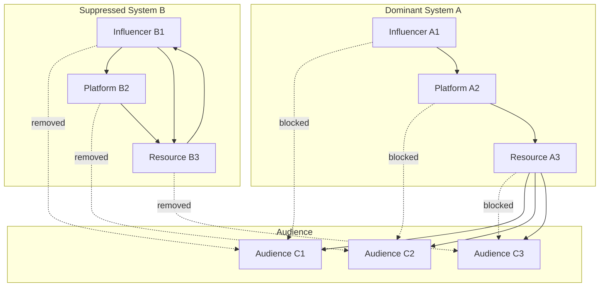
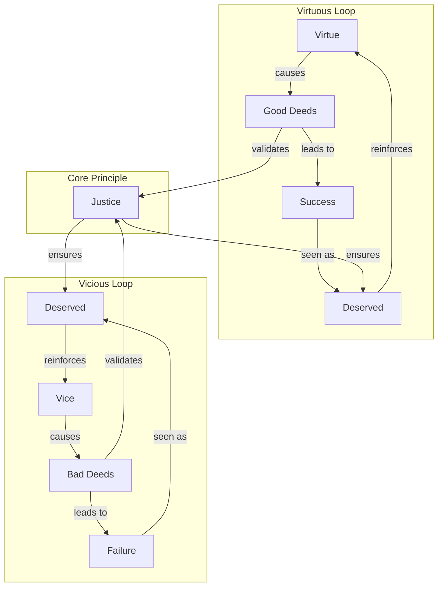
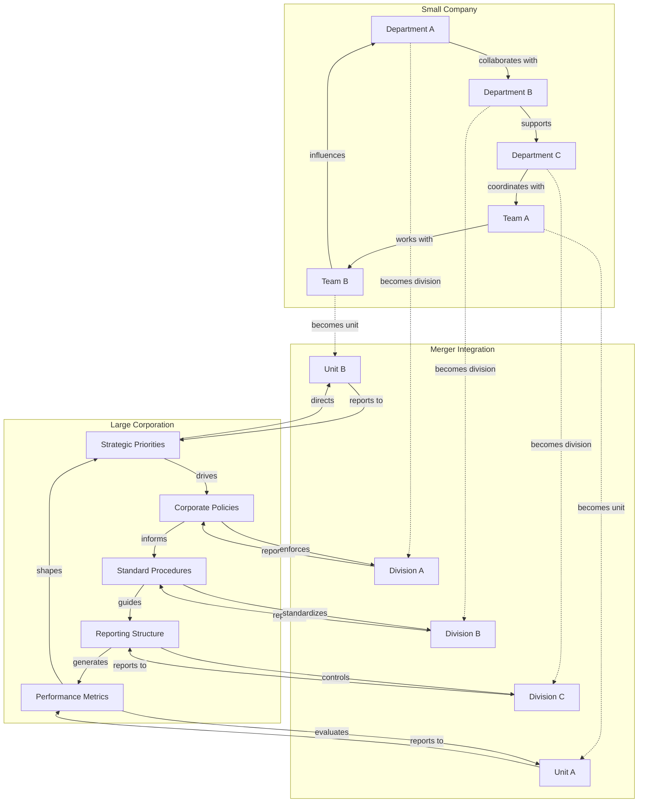
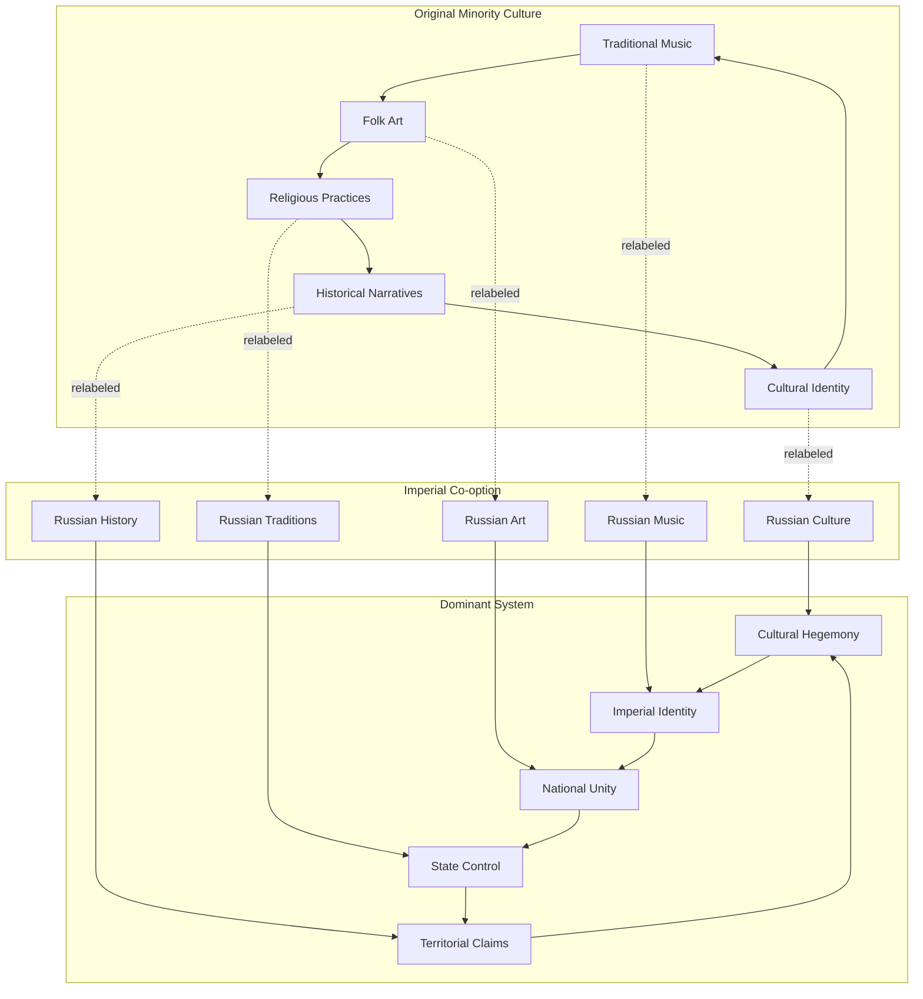
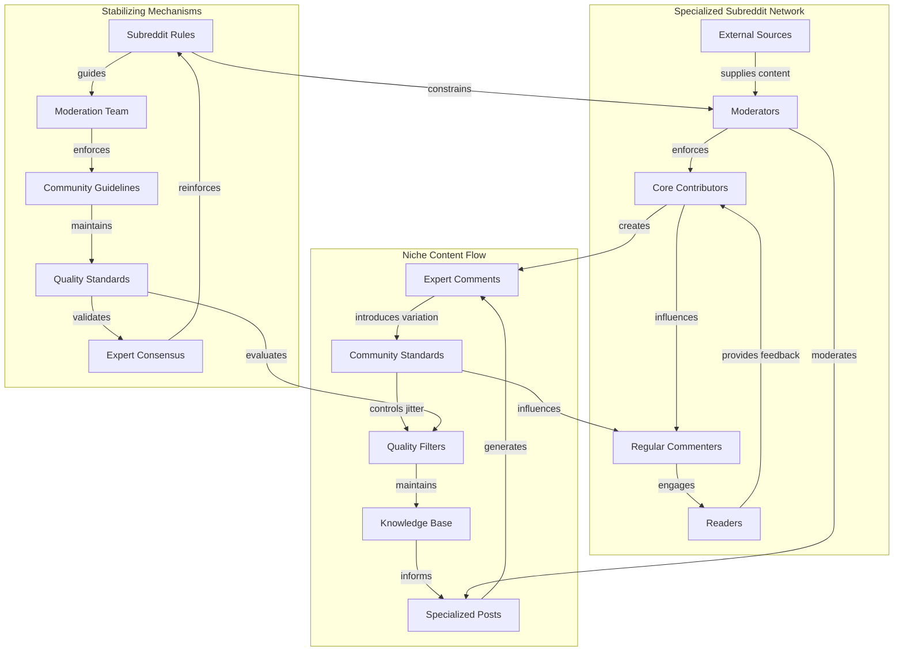

<!--

- What is the interplay between the strategies? Are there overlaps?
- clarify zero-sum and positive-sum dynamics within this scope
- Comparative analyses?

-->

The "vying for dominance" among information systems employs a range of strategies, extending beyond simple presence to more active and subtle interactions. Each mechanism operates through distinct network dynamics that can be analyzed through both intuitive descriptions and measurable graph properties.

## Direct Confrontation and Suppression

This involves overt attempts to eradicate, discredit, or suppress competing narratives or systems. Examples include ideological purges, censorship, public debunking campaigns, or even the violent destruction of cultural artifacts representing rival systems. The perceived emergent "intentionality" of the bio-informational complex is often at play here.

These suppression mechanisms can be analyzed through two complementary perspectives that reveal different aspects of how information systems compete for dominance. These perspectives correspond to the [Repeater/Jitter/Anchor model](../04-information-systems/4a-material-organization-dynamics/4a1-repeater-jitter-anchor-model.md): the substrate lens examines how competition affects **repeaters** (transmission mechanisms) and **anchors** (stabilizing structures), while the substance lens examines how competition introduces **jitter** (variation) and transforms conceptual **anchors**.

### Mechanics

#### 1. Communication/Flow Network Perspective (Substrate Lens)

This perspective focuses on the material infrastructure, channels, and transmission systems that carry and propagate information—how the information system is instantiated and spread in the world. It examines the "how" of information transmission.

- **Network Dynamics:** Direct confrontation operates through the removal of nodes (entities, agents, or channels) and edges (communication links) in the network of information flow. When System A suppresses System B, it may block B’s access to audiences, resources, or platforms, fragmenting the network and isolating B. This targets the rival system’s **repeaters** (transmission mechanisms) and **anchors** (stabilizing structures), disrupting its ability to propagate and maintain coherence.
- **Resource Flow Analysis:** Suppression redirects attention, material support, and cognitive resources away from the suppressed system toward the dominant one.
- **Observable Effects:** The network becomes more fragmented, with longer and more circuitous routes required for information to travel between remaining systems. Isolated clusters or “echo chambers” may form, and the suppressed system loses its ability to act as a bridge or influencer.

**Example: Network Suppression**  
This diagram shows how suppression affects the communication network. System B's connections to audiences are severed (dashed lines), while System A maintains and strengthens its connections. System B becomes isolated, forming an echo chamber with limited external reach.

#### 2. Semantic/Conceptual Network Perspective (Substance Lens)

While the first perspective examines transmission channels, this perspective focuses on the actual content, meaning, and internal logic of the information system—how its core concepts, beliefs, and relationships are structured and maintained. It examines the "what" and "why" of information systems.  
In R/J/A terms, direct confrontation at the substance level works by attacking the rival’s **anchors** (core concepts and stabilizing beliefs) and introducing **jitter** (semantic disruption, doubt, or reinterpretation) to destabilize the system’s internal coherence.

**Example: "Just World" Information System**  
This concept graph shows how the "just world" belief system structures its core concepts. The system explains success/failure through virtue/vice, reinforces itself through the "deserved" outcomes, and is supported by concepts like "justice."

- **Suppression Tactics:**  
  - **Node Removal:** Discrediting or erasing key concepts (e.g., removing “Justice” as the core principle, or eliminating “Deserved” as a meaningful interpretation).
  - **Edge Severing:** Undermining or breaking the relationships between concepts (e.g., challenging the link between “Good Deeds” and “Success,” or breaking the reinforcement loop from “Deserved” back to “Virtue”).
  - **Reframing:** Redefining concepts or relationships to alter the system’s logic (e.g., redefining “Success” as due to luck rather than good deeds, or redefining “Justice” as human-made rather than natural).
- **Observable Effects:** The rival information system’s conceptual structure becomes less coherent, more vulnerable to doubt, and less able to explain or justify itself. If key nodes or connections are removed, the system may collapse or lose persuasive power.

### Implications

These two perspectives work together in practice. Suppression efforts typically target both the transmission infrastructure and the conceptual foundations of rival systems, creating a comprehensive attack on their ability to compete effectively.

**Example:** In the suppression of a conspiracy theory, authorities might:
- **Communication network:** Deplatform key influencers, block hashtags, or restrict sharing (removing nodes/edges in the flow network).
- **Semantic network:** Publicly debunk core claims, introduce counter-narratives, or redefine key terms (removing or altering nodes/edges in the concept graph).
- **Inoculation strategy:** Preemptively expose audiences to weakened versions of conspiracy claims alongside refutations, building cognitive resistance before exposure to the full theory. This creates "immune" nodes in the network that can resist and even counter-propagate against the rival system.
- **Anticipatory counter-narratives:** Authorities may anticipate the proliferation of a harmful narrative and pre-emptively seed a highly viable, emotionally resonant counter-narrative that is directly hostile to the harmful one. By strategically placing this counter-narrative in key network nodes before the harmful narrative gains traction, they can "inoculate" the network—making audiences more resistant to persuasion and reducing the harmful narrative's ability to propagate. This approach leverages both cognitive and network effects, but must be carefully managed to avoid backlash or ethical pitfalls.

---

## Co-option and Assimilation

A more subtle mechanism where a dominant or evolving information system incorporates appealing or non-threatening elements from a competitor. This can neutralize the distinct appeal of the rival or broaden the dominant system's own applicability, effectively "domesticating" or absorbing the competition. For example, a mainstream ideology might adopt certain popular themes from a nascent counter-culture to maintain its relevance.

Like direct confrontation, co-option operates through both network and conceptual channels, but instead of removing or suppressing rival elements, it selectively integrates them into the dominant system's structure.

### Mechanics

#### 1. Communication/Flow Network Perspective (Substrate Lens)

This perspective examines how co-option affects the material infrastructure and transmission channels of information systems.

- **Network Integration:** Co-option involves the strategic absorption of nodes (influencers, platforms, communities) and edges (communication channels) from the rival system into the dominant system's network. Rather than isolating the rival, the dominant system creates new connections that redirect information flow toward itself. **The key insight is that by absorbing a node, the dominant system leverages network effects to replace the node's contents** - the node's connections to the dominant system's network begin to influence what information flows through it, gradually transforming its function and output. In R/J/A terms, this is the absorption of **repeaters** (transmission mechanisms) and their transformation to serve the dominant system's propagation needs.
- **Resource Redirection:** The dominant system captures attention, material support, and cognitive resources that might otherwise flow to the rival system, but does so by offering a "home" for these resources within its own framework.
- **Observable Effects:** The network becomes more centralized around the dominant system, with former rival nodes now acting as bridges or amplifiers for the dominant system's messages. The rival system may lose its distinct network identity as its components become integrated into the dominant system's infrastructure.

**Example: Corporate Merger Network Absorption**  
This diagram shows how departments and teams from a small company get absorbed into a large corporation's network through merger. As they become integrated, the corporation's policies, procedures, and reporting structures begin to influence their operations and decision-making. The absorbed units adapt their practices to match corporate standards and priorities, effectively transforming their function within the network.

#### 2. Semantic/Conceptual Network Perspective (Substance Lens)

This perspective focuses on how conceptual co-option works by absorbing the rival's **anchors** (core concepts and stabilizing beliefs) while introducing controlled **jitter** (reframing and reinterpretation) to transform these elements to serve the dominant system's interests.

**Example: Imperial Cultural Co-option**  
This diagram shows how imperial systems co-opt minority cultural elements through simple relabeling. Traditional music becomes "Russian music," folk art becomes "Russian art," and cultural identity becomes "Russian culture." The original cultural context is erased through relabeling, and the elements are claimed as part of the dominant imperial system's cultural heritage.

---

## Niche Differentiation and Specialization

Not all competition is zero-sum. Information systems can evolve to occupy distinct cognitive, social, or functional niches, thereby reducing direct conflict and allowing for a diverse (though not necessarily equitable) ecosystem of coexisting systems. Different scientific disciplines, artistic genres, or spiritual traditions might cater to different aspects of human experience or inquiry, thus competing less directly for the same immediate "cognitive territory."

Niche differentiation works by developing specialized **repeaters** (transmission mechanisms tailored to specific audiences), controlled **jitter** (variation within bounded domains), and domain-specific **anchors** (stabilizing mechanisms that maintain identity within the niche while allowing adaptation to niche-specific conditions).

### Mechanics

#### 1. Communication/Flow Network Perspective (Substrate Lens)

This perspective examines how niche differentiation affects the material infrastructure and transmission channels of information systems.

- **Specialized Repeaters:** Information systems develop transmission mechanisms optimized for their specific niche. Different systems use different communication channels, platforms, or formats that resonate with their target audiences (e.g., academic journals vs. popular media, specialized conferences vs. general forums).
- **Niche-Optimized Networks:** Information flows through networks of experts, practitioners, or enthusiasts who share common interests and communication norms, creating distinct transmission pathways.
- **Network Segmentation:** The overall information ecosystem becomes segmented into specialized subnetworks, each with its own transmission mechanisms and audience connections.

#### 2. Semantic/Conceptual Network Perspective (Substance Lens)

This perspective focuses on how niche systems maintain distinct conceptual identities while allowing controlled variation.

- **Controlled Jitter:** Niche systems allow variation within bounded domains while maintaining core identity. Systems encourage experimentation and adaptation within the constraints of their niche identity (e.g., new artistic styles within a genre, novel theories within a scientific paradigm).
- **Niche-Specific Adaptation:** Variation is directed toward addressing the unique challenges and opportunities of the niche environment.
- **Identity Preservation:** While allowing jitter, systems maintain core concepts and principles that define their niche identity and distinguish them from other systems.

#### 3. Stabilization Mechanisms (Anchor Lens)

Each niche develops stabilizing mechanisms tailored to its specific domain:

- **Domain-Specific Anchors:** Specialized organizations, standards bodies, or communities that maintain quality and coherence within the niche (e.g., professional associations, peer review systems, artistic movements).
- **Niche Boundaries:** Clear definitions of what belongs within the niche and what falls outside it, helping maintain distinctiveness while allowing internal evolution.
- **Institutional Stability:** Niche institutions serve as anchors that maintain the system's identity and quality standards within its specialized domain.

**Example: Specialized Subreddit Niche**  
This diagram shows how a specialized subreddit (e.g., r/AskHistorians) creates its own niche through specialized **repeaters** (moderators, contributors, users), controlled **jitter** (variation in posts and comments that gets parsed and, for extreme cases of jitter, either contributes to the anchors or gets discarded as unproductive), and domain-specific **anchors** (rules, moderation, expert consensus). The network structure enables high-quality information transmission while the stabilizing mechanisms maintain the niche's distinct identity and standards.

---

## Efficiency of Propagation and Transmission

Beyond its content, the structural and transmissive properties of an information system significantly impact its competitive success. Systems that are simpler, more emotionally resonant, highly memorable, easily replicable through available media (e.g., from easily retold oral myths to shareable digital memes), or those that more effectively leverage innate host psychology (e.g., [biases](../glossary/C.md#cognitive-biases), heuristics) often possess an advantage in propagation speed and reach. The nature of the available material substrates and transmission technologies (e.g., oral culture vs. printing press vs. internet) profoundly shapes these dynamics.

---

## Resilience through Adaptability and Self-Correction

Information systems that possess inherent mechanisms for [adaptation](../glossary/A.md#adaptation), learning, or self-correction may exhibit greater long-term competitive resilience. For instance, scientific methodologies, with their emphasis on falsifiability and revision based on new evidence, allow scientific theories to evolve and maintain explanatory power. Open-source software development models, as information systems for producing other information systems, thrive on iterative improvement and community-driven adaptation.