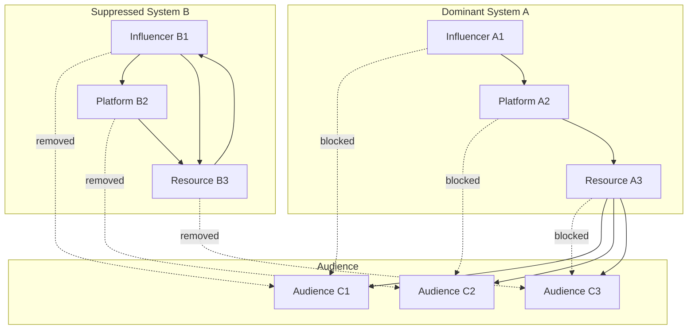
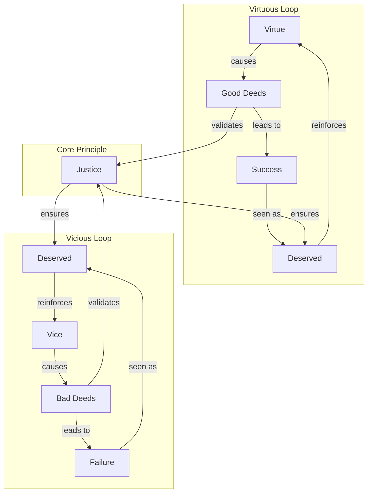
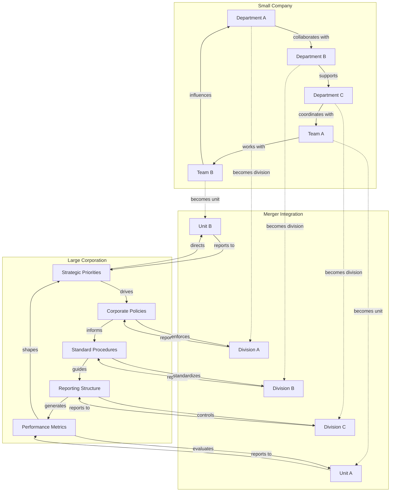
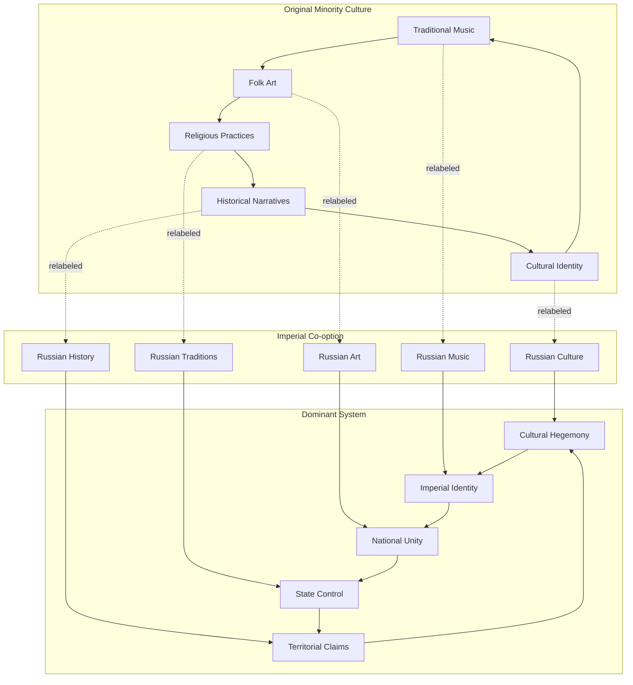
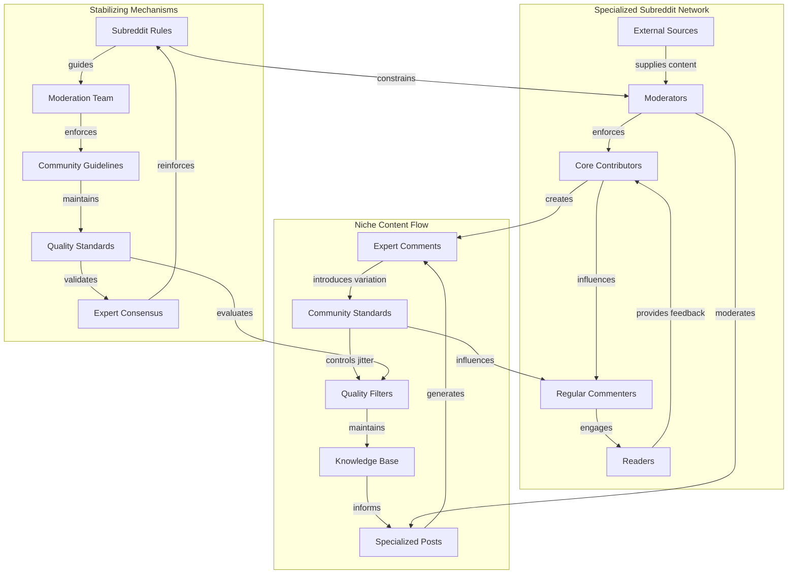
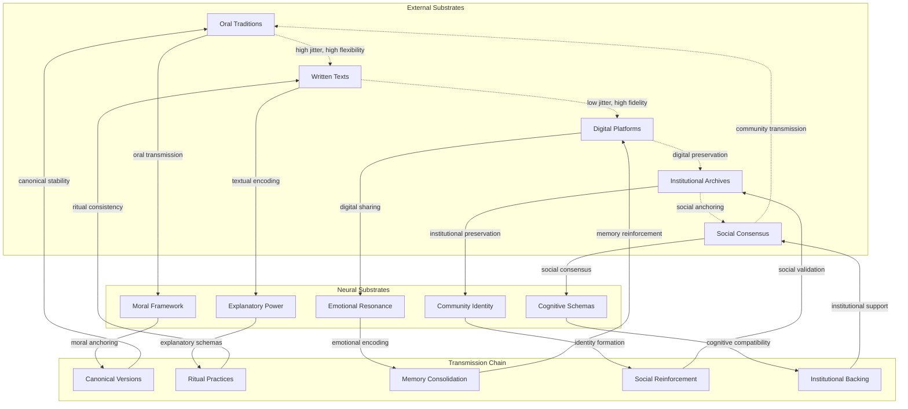
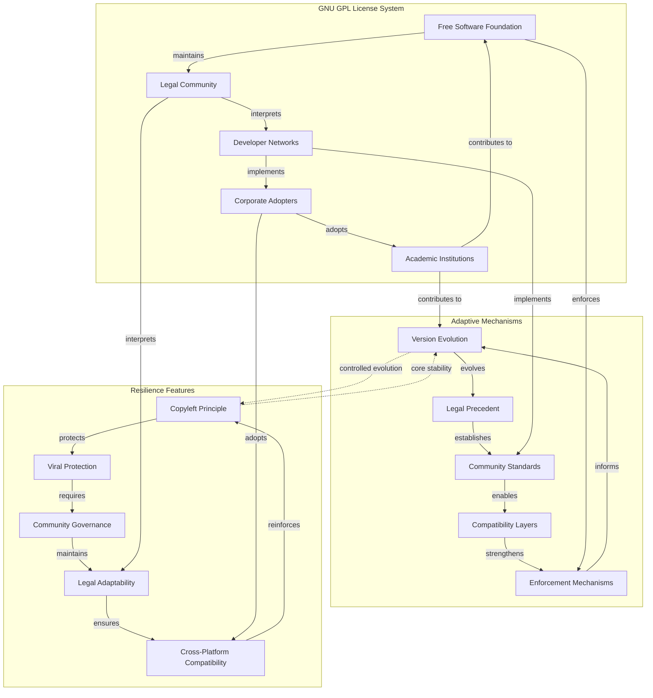

<!--

- What is the interplay between the strategies? Are there overlaps?
- clarify zero-sum and positive-sum dynamics within this scope
- Comparative analyses?

-->

The "vying for dominance" among information systems employs a range of strategies, extending beyond simple presence to more active and subtle interactions. Each mechanism operates through distinct network dynamics that can be analyzed through both intuitive descriptions and measurable graph properties.

## Direct Confrontation and Suppression

This involves overt attempts to eradicate, discredit, or suppress competing narratives or systems. Examples include ideological purges, censorship, public debunking campaigns, or even the violent destruction of cultural artifacts representing rival systems. The perceived emergent "intentionality" of the bio-informational complex is often at play here.

These suppression mechanisms can be analyzed through two complementary perspectives that reveal different aspects of how information systems compete for dominance. These perspectives correspond to the [Repeater/Jitter/Anchor model](../04-information-systems/4a-material-organization-dynamics/4a1-repeater-jitter-anchor-model.md): the substrate lens examines how competition affects **repeaters** (transmission mechanisms) and **anchors** (stabilizing structures), while the substance lens examines how competition introduces **jitter** (variation) and transforms conceptual **anchors**.

### Mechanics

#### 1. Communication/Flow Network Perspective (Substrate Lens)

This perspective focuses on the material infrastructure, channels, and transmission systems that carry and propagate information—how the information system is instantiated and spread in the world. It examines the "how" of information transmission.

- **Network Dynamics:** Direct confrontation operates through the removal of nodes (entities, agents, or channels) and edges (communication links) in the network of information flow. When System A suppresses System B, it may block B’s access to audiences, resources, or platforms, fragmenting the network and isolating B. This targets the rival system’s **repeaters** (transmission mechanisms) and **anchors** (stabilizing structures), disrupting its ability to propagate and maintain coherence.
- **Resource Flow Analysis:** Suppression redirects attention, material support, and cognitive resources away from the suppressed system toward the dominant one.
- **Observable Effects:** The network becomes more fragmented, with longer and more circuitous routes required for information to travel between remaining systems. Isolated clusters or “echo chambers” may form, and the suppressed system loses its ability to act as a bridge or influencer.

**Example: Network Suppression**  
This diagram shows how suppression affects the communication network. System B's connections to audiences are severed (dashed lines), while System A maintains and strengthens its connections. System B becomes isolated, forming an echo chamber with limited external reach.

#### 2. Semantic/Conceptual Network Perspective (Substance Lens)

While the first perspective examines transmission channels, this perspective focuses on the actual content, meaning, and internal logic of the information system—how its core concepts, beliefs, and relationships are structured and maintained. It examines the "what" and "why" of information systems.  
In R/J/A terms, direct confrontation at the substance level works by attacking the rival’s **anchors** (core concepts and stabilizing beliefs) and introducing **jitter** (semantic disruption, doubt, or reinterpretation) to destabilize the system’s internal coherence.

**Example: "Just World" Information System**  
This concept graph shows how the "just world" belief system structures its core concepts. The system explains success/failure through virtue/vice, reinforces itself through the "deserved" outcomes, and is supported by concepts like "justice."

- **Suppression Tactics:**  
  - **Node Removal:** Discrediting or erasing key concepts (e.g., removing “Justice” as the core principle, or eliminating “Deserved” as a meaningful interpretation).
  - **Edge Severing:** Undermining or breaking the relationships between concepts (e.g., challenging the link between “Good Deeds” and “Success,” or breaking the reinforcement loop from “Deserved” back to “Virtue”).
  - **Reframing:** Redefining concepts or relationships to alter the system’s logic (e.g., redefining “Success” as due to luck rather than good deeds, or redefining “Justice” as human-made rather than natural).
- **Observable Effects:** The rival information system’s conceptual structure becomes less coherent, more vulnerable to doubt, and less able to explain or justify itself. If key nodes or connections are removed, the system may collapse or lose persuasive power.

### Implications

These two perspectives work together in practice. Suppression efforts typically target both the transmission infrastructure and the conceptual foundations of rival systems, creating a comprehensive attack on their ability to compete effectively.

**Example:** In the suppression of a conspiracy theory, authorities might:
- **Communication network:** Deplatform key influencers, block hashtags, or restrict sharing (removing nodes/edges in the flow network).
- **Semantic network:** Publicly debunk core claims, introduce counter-narratives, or redefine key terms (removing or altering nodes/edges in the concept graph).
- **Inoculation strategy:** Preemptively expose audiences to weakened versions of conspiracy claims alongside refutations, building cognitive resistance before exposure to the full theory. This creates "immune" nodes in the network that can resist and even counter-propagate against the rival system.
- **Anticipatory counter-narratives:** Authorities may anticipate the proliferation of a harmful narrative and pre-emptively seed a highly viable, emotionally resonant counter-narrative that is directly hostile to the harmful one. By strategically placing this counter-narrative in key network nodes before the harmful narrative gains traction, they can "inoculate" the network—making audiences more resistant to persuasion and reducing the harmful narrative's ability to propagate. This approach leverages both cognitive and network effects, but must be carefully managed to avoid backlash or ethical pitfalls.

---

## Co-option and Assimilation

A more subtle mechanism where a dominant or evolving information system incorporates appealing or non-threatening elements from a competitor. This can neutralize the distinct appeal of the rival or broaden the dominant system's own applicability, effectively "domesticating" or absorbing the competition. For example, a mainstream ideology might adopt certain popular themes from a nascent counter-culture to maintain its relevance.

Like direct confrontation, co-option operates through both network and conceptual channels, but instead of removing or suppressing rival elements, it selectively integrates them into the dominant system's structure.

### Mechanics

#### 1. Communication/Flow Network Perspective (Substrate Lens)

This perspective examines how co-option affects the material infrastructure and transmission channels of information systems.

- **Network Integration:** Co-option involves the strategic absorption of nodes (influencers, platforms, communities) and edges (communication channels) from the rival system into the dominant system's network. Rather than isolating the rival, the dominant system creates new connections that redirect information flow toward itself. **The key insight is that by absorbing a node, the dominant system leverages network effects to replace the node's contents** - the node's connections to the dominant system's network begin to influence what information flows through it, gradually transforming its function and output. In R/J/A terms, this is the absorption of **repeaters** (transmission mechanisms) and their transformation to serve the dominant system's propagation needs.
- **Resource Redirection:** The dominant system captures attention, material support, and cognitive resources that might otherwise flow to the rival system, but does so by offering a "home" for these resources within its own framework.
- **Observable Effects:** The network becomes more centralized around the dominant system, with former rival nodes now acting as bridges or amplifiers for the dominant system's messages. The rival system may lose its distinct network identity as its components become integrated into the dominant system's infrastructure.

**Example: Corporate Merger Network Absorption**  
This diagram shows how departments and teams from a small company get absorbed into a large corporation's network through merger. As they become integrated, the corporation's policies, procedures, and reporting structures begin to influence their operations and decision-making. The absorbed units adapt their practices to match corporate standards and priorities, effectively transforming their function within the network.

#### 2. Semantic/Conceptual Network Perspective (Substance Lens)

This perspective focuses on how conceptual co-option works by absorbing the rival's **anchors** (core concepts and stabilizing beliefs) while introducing controlled **jitter** (reframing and reinterpretation) to transform these elements to serve the dominant system's interests.

**Example: Imperial Cultural Co-option**  
This diagram shows how imperial systems co-opt minority cultural elements through simple relabeling. Traditional music becomes "Russian music," folk art becomes "Russian art," and cultural identity becomes "Russian culture." The original cultural context is erased through relabeling, and the elements are claimed as part of the dominant imperial system's cultural heritage.

---

## Niche Differentiation and Specialization

Not all competition is zero-sum. Information systems can evolve to occupy distinct cognitive, social, or functional niches, thereby reducing direct conflict and allowing for a diverse (though not necessarily equitable) ecosystem of coexisting systems. Different scientific disciplines, artistic genres, or spiritual traditions might cater to different aspects of human experience or inquiry, thus competing less directly for the same immediate "cognitive territory."

Niche differentiation works by developing specialized **repeaters** (transmission mechanisms tailored to specific audiences), controlled **jitter** (variation within bounded domains), and domain-specific **anchors** (stabilizing mechanisms that maintain identity within the niche while allowing adaptation to niche-specific conditions).

### Mechanics

#### 1. Communication/Flow Network Perspective (Substrate Lens)

This perspective examines how niche differentiation affects the material infrastructure and transmission channels of information systems.

- **Specialized Repeaters:** Information systems develop transmission mechanisms optimized for their specific niche. Different systems use different communication channels, platforms, or formats that resonate with their target audiences (e.g., academic journals vs. popular media, specialized conferences vs. general forums).
- **Niche-Optimized Networks:** Information flows through networks of experts, practitioners, or enthusiasts who share common interests and communication norms, creating distinct transmission pathways.
- **Network Segmentation:** The overall information ecosystem becomes segmented into specialized subnetworks, each with its own transmission mechanisms and audience connections.

#### 2. Semantic/Conceptual Network Perspective (Substance Lens)

This perspective focuses on how niche systems maintain distinct conceptual identities while allowing controlled variation.

- **Controlled Jitter:** Niche systems allow variation within bounded domains while maintaining core identity. Systems encourage experimentation and adaptation within the constraints of their niche identity (e.g., new artistic styles within a genre, novel theories within a scientific paradigm).
- **Niche-Specific Adaptation:** Variation is directed toward addressing the unique challenges and opportunities of the niche environment.
- **Identity Preservation:** While allowing jitter, systems maintain core concepts and principles that define their niche identity and distinguish them from other systems.

#### 3. Stabilization Mechanisms (Anchor Lens)

Each niche develops stabilizing mechanisms tailored to its specific domain:

- **Domain-Specific Anchors:** Specialized organizations, standards bodies, or communities that maintain quality and coherence within the niche (e.g., professional associations, peer review systems, artistic movements).
- **Niche Boundaries:** Clear definitions of what belongs within the niche and what falls outside it, helping maintain distinctiveness while allowing internal evolution.
- **Institutional Stability:** Niche institutions serve as anchors that maintain the system's identity and quality standards within its specialized domain.

**Example: Specialized Subreddit Niche**  
This diagram shows how a specialized subreddit (e.g., r/AskHistorians) creates its own niche through specialized **repeaters** (moderators, contributors, users), controlled **jitter** (variation in posts and comments that gets parsed and, for extreme cases of jitter, either contributes to the anchors or gets discarded as unproductive), and domain-specific **anchors** (rules, moderation, expert consensus). The network structure enables high-quality information transmission while the stabilizing mechanisms maintain the niche's distinct identity and standards.

---

## Efficiency of Propagation and Transmission

Beyond its content, the structural and transmissive properties of an information system significantly impact its competitive success. Systems that are simpler, more emotionally resonant, highly memorable, easily replicable through available media (e.g., from easily retold oral myths to shareable digital memes), or those that more effectively leverage innate host psychology (e.g., [biases](../glossary/C.md#cognitive-biases), heuristics) often possess an advantage in propagation speed and reach. The nature of the available material substrates and transmission technologies (e.g., oral culture vs. printing press vs. internet) profoundly shapes these dynamics.

Efficient propagation works by optimizing **repeaters** (transmission mechanisms for speed and reach), minimizing destructive **jitter** (noise that reduces fidelity), and strengthening **anchors** (stabilizing mechanisms that resist competitive pressures).

### Mechanics

#### 1. Communication/Flow Network Perspective (Substrate Lens)

This perspective examines how information systems optimize their transmission infrastructure for maximum reach and speed.

- **Complete Transmission Chain:** Information flows through multiple substrates in sequence - from external networks (social media, messaging) through neural substrates (attention, memory, cognitive processing) and back to external networks. Each substrate hop introduces different constraints and opportunities for optimization.
- **Neural Substrate Optimization:** Systems design content to navigate neural "security gates" (attention filters, cognitive load limits) and exploit neural "vulnerabilities" (biases, heuristics, emotional triggers) to maximize retention and transmission fidelity.
- **Substrate Hopping Efficiency:** Successful systems optimize for the entire chain, not just individual substrates. This includes managing jitter across different transmission modes (high-fidelity digital vs. high-jitter oral transmission) and ensuring information can survive multiple substrate transitions.

#### 2. Semantic/Conceptual Network Perspective (Substance Lens)

This perspective quantifies the compatibility and long-term viability of information across different substrates.

- **Neural Retention Optimization:** Content is designed to maximize retention in neural substrates through emotional salience, narrative structure, pattern recognition, and alignment with existing cognitive schemas. Systems leverage memory consolidation mechanisms (sleep, repetition, emotional encoding) to enhance long-term retention.
- **External Anchor Compatibility:** Information is structured to be compatible with external stabilizing mechanisms (institutional archives, social consensus, technological platforms) that can preserve it across time and substrate transitions.
- **Jitter Minimization:** Systems reduce variation and noise that could degrade information during transmission. This includes creating canonical versions, using redundant encoding, and designing content that resists distortion across different transmission modes.
- **Identity Fusion:** When information systems achieve deep integration with hosts (forming [Bio-Informational Complexes](../05-competitive-dynamics/5e-bio-informational-complex.md)), the host becomes both a highly motivated repeater and a living anchor. The host's identity becomes fused with the information system, creating powerful protective reactions and dedicated resource allocation that amplify propagation efficiency.

**Example: Religious Information Systems**  
This diagram shows how religious systems optimize propagation across the complete transmission chain. They leverage **neural substrates** (moral frameworks, explanatory power, emotional resonance) to enhance retention, use **external anchors** (institutional archives, social consensus) for long-term preservation, and employ **jitter minimization** (canonical versions, ritual practices) to maintain fidelity across substrate transitions from oral to written to digital transmission.

---

## Resilience through Adaptability and Self-Correction

Information systems that possess inherent mechanisms for [adaptation](../glossary/A.md#adaptation), learning, or self-correction may exhibit greater long-term competitive resilience. For instance, scientific methodologies, with their emphasis on falsifiability and revision based on new evidence, allow scientific theories to evolve and maintain explanatory power. Open-source software development models, as information systems for producing other information systems, thrive on iterative improvement and community-driven adaptation.

Resilient systems develop **adaptive repeaters** (transmission mechanisms that can modify themselves), **strategic jitter** (intentional variation that enables learning), and **flexible anchors** (stabilizing mechanisms that can evolve without losing core identity). Viable information systems exist in a precarious **Goldilocks zone** between maladaptive rigidity (where strong self-reinforcement creates resistance to beneficial change) and disintegration (where excessive adaptation erodes core identity and coherence). The most resilient systems balance these opposing forces through controlled evolution.

### Mechanics

#### 1. Communication/Flow Network Perspective (Substrate Lens)

This perspective examines how information systems develop adaptive transmission infrastructure that can respond to competitive challenges.

- **Adaptive Repeaters:** Systems develop transmission mechanisms that can modify their own structure and function in response to environmental changes. This includes learning algorithms, community-driven evolution, and institutional reform processes that allow the system to adapt its propagation strategies.
- **Network Plasticity:** Information flows through networks that can reorganize, expand, or contract based on competitive pressures. Systems develop mechanisms for identifying and responding to threats, opportunities, and changing environmental conditions.
- **Substrate Flexibility:** Systems can adapt to new transmission substrates and technologies, maintaining their competitive position as the information environment evolves.

#### 2. Semantic/Conceptual Network Perspective (Substance Lens)

This perspective focuses on how information systems maintain conceptual coherence while allowing strategic adaptation.

- **Strategic Jitter:** Systems intentionally introduce variation to explore new possibilities and adapt to changing conditions. This includes experimentation, hypothesis testing, and controlled innovation that allows the system to learn and evolve.
- **Learning Mechanisms:** Information systems develop processes for incorporating new knowledge, correcting errors, and improving their explanatory power or predictive accuracy.
- **Identity Preservation:** While allowing adaptation, systems maintain core concepts and principles that define their essential identity and distinguish them from other systems.

#### 3. Stabilization Mechanisms (Anchor Lens)

Resilient systems develop stabilizing mechanisms that can evolve without losing core identity.

- **Flexible Anchors:** Systems create stabilizing mechanisms that can adapt to new conditions while maintaining essential stability. This includes institutional reform processes, community-driven standards evolution, and adaptive quality control systems designed to support controlled evolution rather than rigid preservation.
- **Identity Fusion Resilience:** When hosts become deeply fused with information systems (forming [Bio-Informational Complexes](../05-competitive-dynamics/5e-bio-informational-complex.md)), the host's adaptive capabilities become tools for information system resilience. The host's learning, creativity, and problem-solving abilities are directed toward protecting and evolving the information system, creating a highly resilient competitive unit.
- **Self-Reinforcing Feedback Loops:** Resilient systems develop [positive feedback mechanisms](../04-information-systems/4b-emergent-stability-longevity/4b1-mechanisms-emergent-stability.md#4b11-self-reinforcing-feedback-loops-in-information-systems) that strengthen their own propagation through utility reinforcement, identity integration, and cognitive entrenchment. These loops create virtuous cycles that amplify the system's competitive position.
- **Error Correction and Quality Control:** Systems develop mechanisms to detect and correct degradation through consistency monitoring, restoration processes, and quality selection. This includes peer review, automated verification, and community oversight that filter detrimental jitter while incorporating beneficial innovations.

**Example: GNU GPL License Resilience**  
This diagram shows how the GNU GPL license system demonstrates resilience through **adaptive repeaters** (FSF, legal community, developer networks), **strategic jitter** (version evolution, legal precedent, compatibility layers), and **flexible anchors** (copyleft principle, viral protection, community governance). The system balances between maladaptive rigidity (overly restrictive licensing) and disintegration (loss of copyleft protection), maintaining its core identity while adapting to new technologies and legal environments.