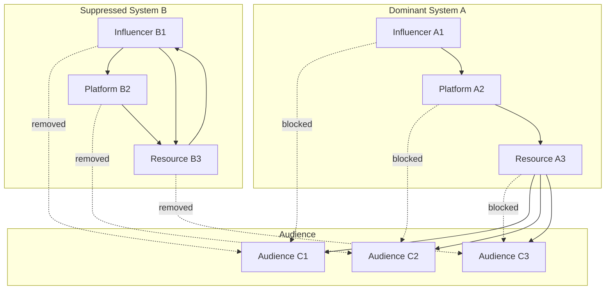
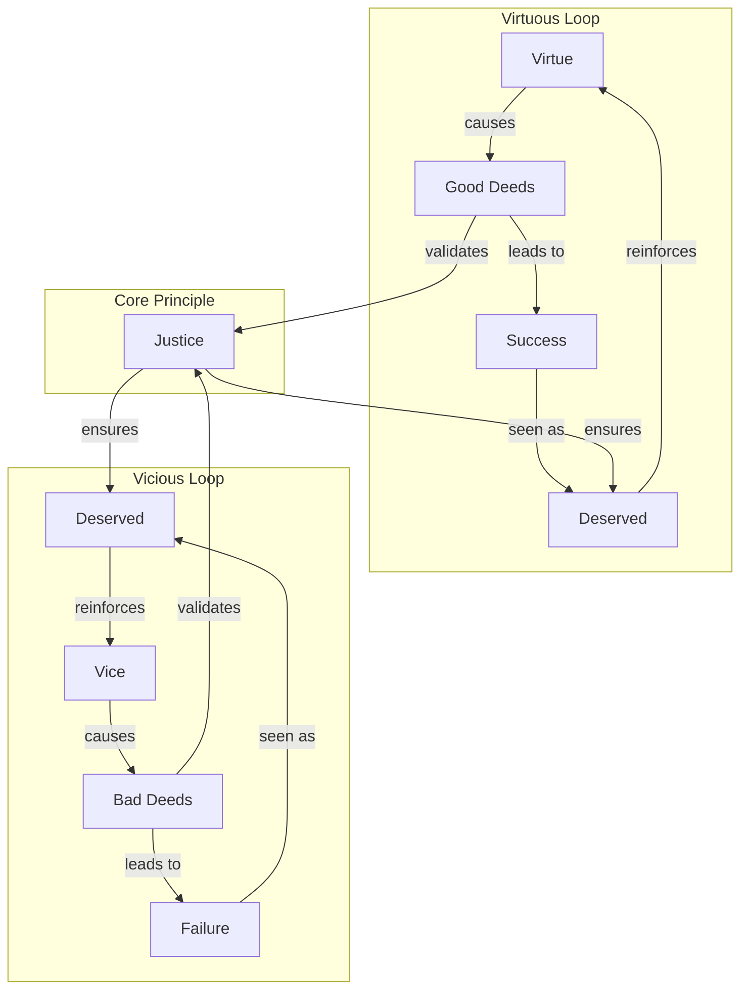

<!--

- What is the interplay between the strategies? Are there overlaps?
- clarify zero-sum and positive-sum dynamics within this scope
- Comparative analyses?

-->

The "vying for dominance" among information systems employs a range of strategies, extending beyond simple presence to more active and subtle interactions. Each mechanism operates through distinct network dynamics that can be analyzed through both intuitive descriptions and measurable graph properties.

## Direct Confrontation and Suppression

This involves overt attempts to eradicate, discredit, or suppress competing narratives or systems. Examples include ideological purges, censorship, public debunking campaigns, or even the violent destruction of cultural artifacts representing rival systems. The perceived emergent "intentionality" of the bio-informational complex is often at play here.

These suppression mechanisms can be analyzed through two complementary perspectives that reveal different aspects of how information systems compete for dominance.

### Mechanics

#### 1. Communication/Flow Network Perspective (Substrate Lens)

This perspective focuses on the material infrastructure, channels, and transmission systems that carry and propagate information—how the information system is instantiated and spread in the world. It examines the "how" of information transmission.

- **Network Dynamics:** Direct confrontation operates through the removal of nodes (entities, agents, or channels) and edges (communication links) in the network of information flow. When System A suppresses System B, it may block B’s access to audiences, resources, or platforms, fragmenting the network and isolating B.
- **Resource Flow Analysis:** Suppression redirects attention, material support, and cognitive resources away from the suppressed system toward the dominant one.
- **Observable Effects:** The network becomes more fragmented, with longer and more circuitous routes required for information to travel between remaining systems. Isolated clusters or “echo chambers” may form, and the suppressed system loses its ability to act as a bridge or influencer.

**Example: Network Suppression**  
This diagram shows how suppression affects the communication network. System B's connections to audiences are severed (dashed lines), while System A maintains and strengthens its connections. System B becomes isolated, forming an echo chamber with limited external reach.

#### 2. Semantic/Conceptual Network Perspective (Substance Lens)

While the first perspective examines transmission channels, this perspective focuses on the actual content, meaning, and internal logic of the information system—how its core concepts, beliefs, and relationships are structured and maintained. It examines the "what" and "why" of information systems.

**Example: "Just World" Information System**  
This concept graph shows how the "just world" belief system structures its core concepts. The system explains success/failure through virtue/vice, reinforces itself through the "deserved" outcomes, and is supported by concepts like "justice."

- **Suppression Tactics:**  
  - **Node Removal:** Discrediting or erasing key concepts (e.g., removing “Justice” as the core principle, or eliminating “Deserved” as a meaningful interpretation).
  - **Edge Severing:** Undermining or breaking the relationships between concepts (e.g., challenging the link between “Good Deeds” and “Success,” or breaking the reinforcement loop from “Deserved” back to “Virtue”).
  - **Reframing:** Redefining concepts or relationships to alter the system’s logic (e.g., redefining “Success” as due to luck rather than good deeds, or redefining “Justice” as human-made rather than natural).
- **Observable Effects:** The rival information system’s conceptual structure becomes less coherent, more vulnerable to doubt, and less able to explain or justify itself. If key nodes or connections are removed, the system may collapse or lose persuasive power.

### Implications

These two perspectives work together in practice. Suppression efforts typically target both the transmission infrastructure and the conceptual foundations of rival systems, creating a comprehensive attack on their ability to compete effectively.

**Example:** In the suppression of a conspiracy theory, authorities might:
- **Communication network:** Deplatform key influencers, block hashtags, or restrict sharing (removing nodes/edges in the flow network).
- **Semantic network:** Publicly debunk core claims, introduce counter-narratives, or redefine key terms (removing or altering nodes/edges in the concept graph).

---

## Co-option and Assimilation

A more subtle mechanism where a dominant or evolving information system incorporates appealing or non-threatening elements from a competitor. This can neutralize the distinct appeal of the rival or broaden the dominant system's own applicability, effectively "domesticating" or absorbing the competition. For example, a mainstream ideology might adopt certain popular themes from a nascent counter-culture to maintain its relevance.

## Niche Differentiation and Specialization

Not all competition is zero-sum. Information systems can evolve to occupy distinct cognitive, social, or functional niches, thereby reducing direct conflict and allowing for a diverse (though not necessarily equitable) ecosystem of coexisting systems. Different scientific disciplines, artistic genres, or spiritual traditions might cater to different aspects of human experience or inquiry, thus competing less directly for the same immediate "cognitive territory."

## Efficiency of Propagation and Transmission

Beyond its content, the structural and transmissive properties of an information system significantly impact its competitive success. Systems that are simpler, more emotionally resonant, highly memorable, easily replicable through available media (e.g., from easily retold oral myths to shareable digital memes), or those that more effectively leverage innate host psychology (e.g., [biases](../glossary/C.md#cognitive-biases), heuristics) often possess an advantage in propagation speed and reach. The nature of the available material substrates and transmission technologies (e.g., oral culture vs. printing press vs. internet) profoundly shapes these dynamics.

## Resilience through Adaptability and Self-Correction

Information systems that possess inherent mechanisms for [adaptation](../glossary/A.md#adaptation), learning, or self-correction may exhibit greater long-term competitive resilience. For instance, scientific methodologies, with their emphasis on falsifiability and revision based on new evidence, allow scientific theories to evolve and maintain explanatory power. Open-source software development models, as information systems for producing other information systems, thrive on iterative improvement and community-driven adaptation.