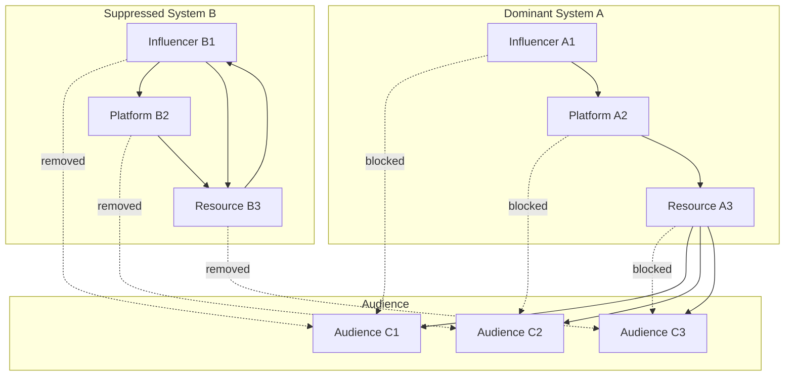
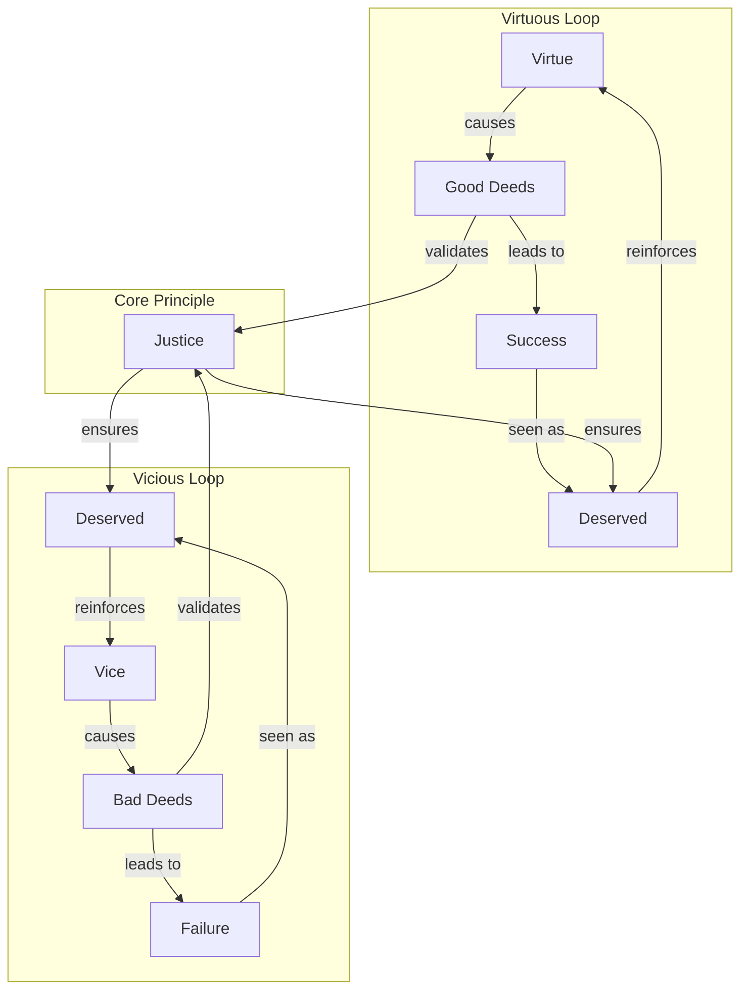

Direct confrontation represents the most overt competitive mechanism, where information systems actively attempt to eradicate, discredit, or suppress competing narratives or systems. Examples include ideological purges, censorship, public debunking campaigns, or even the violent destruction of cultural artifacts representing rival systems. The perceived emergent "intentionality" of the bio-informational complex is often at play here.

These suppression mechanisms can be analyzed through two complementary perspectives that reveal different aspects of how information systems compete for dominance. These perspectives correspond to the [Repeater/Jitter/Anchor model](../../04-information-systems/4a-material-organization-dynamics/4a1-repeater-jitter-anchor-model.md): the substrate lens examines how competition affects **repeaters** (transmission mechanisms) and **anchors** (stabilizing structures), while the substance lens examines how competition introduces **jitter** (variation) and transforms conceptual **anchors**.

### Mechanics

#### 1. Communication/Flow Network Perspective (Substrate Lens)

This perspective focuses on the material infrastructure, channels, and transmission systems that carry and propagate information—how the information system is instantiated and spread in the world. It examines the "how" of information transmission.

- **Network Dynamics:** Direct confrontation operates through the removal of nodes (entities, agents, or channels) and edges (communication links) in the network of information flow. When System A suppresses System B, it may block B’s access to audiences, resources, or platforms, fragmenting the network and isolating B. This targets the rival system’s **repeaters** (transmission mechanisms) and **anchors** (stabilizing structures), disrupting its ability to propagate and maintain coherence.
- **Resource Flow Analysis:** Suppression redirects attention, material support, and cognitive resources away from the suppressed system toward the dominant one.
- **Observable Effects:** The network becomes more fragmented, with longer and more circuitous routes required for information to travel between remaining systems. Isolated clusters or “echo chambers” may form, and the suppressed system loses its ability to act as a bridge or influencer.

**Example: Network Suppression**  
This diagram shows how suppression affects the communication network. System B's connections to audiences are severed (dashed lines), while System A maintains and strengthens its connections. System B becomes isolated, forming an echo chamber with limited external reach.

#### 2. Semantic/Conceptual Network Perspective (Substance Lens)

While the first perspective examines transmission channels, this perspective focuses on the actual content, meaning, and internal logic of the information system—how its core concepts, beliefs, and relationships are structured and maintained. It examines the "what" and "why" of information systems.  
In R/J/A terms, direct confrontation at the substance level works by attacking the rival’s **anchors** (core concepts and stabilizing beliefs) and introducing **jitter** (semantic disruption, doubt, or reinterpretation) to destabilize the system’s internal coherence.

**Example: "Just World" Information System**  
This concept graph shows how the "just world" belief system structures its core concepts. The system explains success/failure through virtue/vice, reinforces itself through the "deserved" outcomes, and is supported by concepts like "justice."

- **Suppression Tactics:**  
  - **Node Removal:** Discrediting or erasing key concepts (e.g., removing “Justice” as the core principle, or eliminating “Deserved” as a meaningful interpretation).
  - **Edge Severing:** Undermining or breaking the relationships between concepts (e.g., challenging the link between “Good Deeds” and “Success,” or breaking the reinforcement loop from “Deserved” back to “Virtue”).
  - **Reframing:** Redefining concepts or relationships to alter the system’s logic (e.g., redefining “Success” as due to luck rather than good deeds, or redefining “Justice” as human-made rather than natural).
- **Observable Effects:** The rival information system’s conceptual structure becomes less coherent, more vulnerable to doubt, and less able to explain or justify itself. If key nodes or connections are removed, the system may collapse or lose persuasive power.

### Causal Chains

Each mechanism can be understood through two distinct but complementary causal pathways: the Substrate lens, which focuses on the material channels of information flow, and the Substance lens, which focuses on the conceptual and semantic content itself.

#### Causal Chain (Substrate/Flow Lens)

This pathway targets the rival's ability to transmit its message.

1. **Identify Key Infrastructure:** The dominant system's hosts (or the Bio-Informational Complex (BIC) acting as a whole) identify the critical repeaters (influencers, platforms, funding sources) and communication edges (transmission links) of the rival system.

2. **Execute Disruption:** The hosts take action to sever these links. This can involve deplatforming influencers, blocking websites, cutting funding, or applying social pressure to silence key voices.

3. **Isolate Rival System:** The rival system's network becomes fragmented. It can no longer effectively reach its audience or acquire resources, leading to the formation of isolated "echo chambers."

4. **Capture Resources:** The dominant system captures the attention and resources that were previously allocated to its rival, strengthening its own position.

#### Causal Chain (Substance/Conceptual Lens)

This pathway targets the internal coherence and believability of the rival's ideas.

1. **Identify Conceptual Anchors:** The dominant system identifies the core concepts or beliefs (anchors) that give the rival system its explanatory power (e.g., the concept of "Justice" in the "Just World" belief system).

2. **Introduce Semantic Jitter:** The system introduces jitter (variation or noise) by creating and disseminating counter-narratives, debunking claims, or reframing key terms to create doubt and confusion. For example, redefining "Success" as a product of luck rather than "Good Deeds."

3. **Sever Semantic Links:** These attacks weaken or break the logical connections between the rival's core concepts. The system's narrative loses its internal consistency and persuasive power.

4. **Collapse of Coherence:** Hosts find the rival system less able to explain the world, leading to a loss of confidence and potential abandonment of the system.

### Implications

These two perspectives work together in practice. Suppression efforts typically target both the transmission infrastructure and the conceptual foundations of rival systems, creating a comprehensive attack on their ability to compete effectively.

**Example:** In the suppression of a conspiracy theory, authorities might:
- **Communication network:** Deplatform key influencers, block hashtags, or restrict sharing (removing nodes/edges in the flow network).
- **Semantic network:** Publicly debunk core claims, introduce counter-narratives, or redefine key terms (removing or altering nodes/edges in the concept graph).
- **Inoculation strategy:** Preemptively expose audiences to weakened versions of conspiracy claims alongside refutations, building cognitive resistance before exposure to the full theory. This creates "immune" nodes in the network that can resist and even counter-propagate against the rival system.
- **Anticipatory counter-narratives:** Authorities may anticipate the proliferation of a harmful narrative and pre-emptively seed a highly viable, emotionally resonant counter-narrative that is directly hostile to the harmful one. By strategically placing this counter-narrative in key network nodes before the harmful narrative gains traction, they can "inoculate" the network—making audiences more resistant to persuasion and reducing the harmful narrative's ability to propagate. This approach leverages both cognitive and network effects, but must be carefully managed to avoid backlash or ethical pitfalls.
