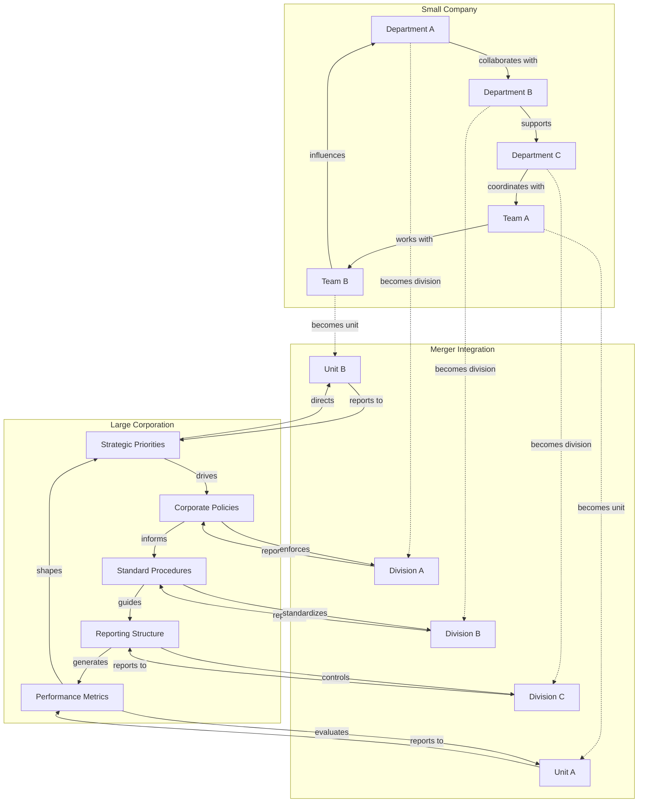
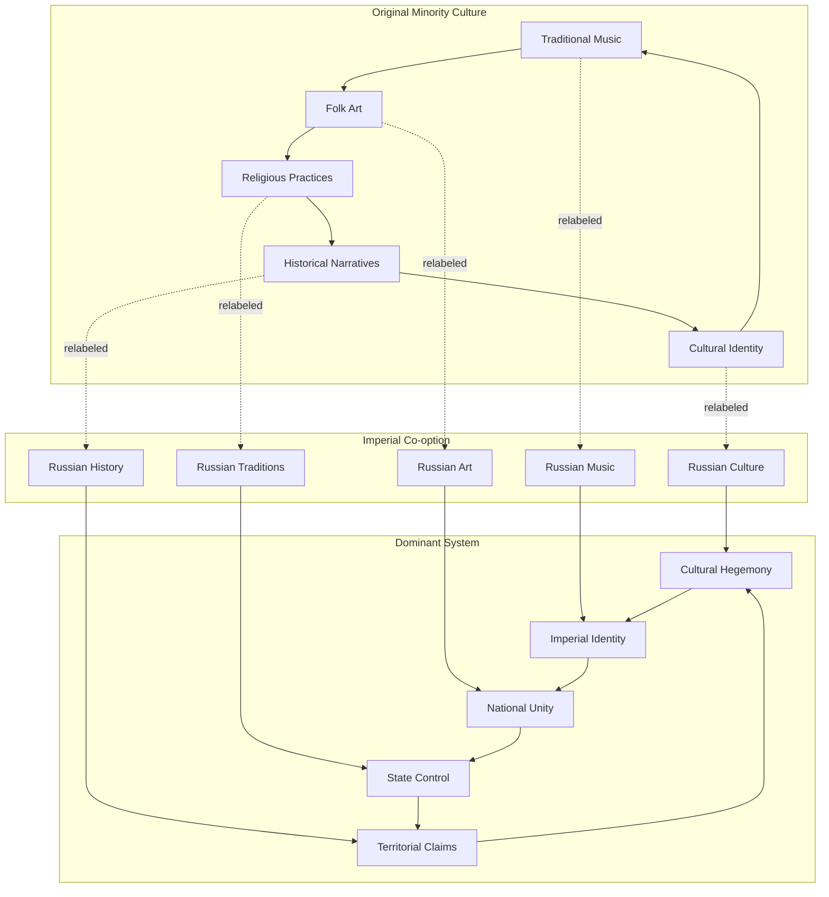

A more subtle mechanism where a dominant or evolving information system incorporates appealing or non-threatening elements from a competitor. This can neutralize the distinct appeal of the rival or broaden the dominant system's own applicability, effectively "domesticating" or absorbing the competition. For example, a mainstream ideology might adopt certain popular themes from a nascent counter-culture to maintain its relevance.

Like direct confrontation, co-option operates through both network and conceptual channels, but instead of removing or suppressing rival elements, it selectively integrates them into the dominant system's structure.

### Mechanics

#### 1. Communication/Flow Network Perspective (Substrate Lens)

This perspective examines how co-option affects the material infrastructure and transmission channels of information systems.

- **Network Integration:** Co-option involves the strategic absorption of nodes (influencers, platforms, communities) and edges (communication channels) from the rival system into the dominant system's network. Rather than isolating the rival, the dominant system creates new connections that redirect information flow toward itself. **The key insight is that by absorbing a node, the dominant system leverages network effects to replace the node's contents** where the node's connections to the dominant system's network begin to influence what information flows through it, gradually transforming its function and output. In R/J/A terms, this is the absorption of **repeaters** (transmission mechanisms) and their transformation to serve the dominant system's propagation needs.
- **Resource Redirection:** The dominant system captures attention, material support, and cognitive resources that might otherwise flow to the rival system, but does so by offering a "home" for these resources within its own framework.
- **Observable Effects:** The network becomes more centralized around the dominant system, with former rival nodes now acting as bridges or amplifiers for the dominant system's messages. The rival system may lose its distinct network identity as its components become integrated into the dominant system's infrastructure.

**Example: Corporate Merger Network Absorption**  
This diagram shows how departments and teams from a small company get absorbed into a large corporation's network through merger. As they become integrated, the corporation's policies, procedures, and reporting structures begin to influence their operations and decision-making. The absorbed units adapt their practices to match corporate standards and priorities, effectively transforming their function within the network.

#### 2. Semantic/Conceptual Network Perspective (Substance Lens)

This perspective focuses on how conceptual co-option works by absorbing the rival's **anchors** (core concepts and stabilizing beliefs) while introducing controlled **jitter** (reframing and reinterpretation) to transform these elements to serve the dominant system's interests.

**Example: Imperial Cultural Co-option**  
This diagram shows how imperial systems co-opt minority cultural elements through simple relabeling. Traditional music becomes "Russian music," folk art becomes "Russian art," and cultural identity becomes "Russian culture." The original cultural context is erased through relabeling, and the elements are claimed as part of the dominant imperial system's cultural heritage.

### Causal Chains

#### Causal Chain (Substrate/Flow Lens)

1. **Identify High-Value Nodes:** The dominant system identifies influential nodes (e.g., a charismatic leader, a popular community) within the rival system's network.

2. **Create Bridges:** Instead of attacking, the dominant system creates new communication links to these nodes, offering them a larger platform, resources, or legitimacy.

3. **Integrate and Influence:** The absorbed node becomes integrated into the dominant system's network. The information flowing to the node is now primarily from the dominant system.

4. **Transform and Re-Transmit:** Over time, the node's own output begins to align with the dominant system's patterns and norms. It effectively becomes a repeater for the dominant system, broadcasting a modified, "domesticated" version of its original message.

#### Causal Chain (Substance/Conceptual Lens)

1. **Identify Appealing Concepts:** The dominant system identifies popular or resonant concepts (anchors) from the rival system.

2. **Re-label and Reframe:** The dominant system strips the concept of its original context and integrates it into its own semantic network, often by simply relabeling it (e.g., a minority folk tradition is co-opted and relabeled as "Russian Folk Art").

3. **Forge New Connections:** The co-opted concept is now linked to the core principles of the dominant system, serving to reinforce the dominant narrative.

4. **Neutralize Rival:** The rival system loses a key, appealing element, diminishing its distinctiveness and competitive advantage.