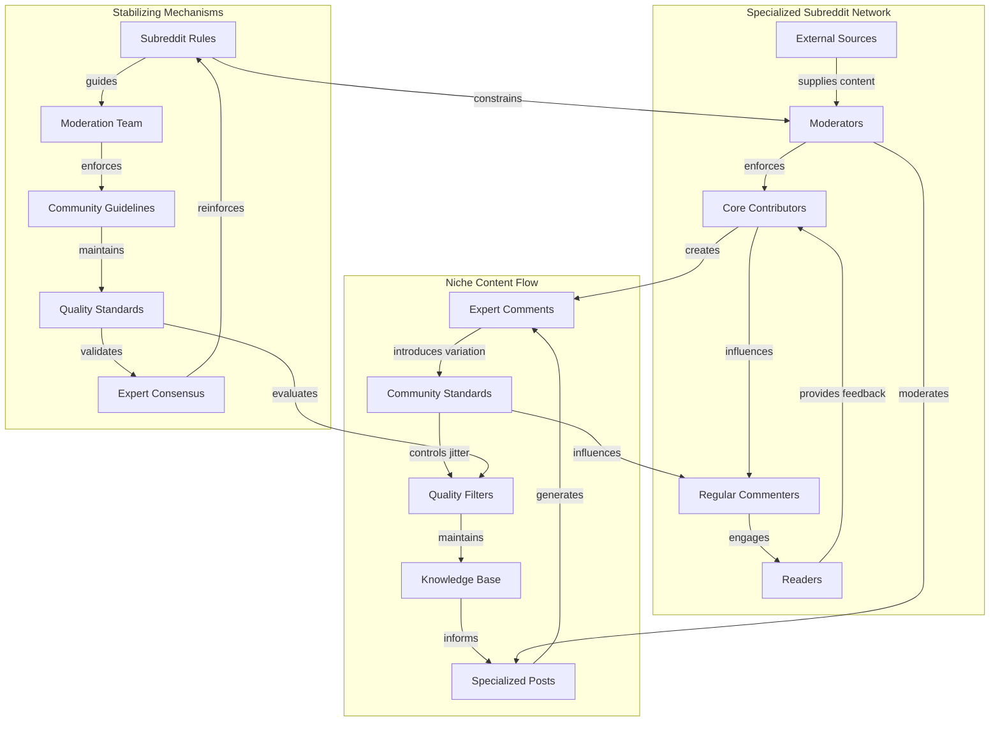

Niche differentiation represents a cooperative competitive mechanism where information systems evolve to occupy distinct cognitive, social, or functional niches, thereby reducing direct conflict and allowing for a diverse (though not necessarily equitable) ecosystem of coexisting systems. Different scientific disciplines, artistic genres, or spiritual traditions might cater to different aspects of human experience or inquiry, thus competing less directly for the same immediate "cognitive territory."

Niche differentiation works by developing specialized **repeaters** (transmission mechanisms tailored to specific audiences), controlled **jitter** (variation within bounded domains), and domain-specific **anchors** (stabilizing mechanisms that maintain identity within the niche while allowing adaptation to niche-specific conditions).

### Mechanics

#### 1. Communication/Flow Network Perspective (Substrate Lens)

This perspective examines how niche differentiation affects the material infrastructure and transmission channels of information systems.

- **Specialized Repeaters:** Information systems develop transmission mechanisms optimized for their specific niche. Different systems use different communication channels, platforms, or formats that resonate with their target audiences (e.g., academic journals vs. popular media, specialized conferences vs. general forums).
- **Niche-Optimized Networks:** Information flows through networks of experts, practitioners, or enthusiasts who share common interests and communication norms, creating distinct transmission pathways.
- **Network Segmentation:** The overall information ecosystem becomes segmented into specialized subnetworks, each with its own transmission mechanisms and audience connections.

#### 2. Semantic/Conceptual Network Perspective (Substance Lens)

This perspective focuses on how niche systems maintain distinct conceptual identities while allowing controlled variation.

- **Controlled Jitter:** Niche systems allow variation within bounded domains while maintaining core identity. Systems encourage experimentation and adaptation within the constraints of their niche identity (e.g., new artistic styles within a genre, novel theories within a scientific paradigm).
- **Niche-Specific Adaptation:** Variation is directed toward addressing the unique challenges and opportunities of the niche environment.
- **Identity Preservation:** While allowing jitter, systems maintain core concepts and principles that define their niche identity and distinguish them from other systems.

#### 3. Stabilization Mechanisms (Anchor Lens)

Each niche develops stabilizing mechanisms tailored to its specific domain:

- **Domain-Specific Anchors:** Specialized organizations, standards bodies, or communities that maintain quality and coherence within the niche (e.g., professional associations, peer review systems, artistic movements).
- **Niche Boundaries:** Clear definitions of what belongs within the niche and what falls outside it, helping maintain distinctiveness while allowing internal evolution.
- **Institutional Stability:** Niche institutions serve as anchors that maintain the system's identity and quality standards within its specialized domain.

**Example: Specialized Subreddit Niche**  
This diagram shows how a specialized subreddit (e.g., r/AskHistorians) creates its own niche through specialized **repeaters** (moderators, contributors, users), controlled **jitter** (variation in posts and comments that gets parsed and, for extreme cases of jitter, either contributes to the anchors or gets discarded as unproductive), and domain-specific **anchors** (rules, moderation, expert consensus). The network structure enables high-quality information transmission while the stabilizing mechanisms maintain the niche's distinct identity and standards.

### Causal Chain

1. **Direct Competition Creates Pressure:** Two systems compete for the same broad audience, leading to conflict and inefficiency.

2. **Jitter Creates a Variant:** A variation (jitter) of one system emerges, focusing on a specific sub-topic or specialized audience.

3. **Specialization Occurs:** This specialized variant attracts a highly dedicated niche audience with strong substrate affinity.

4. **Develop Niche Infrastructure:** The niche system develops its own specialized repeaters (e.g., academic journals, expert forums) and anchors (specialized jargon, community standards).

5. **Competition is Reduced:** By catering to different needs, the two systems no longer compete directly for the same "cognitive territory," allowing for coexistence. A specialized subreddit like r/AskHistorians is a perfect example of this process.