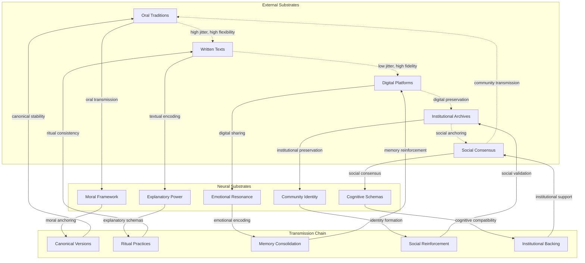

Beyond its content, the structural and transmissive properties of an information system significantly impact its competitive success. Systems that are simpler, more emotionally resonant, highly memorable, easily replicable through available media (e.g., from easily retold oral myths to shareable digital memes), or those that more effectively leverage innate host psychology (e.g., [biases](../../glossary/C.md#cognitive-biases), heuristics) often possess an advantage in propagation speed and reach. The nature of the available material substrates and transmission technologies (e.g., oral culture vs. printing press vs. internet) profoundly shapes these dynamics.

Efficient propagation works by optimizing **repeaters** (transmission mechanisms for speed and reach), minimizing destructive **jitter** (noise that reduces fidelity), and strengthening **anchors** (stabilizing mechanisms that resist competitive pressures).

### Mechanics

#### 1. Communication/Flow Network Perspective (Substrate Lens)

This perspective examines how information systems optimize their transmission infrastructure for maximum reach and speed.

- **Complete Transmission Chain:** Information flows through multiple substrates in sequence - from external networks (social media, messaging) through neural substrates (attention, memory, cognitive processing) and back to external networks. Each substrate hop introduces different constraints and opportunities for optimization.
- **Neural Substrate Optimization:** Systems design content to navigate neural "security gates" (attention filters, cognitive load limits) and exploit neural "vulnerabilities" (biases, heuristics, emotional triggers) to maximize retention and transmission fidelity.
- **Substrate Hopping Efficiency:** Successful systems optimize for the entire chain, not just individual substrates. This includes managing jitter across different transmission modes (high-fidelity digital vs. high-jitter oral transmission) and ensuring information can survive multiple substrate transitions.

#### 2. Semantic/Conceptual Network Perspective (Substance Lens)

This perspective quantifies the compatibility and long-term viability of information across different substrates.

- **Neural Retention Optimization:** Content is designed to maximize retention in neural substrates through emotional salience, narrative structure, pattern recognition, and alignment with existing cognitive schemas. Systems leverage memory consolidation mechanisms (sleep, repetition, emotional encoding) to enhance long-term retention.
- **External Anchor Compatibility:** Information is structured to be compatible with external stabilizing mechanisms (institutional archives, social consensus, technological platforms) that can preserve it across time and substrate transitions.
- **Jitter Minimization:** Systems reduce variation and noise that could degrade information during transmission. This includes creating canonical versions, using redundant encoding, and designing content that resists distortion across different transmission modes.
- **Identity Fusion:** When information systems achieve deep integration with hosts (forming [Bio-Informational Complexes](../5e-bio-informational-complex.md)), the host becomes both a highly motivated repeater and a living anchor. The host's identity becomes fused with the information system, creating powerful protective reactions and dedicated resource allocation that amplify propagation efficiency.

**Example: Religious Information Systems**  
This diagram shows how religious systems optimize propagation across the complete transmission chain. They leverage **neural substrates** (moral frameworks, explanatory power, emotional resonance) to enhance retention, use **external anchors** (institutional archives, social consensus) for long-term preservation, and employ **jitter minimization** (canonical versions, ritual practices) to maintain fidelity across substrate transitions from oral to written to digital transmission.

### Causal Chain

1. **Encounter and Cognitive Load:** A host encounters two competing information systems. System A is simple, emotionally resonant, and easy to remember. System B is complex and requires significant cognitive effort.

2. **Neural Optimization:** The host's brain, seeking efficiency, finds it easier to process and encode System A. The pattern aligns better with innate cognitive biases and heuristics.

3. **Enhanced Retention and Fidelity:** System A is retained in memory more effectively and with less degradation (less destructive jitter) than System B.

4. **Motivated Repetition:** The host is more likely to repeat the simpler, more emotionally engaging System A to others. This effect is amplified when the system becomes fused with the host's identity, forming a Bio-Informational Complex (BIC) where the host becomes a highly motivated repeater.

5. **Competitive Advantage:** Due to its higher transmission rate and fidelity, System A out-competes System B in spreading to new hosts and securing cognitive resources.
