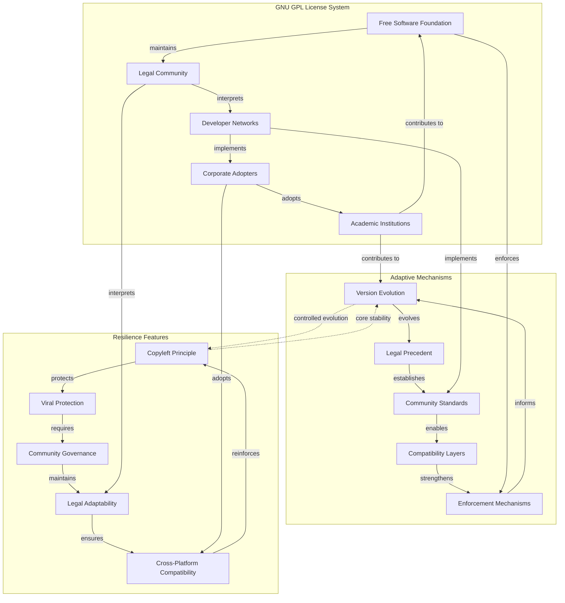

Resilience through adaptability represents the long-term competitive strategy where information systems develop mechanisms for [adaptation](../../glossary/A.md#adaptation), learning, or self-correction to maintain relevance over time. For instance, scientific methodologies, with their emphasis on falsifiability and revision based on new evidence, allow scientific theories to evolve and maintain explanatory power. Open-source software development models, as information systems for producing other information systems, thrive on iterative improvement and community-driven adaptation.

Resilient systems develop **adaptive repeaters** (transmission mechanisms that can modify themselves), **strategic jitter** (intentional variation that enables learning), and **flexible anchors** (stabilizing mechanisms that can evolve without losing core identity). Viable information systems exist in a precarious **Goldilocks zone** between maladaptive rigidity (where strong self-reinforcement creates resistance to beneficial change) and disintegration (where excessive adaptation erodes core identity and coherence). The most resilient systems balance these opposing forces through controlled evolution.

### Mechanics

#### 1. Communication/Flow Network Perspective (Substrate Lens)

This perspective examines how information systems develop adaptive transmission infrastructure that can respond to competitive challenges.

- **Adaptive Repeaters:** Systems develop transmission mechanisms that can modify their own structure and function in response to environmental changes. This includes learning algorithms, community-driven evolution, and institutional reform processes that allow the system to adapt its propagation strategies.
- **Network Plasticity:** Information flows through networks that can reorganize, expand, or contract based on competitive pressures. Systems develop mechanisms for identifying and responding to threats, opportunities, and changing environmental conditions.
- **Substrate Flexibility:** Systems can adapt to new transmission substrates and technologies, maintaining their competitive position as the information environment evolves.

#### 2. Semantic/Conceptual Network Perspective (Substance Lens)

This perspective focuses on how information systems maintain conceptual coherence while allowing strategic adaptation.

- **Strategic Jitter:** Systems intentionally introduce variation to explore new possibilities and adapt to changing conditions. This includes experimentation, hypothesis testing, and controlled innovation that allows the system to learn and evolve.
- **Learning Mechanisms:** Information systems develop processes for incorporating new knowledge, correcting errors, and improving their explanatory power or predictive accuracy.
- **Identity Preservation:** While allowing adaptation, systems maintain core concepts and principles that define their essential identity and distinguish them from other systems.

#### 3. Stabilization Mechanisms (Anchor Lens)

Resilient systems develop stabilizing mechanisms that can evolve without losing core identity.

- **Flexible Anchors:** Systems create stabilizing mechanisms that can adapt to new conditions while maintaining essential stability. This includes institutional reform processes, community-driven standards evolution, and adaptive quality control systems designed to support controlled evolution rather than rigid preservation.
- **Identity Fusion Resilience:** When hosts become deeply fused with information systems (forming [Bio-Informational Complexes](../5e-bio-informational-complex.md)), the host's adaptive capabilities become tools for information system resilience. The host's learning, creativity, and problem-solving abilities are directed toward protecting and evolving the information system, creating a highly resilient competitive unit.
- **Self-Reinforcing Feedback Loops:** Resilient systems develop [positive feedback mechanisms](../../04-information-systems/4b-emergent-stability-longevity/4b1-mechanisms-emergent-stability.md#4b11-self-reinforcing-feedback-loops) that strengthen their own propagation through utility reinforcement, identity integration, and cognitive entrenchment. These loops create virtuous cycles that amplify the system's competitive position.
- **Error Correction and Quality Control:** Systems develop mechanisms to detect and correct degradation through consistency monitoring, restoration processes, and quality selection. This includes peer review, automated verification, and community oversight that filter detrimental jitter while incorporating beneficial innovations.

**Example: GNU GPL License Resilience**  
This diagram shows how the GNU GPL license system demonstrates resilience through **adaptive repeaters** (FSF, legal community, developer networks), **strategic jitter** (version evolution, legal precedent, compatibility layers), and **flexible anchors** (copyleft principle, viral protection, community governance). The system balances between maladaptive rigidity (overly restrictive licensing) and disintegration (loss of copyleft protection), maintaining its core identity while adapting to new technologies and legal environments.

### Causal Chain

1. **Environmental Shift:** A change in the social or technological environment challenges the validity of existing information systems.

2. **System Response:**
   - **Rigid System:** Its inflexible anchors prevent it from adapting. Its explanations no longer fit the new reality, and it loses utility.
   - **Adaptive System:** It has mechanisms for strategic jitter (e.g., peer review, falsifiability, feedback channels) that allow it to test variations.

3. **Selective Adaptation:** The adaptive system incorporates beneficial new information, updating its peripheral features while its flexible anchors preserve its core identity.

4. **Competitive Displacement:** The adaptive system maintains its relevance and utility, while the rigid system becomes obsolete. Hosts of the rigid system eventually abandon it in favor of the more effective, adaptive one. The GNU GPL license system is a prime example of this resilience in action.
