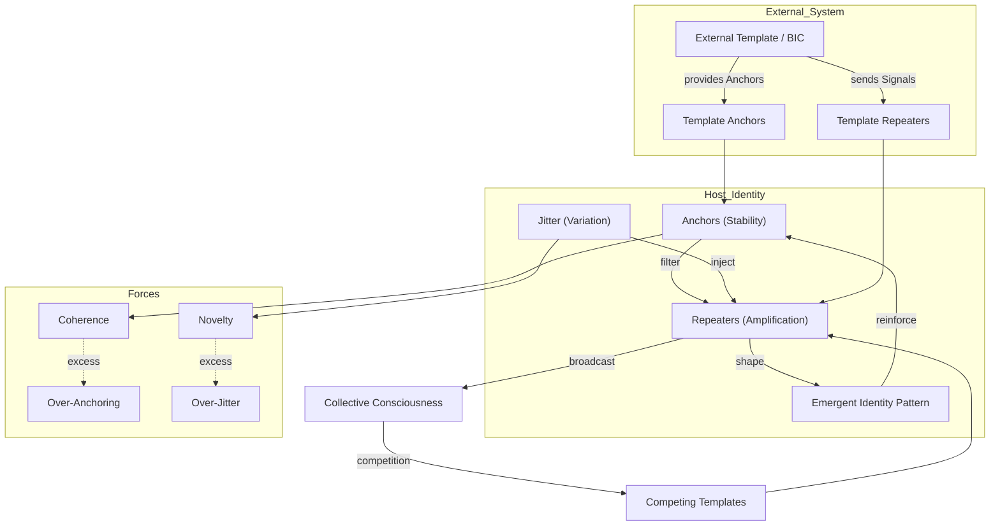

<!--

- Needs fleshing out

-->

Building on the boundary-shift mechanics of **[6.b](6b-redrawing-borders-collective-consciousness.md)**, this section turns inward to the subjective layer: How do those macro dynamics rewrite what it feels like to *be* a self?  Within the Brain-from-Brane ontology, identity is itself an **information system**—a pattern of stable references (Anchors) maintained by biological and socio-technical **Repeaters** while navigating ongoing **Jitter** (experience, memory drift, situational role-shifts).

## **6.d.1. Identity as a Multi-Substrate Information Pattern**

Key Components and Mechanisms of Identity as an Information System

| Component | Mechanism | R/J/A Role | Example |
|-----------|-----------|-----------|---------|
| **Narrative Core** | Autobiographical stories, value hierarchies | *Anchors* (provide stability & meaning) | Personal "origin story," religious creed |
| **Role Ensemble** | Context-specific behavior scripts (parent, coder, gamer) | *Repeaters* (reactivate scripts in situ) | Slack persona vs family persona |
| **Experiential Flux** | Sensory input, emotional states, social feedback | *Jitter* (injects variation) | Mood swings after news feed binge |
| **Metacognitive Governor** | Reflective monitoring, coherence maintenance | Dynamic Anchor selection / Jitter filtering | Journaling, therapy, meditation |

Identity coherence therefore depends on a healthy Anchor-to-Jitter ratio: too many rigid Anchors → maladaptive rigidity; too much unfiltered Jitter → fragmentation.

## **6.d.2. BIC-Driven Identity Dynamics**

When an external information system fuses with a host to form a **[Bio-Informational Complex](../05-competitive-dynamics/5e-bio-informational-complex.md)**, the BIC's propagation goals begin to **co-opt identity machinery**:

1. **Template Imprinting (Exposure → Adoption)** – The BIC supplies pre-packaged Anchors (slogans, rituals) that overwrite or nest inside the host's narrative core.
2. **Cognitive Dominance (Lock-In)** – High-salience Repeaters (notifications, group rituals) crowd out alternative role ensembles, narrowing attentional bandwidth.
3. **Goal Hybridization** – Host survival goals merge with template propagation goals; the host now defends the BIC as self.
4. **Schism & Drift (Propagation → Breakdown)** – Divergent Jitter among sub-groups seeds new BIC splinters, each claiming authentic identity.

### **Spectrum of BIC Identity Outcomes**

How Different BIC Types Shape Identity Coherence, Flexibility, and Well-Being

| BIC Type | Identity Coherence | Flexibility | Well-Being Impact | Illustrative Case |
|----------|-------------------|-------------|-------------------|------------------|
| **Mutualist** | High (Anchors align with intrinsic values) | Moderate (supports multiple roles) | Positive (purpose, community) | Open-source contributor culture |
| **Commensal** | Moderate | High (easy to opt in/out) | Neutral | Casual fandom |
| **Parasitic** | Rigid but brittle (over-anchoring) | Low (role monoculture) | Negative (stress, isolation) | Extremist conspiracy movement |

### **Visual: Competing Forces in Identity Formation**

This diagram situates the host's internal A/J/R triad within a broader information ecology: external templates feed Anchors and Repeaters into the host, shifting the balance between coherence and novelty; the resulting identity pattern then propagates outward, entering competitive dynamics with other templates.

## **6.d.3. Identity Fluidity and "Mosaic Selves"**

Global information flow enables individuals to assemble **mosaic identities**: a *portfolio* of micro-BIC affiliations (e-sports clan, climate activism, crypto DAO).  Advantages include:

• **Adaptive Resilience** – Multiple Anchors reduce single-point failure risk.  
• **Generativity** – Cross-domain Jitter sparks creativity.  

Risks mirror advantages:

• **Fragmentation Fatigue** – Excessive Jitter without integrative Anchors leads to decision paralysis.  
• **Exploit Surface Expansion** – More identity nodes enlarge the attack surface for parasitic BICs.

> **Clarification – Mosaic ≠ BIC (By Default)**  
> A mosaic identity is *not itself* a distinct **Bio-Informational Complex**; it is a host that maintains several *partial* BIC couplings in parallel. Only when those micro-affiliations begin to interlock—sharing Anchors, reinforcing Repeaters, and winning a dominant share of cognitive resources—does the constellation meet the reciprocal-dependency criteria that would qualify it as a *higher-order or meta-BIC*.  Analysts should therefore track (a) cross-affiliation symbol convergence, (b) joint protective reactions, and (c) shared resource pipelines as early signals of such self-stabilizing behavior.

## **6.d.4. Navigational Literacies & Resilience Strategies**

1. **Anchor Auditing** – Periodic review of which narratives occupy core memory slots; prune obsolete or externally injected Anchors.  
2. **Jitter Hygiene** – Intentional information-diet design (timeboxing feeds, diverse sources) to modulate variation intensity.  
3. **Meta-Anchor Formation** – Develop higher-order frameworks (critical thinking heuristics, scientific method) that govern Anchor admission criteria.  
4. **BIC Health Checks** – Apply **ACAP**-style metrics (resource allocation balance, cognitive dominance index) to monitor coupled systems.

## **6.d.5. Research & Falsifiable Predictions**

Falsifiable Predictions on Identity Dynamics in the Information Age

| Hypothesis | Measure | Falsifier |
|------------|---------|-----------|
| **Anchor Density Curve** – Identity coherence peaks at an optimal Anchor/Jitter ratio (~0.35 Anchors per salient role). | Longitudinal self-report & behavioral stability studies. | Identity coherence keeps rising or falling steadily with more Anchors (no hump-shaped peak). |
| **Parasitic BIC Well-Being Decline** – Hosts with >40% daily cognitive bandwidth allocated to a single BIC show measurable well-being drop within six months. | Time-tracking + mental-health surveys. | Well-being stays the same or even improves despite heavy BIC dominance. |
| **Mosaic Creativity Boost** – Individuals maintaining 5–7 micro-affiliations outperform peers on divergent-thinking tests. | Identity inventory vs creativity metrics. | Creative-thinking scores show no boost for people with many affiliations. |

## **6.d.6. Group-Scale Dynamics: Diversity vs Cohesion**

At the collective layer the same Anchor/Jitter logic scales up:

| Factor | Diversity Benefit (Jitter) | Cohesion Mechanism (Anchor) | Failure Mode |
|--------|---------------------------|-----------------------------|--------------|
| **Perspective Variety** | Wider solution space; more creative recombinations | Shared epistemic standards (scientific method, peer-review norms) | Echo-chamber fragmentation if no common validation rules |
| **Role Specialization** | Parallel problem solving; adaptability in volatile environments | Clear coordination protocols, APIs, or rituals that stitch specialties together | Siloed sub-cultures unable to interoperate |
| **Cultural/Value Pluralism** | Resilience to context shocks; broader legitimacy | Superordinate narrative or mission that all sub-groups endorse | Ideological schisms and zero-sum politics |

The sweet spot resembles a **spoked wheel**: heterogeneous sub-groups (the rim) generate novel Jitter, while integrative Anchors at the hub prevent centrifugal drift.  Practical centripetal forces include:

1. **Meta-Anchors** – Explicit governance principles (e.g., open-source licenses, scientific integrity codes) that override local customs when conflicts arise.
2. **Bridge Roles** – Individuals or teams with overlapping micro-affiliations who translate between sub-cultures; in network terms they lower path length and dampen polarization.
3. **Ritual Synchrony** – Regular shared ceremonies (all-hands meetings, cross-guild hackathons) that refresh a sense of common purpose.
4. **Compatibility APIs** – Technical or procedural interfaces ensuring modules built by different sub-groups snap together without costly negotiation.

> **Design Heuristic**: Track the group's Anchor/Jitter ratio just as for individuals.  If novelty stalls, inject cross-pollination (diversity Jitter).  If coherence frays, strengthen meta-Anchors or increase bridge-role bandwidth.

These mechanisms convert diversity from a centrifugal threat into an engine of collective generativity—providing a mechanistic backing to the slogan *"diversity is our strength"* **when** centripetal structures are intentionally maintained.

---
[<< Previous: 6C Fluid Dynamics Metaphor](6c-fluid-dynamics-metaphor.md) | [Up: 6 Influence Collective Consciousness](6-influence-collective-consciousness.md) | [Next: 7 Agentive Dissolution Legacy >>](../07-agentive-dissolution-legacy/7-agentive-dissolution-legacy.md)
