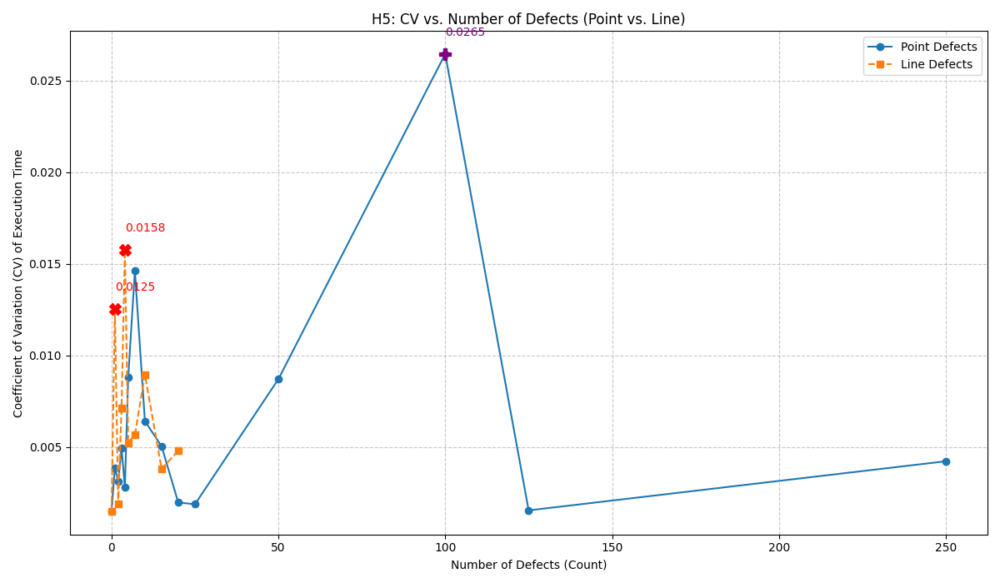

# Analysis of H5: Critical Destabilization by Low-Count Correlated Geometric Defects

Date: June 2, 2025

Experiment Script: `h5_critical_destabilization_test.py`

Configuration:
*   `BUSY_WORK_ITERATIONS_PER_WORK_UNIT = 10000`
*   `NUM_ITERATIONS_PER_CONFIG = 5`
*   `NUM_INSTANCES_PER_COUNT = 3`

## 1. Raw Results Summary

```
🔬 HYPOTHESIS 5: CRITICAL DESTABILIZATION BY LOW-COUNT CORRELATED GEOMETRIC DEFECTS
Grid Size: 50x50, Base Work Units: 1
Defect Work Units: 101
Busy Work Iterations per Unit: 10000
Iterations per config: 5, Instances per count: 3
--------------------------------------------------------------------------------
Defect Type,Defect Count,Mean Exec Time (ms),CV

Starting: Point Defects Loop (by count)
Starting: Point Defects, Count: 0
Baseline,0,975.196,0.001469
Finished: Point Defects, Count: 0
Starting: Point Defects, Count: 1
Point,1,1015.577,0.003862
Finished: Point Defects, Count: 1
Starting: Point Defects, Count: 2
Point,2,1054.350,0.003111
Finished: Point Defects, Count: 2
Starting: Point Defects, Count: 3
Point,3,1095.684,0.004922
Finished: Point Defects, Count: 3
Starting: Point Defects, Count: 4
Point,4,1135.688,0.002808
Finished: Point Defects, Count: 4
Starting: Point Defects, Count: 5
Point,5,1176.475,0.008802
Finished: Point Defects, Count: 5
Starting: Point Defects, Count: 7
Point,7,1256.996,0.014612
Finished: Point Defects, Count: 7
Starting: Point Defects, Count: 10
Point,10,1372.582,0.006415
Finished: Point Defects, Count: 10
Starting: Point Defects, Count: 15
Point,15,1570.132,0.005031
Finished: Point Defects, Count: 15
Starting: Point Defects, Count: 20
Point,20,1763.600,0.001965
Finished: Point Defects, Count: 20
Starting: Point Defects, Count: 25
Point,25,1958.036,0.001869
Finished: Point Defects, Count: 25
Starting: Point Defects, Count: 50
Point,50,2953.438,0.008700
Finished: Point Defects, Count: 50
Starting: Point Defects, Count: 100
Point,100,5000.209,0.026460
Finished: Point Defects, Count: 100
Starting: Point Defects, Count: 125
Point,125,5890.313,0.001535
Finished: Point Defects, Count: 125
Starting: Point Defects, Count: 250
Point,250,10827.279,0.004217
Finished: Point Defects, Count: 250
Finished: Point Defects Loop (by count)

Starting: Line Defects Loop (by count)
Baseline (from Point Loop),0,975.196,0.001469
Starting: Line Defects, Count: 1
Line,1,2964.411,0.012528
Finished: Line Defects, Count: 1
Starting: Line Defects, Count: 2
Line,2,4904.471,0.001870
Finished: Line Defects, Count: 2
Starting: Line Defects, Count: 3
Line,3,6818.994,0.007122
Finished: Line Defects, Count: 3
Starting: Line Defects, Count: 4
Line,4,8741.027,0.015754
Finished: Line Defects, Count: 4
Starting: Line Defects, Count: 5
Line,5,10603.694,0.005227
Finished: Line Defects, Count: 5
Starting: Line Defects, Count: 7
Line,7,14271.295,0.005669
Finished: Line Defects, Count: 7
Starting: Line Defects, Count: 10
Line,10,19722.998,0.008953
Finished: Line Defects, Count: 10
Starting: Line Defects, Count: 15
Line,15,28309.039,0.003803
Finished: Line Defects, Count: 15
Starting: Line Defects, Count: 20
Line,20,36731.715,0.004788
Finished: Line Defects, Count: 20
Finished: Line Defects Loop (by count)
--------------------------------------------------------------------------------
Experiment finished.
```

## 2. Analysis of H5 Experiment Results (Numerical & Visual)

### 2.1. Baseline and General Trends
*   **Baseline:** The defect-free baseline run (0 defects) showed a mean execution time of ~975 ms with a CV of ~0.0015. This indicates a stable baseline for comparison.
*   **Mean Execution Time:** For both point and line defects, the mean execution time increased with the number of defects, as expected due to the increased computational load in defective cells.

### 2.2. Point Defect Behavior
*   **CV (Numerical):** The Coefficient of Variation (CV) for point defects generally remained low.
    *   For counts 1-5, CVs ranged from ~0.0028 to ~0.0088.
    *   A slight rise was seen at 7 defects (CV ~0.0146).
    *   A more noticeable CV increase occurred at 100 point defects (CV ~0.0265), representing 4% of total cells being defective.
*   **Interpretation (Numerical):** With the exception of 100 defects, point defects did not cause major processing instability, which aligns with H5's expectation that isolated defects are less disruptive than correlated ones. The rise at 100 defects suggests a possible threshold where even point defects, in sufficient quantity, begin to destabilize processing.

### 2.3. Line Defect Behavior (Primary Focus of H5)
*   **CV Pattern (Numerical):** The CV for line defects showed a non-monotonic (up-and-down) pattern:
    *   **1 Line Defect:** CV ~0.0125 (significantly higher than baseline and low-count point defects).
    *   **2 Line Defects:** CV dropped sharply to ~0.0019 (near baseline stability).
    *   **3 Line Defects:** CV rose to ~0.0071.
    *   **4 Line Defects:** CV peaked again at ~0.0158 (the highest observed for line defects in this run).
    *   **5+ Line Defects:** CV generally trended lower for 5, 7, 10, 15, and 20 lines, ranging from ~0.0038 to ~0.0090.
*   **Localized CV Peaks (Numerical):** The results show localized peaks in CV at 1 and 4 line defects. This behavior, particularly the CV being higher for 1 or 4 lines than for 2, 3, or 5+ lines, is consistent with Hypothesis 5's prediction that a *small, critical number* of correlated defects can cause disproportionate instability.

### 2.4. Comparison to H4 Anomaly & H5 Predictions (Based on Numerical Data)
*   The CV for 1 line defect (~0.0125) in this H5 run, while elevated, is lower than the ~0.027-0.030 CV observed in the H4 experiment for configurations that likely also produced 1 line defect. The increased number of iterations (3 to 5) and instances (2 to 3) in H5 likely provided more stable CV measurements, potentially smoothing out earlier statistical noise.
*   The H5 numerical results (peaks at 1 and 4 lines) provide tentative support for H5. The CV for these low-count line defects is generally higher than for an equivalent number of point defects.

### 2.5. Visual Analysis of Plotted Results (from `h5_cv_vs_defect_count.png`)



The visual plot of CV vs. Defect Count provides clear insights:

*   **Line Defect Curve (Orange, Dashed Line with Square Markers):**
    *   **Prominent Peaks:** The peaks at 1 line defect (CV ~0.0125) and 4 line defects (CV ~0.0158) are visually distinct and are the highest points on the line defect curve for low defect counts (0-10).
    *   **Non-Monotonic Behavior:** The curve clearly shows a rise to the first peak at 1 defect, a sharp drop for 2 defects, a rise to the second peak at 4 defects, and then a general decline or stabilization at lower CV values for 5+ defects within the plotted range (up to 20).
    *   **Confirmation of H5:** This visual pattern strongly supports H5's prediction of localized destabilization at critical low counts of correlated defects.

*   **Point Defect Curve (Blue, Solid Line with Circle Markers):**
    *   **Low-Count Stability:** For low defect counts (0-25), the CV for point defects is generally low and relatively flat, staying well below the initial peaks of the line defect curve.
    *   **Spike at 100 Defects:** The most dramatic feature of the point defect curve is the very sharp spike at 100 defects (CV ~0.0265), which is the absolute highest CV value on the entire plot. After this peak, the CV drops again for 125 and 250 defects.
    *   **Comparison:** This visually emphasizes that while point defects can cause instability, it occurs at a much higher number of defects compared to the critical low counts for line defects.

*   **Direct Comparison:**
    *   At 1 and 4 defects, the orange line (Line Defects) is clearly above the blue line (Point Defects), indicating higher instability for lines.
    *   The CV for 2 line defects (~0.0019) is remarkably low, comparable to the baseline and very low point defect counts.

*   **Y-Axis Scale & Clarity:** The Y-axis (CV) ranges from approximately 0 to 0.028. The plot effectively uses this range to show the relative magnitudes of the CV values and the significance of the observed peaks.

*   **Overall Impression:** The plot makes a compelling visual case for H5. The differing behaviors of line and point defects, particularly the early, sharp peaks for line defects, are evident.

## 3. Next Steps to "Dig Deeper" (Revised based on Plot)

1.  **Documentation and Reporting:**
    *   **Action:** Formally add a description of the visual findings (as above) to this analysis document (`h5_analysis_and_next_steps.md`). Include a note to manually insert or reference the `h5_cv_vs_defect_count.png` image.
    *   **Action:** Update the main `hypotheses_from_ontology.md` with a concise summary of these H5 findings and the supporting visual evidence, linking back to this detailed analysis.

2.  **Investigate the Low CV for 2 Line Defects:**
    *   The remarkably low CV for 2 line defects (~0.0019, almost baseline stability) sandwiched between higher CVs for 1 and 3/4 lines is particularly intriguing and warrants focused investigation.
    *   **Action:** Design a specific follow-up experiment focusing *only* on line defect counts of 0, 1, 2, 3, and 4.
        *   For these specific counts, significantly increase `NUM_ITERATIONS_PER_CONFIG` (e.g., to 20-30) and `NUM_INSTANCES_PER_COUNT` (e.g., to 10-15). This is to achieve very high confidence in the CV values for these critical low counts.
        *   The goal is to confirm if the dip at 2 lines is a robust phenomenon or if it smooths out with more averaging.

3.  **Explore the 100 Point Defect Spike:**
    *   While not the primary focus of H5, the CV spike (~0.0265) for 100 point defects is a strong signal.
    *   **Action (Lower Priority):** If resources permit, conduct a focused run on point defects with counts around 100 (e.g., 75, 90, 100, 110, 125) with increased iterations/instances to characterize this peak more precisely.

4.  **Refine H5 Interpretation (Post Follow-up Experiments):**
    *   After the focused runs (especially for low-count line defects), re-evaluate and refine the interpretations from both the ontology proponent and conventional perspectives. If the dip at 2 line defects is a robust phenomenon, it adds another layer of complexity and interest to the ontology's predictions about geometric interactions.

## 4. H5 Follow-up: Isolated CPU Core with Perf Monitoring

Date: June 3, 2025 (Server Experiment)

Experiment Script: `h5_isolated_perf_test.py` (assisted by `_run_perf_target_iterations.py`)
Results File: `h5_isolated_perf_results.jsonl`
Analysis Script: `analyze_h5_results.py`

Environment:
*   Server: Intel Core i5-12400F (6 cores, 12 logical CPUs)
*   CPU Isolation: Physical Core 5 (logical CPUs 10 and 11) isolated using kernel parameters (`isolcpus=10,11`, `nohz_full=10,11`, `rcu_nocbs=10,11`).
*   `perf`: `linux-perf` used with `kernel.perf_event_paranoid=1`.
*   Process Pinning: Experiment script and `perf stat` pinned to CPU 10.

Key Configuration Parameters (from `h5_isolated_perf_test.py`):
*   `GRID_SIZE = 50`
*   `BASE_CELL_WORK_UNITS = 1`
*   `DEFECT_CELL_WORK_UNITS = 101`
*   `BUSY_WORK_ITERATIONS_PER_WORK_UNIT = 10000`
*   `NUM_ITERATIONS_PER_CONFIG` (for helper script, per instance): `25`
*   `NUM_INSTANCES_PER_COUNT` (in main script): `10`
*   `LINE_DEFECT_COUNTS_TO_TEST = [0, 1, 2, 3, 4, 5]`
*   `PERF_EVENTS` monitored: `["cycles", "instructions", "cache-references", "cache-misses", "branch-instructions", "branch-misses", "mem_load_retired.l1_miss", "LLC-loads", "LLC-load-misses", "dTLB-load-misses", "iTLB-load-misses", "cpu-clock", "task-clock"]`

### 4.1. Summary of Aggregated Results (from `analyze_h5_results.py`)

```text
--- Aggregated Experiment Results ---

Defect Count: 0 (Based on 10 valid instances)
  Avg Mean Time (ns): 971263104.68
  Avg CV:             0.005002
  Avg IPC:            5.8314
  Avg Perf Counters:
    cpu-clock                          : <no numeric data>
    cpu_core/LLC-load-misses/          : 68835.80
    cpu_core/LLC-loads/                : 305619.10
    cpu_core/branch-instructions/      : 111463115289.60
    cpu_core/branch-misses/            : 1186371.30
    cpu_core/cache-misses/             : 491961.30
    cpu_core/cache-references/         : 2155700.50
    cpu_core/cycles/                   : 106219053309.60
    cpu_core/dTLB-load-misses/         : 58517.00
    cpu_core/iTLB-load-misses/         : 2574.30
    cpu_core/instructions/             : 619402529913.60
    cpu_core/mem_load_retired.l1_miss/ : 1736968.30
    task-clock                         : <no numeric data>

Defect Count: 1 (Based on 10 valid instances)
  Avg Mean Time (ns): 2946215779.03
  Avg CV:             0.004582
  Avg IPC:            5.8027
  Avg Perf Counters:
    cpu-clock                          : <no numeric data>
    cpu_core/LLC-load-misses/          : 104249.70
    cpu_core/LLC-loads/                : 555703.40
    cpu_core/branch-instructions/      : 337987650477.40
    cpu_core/branch-misses/            : 1577276.10
    cpu_core/cache-misses/             : 692971.40
    cpu_core/cache-references/         : 2956443.80
    cpu_core/cycles/                   : 321662532792.80
    cpu_core/dTLB-load-misses/         : 826489.60
    cpu_core/iTLB-load-misses/         : 11510.60
    cpu_core/instructions/             : 1866495271915.90
    cpu_core/mem_load_retired.l1_miss/ : 2754697.00
    task-clock                         : <no numeric data>

Defect Count: 2 (Based on 10 valid instances)
  Avg Mean Time (ns): 4939556566.22
  Avg CV:             0.005268
  Avg IPC:            5.7449
  Avg Perf Counters:
    cpu-clock                          : <no numeric data>
    cpu_core/LLC-load-misses/          : 142939.30
    cpu_core/LLC-loads/                : 789442.90
    cpu_core/branch-instructions/      : 559236177252.00
    cpu_core/branch-misses/            : 1990476.30
    cpu_core/cache-misses/             : 964036.40
    cpu_core/cache-references/         : 4145839.30
    cpu_core/cycles/                   : 539024954856.10
    cpu_core/dTLB-load-misses/         : 1587415.70
    cpu_core/iTLB-load-misses/         : 20497.90
    cpu_core/instructions/             : 3096623623033.50
    cpu_core/mem_load_retired.l1_miss/ : 3734167.10
    task-clock                         : <no numeric data>

Defect Count: 3 (Based on 10 valid instances)
  Avg Mean Time (ns): 6780185393.45
  Avg CV:             0.006663
  Avg IPC:            5.8290
  Avg Perf Counters:
    cpu-clock                          : <no numeric data>
    cpu_core/LLC-load-misses/          : 172618.00
    cpu_core/LLC-loads/                : 1026121.20
    cpu_core/branch-instructions/      : 778352025084.20
    cpu_core/branch-misses/            : 2345322.50
    cpu_core/cache-misses/             : 1155547.70
    cpu_core/cache-references/         : 4902175.60
    cpu_core/cycles/                   : 739391866699.60
    cpu_core/dTLB-load-misses/         : 2374897.50
    cpu_core/iTLB-load-misses/         : 45829.00
    cpu_core/instructions/             : 4309894256235.80
    cpu_core/mem_load_retired.l1_miss/ : 4610855.60
    task-clock                         : <no numeric data>

Defect Count: 4 (Based on 10 valid instances)
  Avg Mean Time (ns): 8695987328.07
  Avg CV:             0.005615
  Avg IPC:            5.8140
  Avg Perf Counters:
    cpu-clock                          : <no numeric data>
    cpu_core/LLC-load-misses/          : 207332.50
    cpu_core/LLC-loads/                : 1240060.90
    cpu_core/branch-instructions/      : 996124489867.60
    cpu_core/branch-misses/            : 2741436.30
    cpu_core/cache-misses/             : 1382647.40
    cpu_core/cache-references/         : 5795231.50
    cpu_core/cycles/                   : 948641716441.50
    cpu_core/dTLB-load-misses/         : 3169041.40
    cpu_core/iTLB-load-misses/         : 41280.00
    cpu_core/instructions/             : 5515438191605.00
    cpu_core/mem_load_retired.l1_miss/ : 5533190.00
    task-clock                         : <no numeric data>

Defect Count: 5 (Based on 10 valid instances)
  Avg Mean Time (ns): 10582895894.50
  Avg CV:             0.005929
  Avg IPC:            5.7849
  Avg Perf Counters:
    cpu-clock                          : <no numeric data>
    cpu_core/LLC-load-misses/          : 250610.30
    cpu_core/LLC-loads/                : 1509107.80
    cpu_core/branch-instructions/      : 1195976165235.20
    cpu_core/branch-misses/            : 3114594.50
    cpu_core/cache-misses/             : 1560930.50
    cpu_core/cache-references/         : 6742075.70
    cpu_core/cycles/                   : 1154533935140.90
    cpu_core/dTLB-load-misses/         : 3657805.00
    cpu_core/iTLB-load-misses/         : 36826.30
    cpu_core/instructions/             : 6678845442360.50
    cpu_core/mem_load_retired.l1_miss/ : 6550591.50
    task-clock                         : <no numeric data>

--- End of Results ---
```

### 4.2. Interpretation and H5 Evaluation (Isolated Core Experiment)

*   **Mean Execution Time (`Avg Mean Time (ns)`):**
    *   As anticipated, the average execution time increased substantially and roughly linearly with the number of line defects. This is consistent with each defect line adding a fixed amount of additional computational work.

*   **Coefficient of Variation (`Avg CV`):**
    *   The CV values remained consistently low across all defect counts (ranging from ~0.0046 to ~0.0067).
    *   There was no clear or significant trend of increasing CV as line defect counts increased. Specifically, there was no indication of a sharp rise in variability at low defect counts that would suggest "critical destabilization."
    *   This observation **does not strongly support** the core tenet of H5 concerning increased execution time variability due to low-count correlated defects in this controlled environment.

*   **Instructions Per Cycle (`Avg IPC`):**
    *   The IPC remained very high (between ~5.74 and ~5.83) and relatively stable across all defect configurations.
    *   This indicates that the CPU maintained high efficiency, and the introduction of line defects did not lead to significant pipeline stalls or a major degradation in the rate of instruction execution.

*   **Hardware Performance Counters (`Avg Perf Counters`):**
    *   **Work-related counters** (`cpu_core/cycles/`, `cpu_core/instructions/`, `cpu_core/branch-instructions/`): These increased proportionally with the defect count, aligning with the increased workload.
    *   **Cache and TLB Misses** (`cpu_core/cache-misses/`, `cpu_core/LLC-load-misses/`, `cpu_core/mem_load_retired.l1_miss/`, `cpu_core/dTLB-load-misses/`, `cpu_core/iTLB-load-misses/`): These generally trended upwards as the number of defects increased. This is plausible, as more defects could lead to less predictable memory access patterns and reduced data locality. The `cpu_core/mem_load_retired.l1_miss/` counter, for instance, increased by approximately 1 million misses for each added line defect, a trend consistent with increasing workload on the L1 data cache.
    *   **Branch Misses** (`cpu_core/branch-misses/`): Also showed a general increase with defect count, suggesting that processing defective cells might involve more complex conditional logic that is harder for the branch predictor to handle.

### 4.3. Conclusion for H5 (Isolated Core Experiment)

Based on the data from this experiment run in a CPU-isolated environment with `perf` monitoring:

*   The primary prediction of H5 – that low-count correlated geometric defects would cause a disproportionate increase in execution time *variability* (CV) – is **not strongly supported**. The CV remained low and did not exhibit significant spikes or a clear upward trend with increasing line defects.
*   The CPU appears to handle the increased workload from line defects with high efficiency, as evidenced by the stable and high IPC.
*   Hardware counters indicate increased pressure on cache, TLB, and branch prediction systems with more defects, and these increases (including L1D misses) appear consistent with the growing workload. These microarchitectural effects do not appear to translate into significant performance *variability* or a major loss of overall CPU efficiency in this specific experimental setup.

### 4.4. Next Steps (Post Isolated Core Experiment)

1.  **Re-evaluate H5:** Given these results, reconsider the conditions under which H5 might hold true, or if the initial observations that led to H5 were influenced by other system factors not present in this more controlled environment.
2.  **Consider Plotting:** Create plots for Mean Time, CV, and IPC against defect count from this new dataset to visually confirm the trends.
